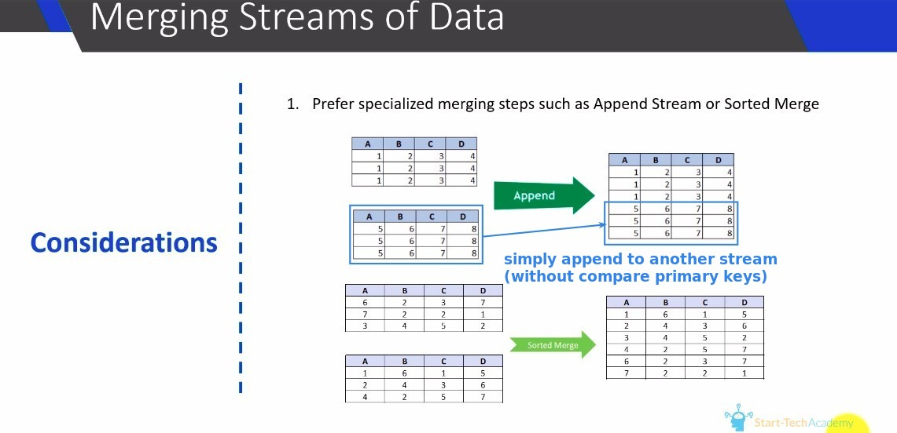
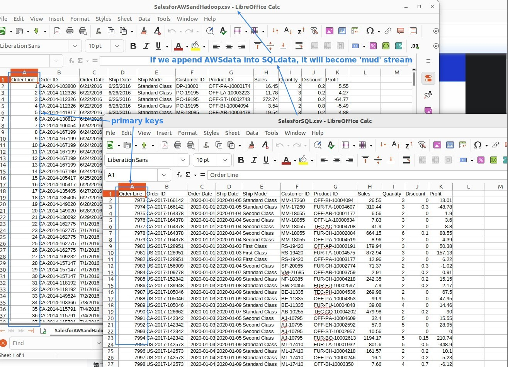
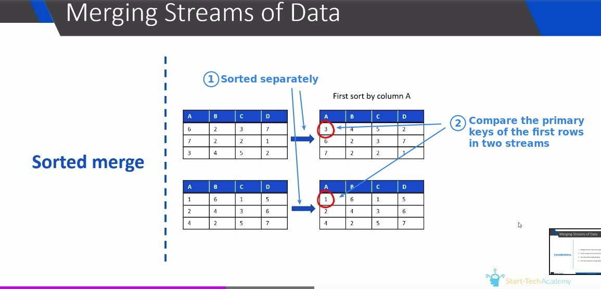
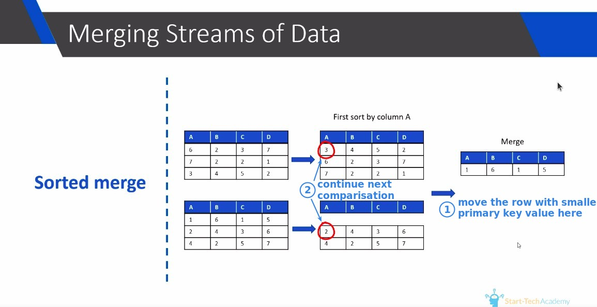
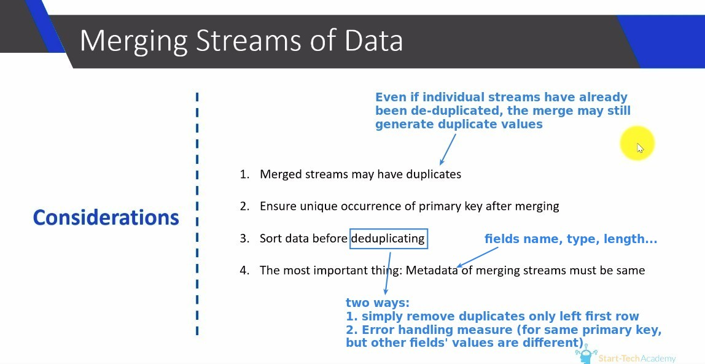

## **Two specialized steps to MERGE STREAMS**

### *Append merge* 

**mud stream**

> This is what we need to avoid, and why we use specialized steps to do merge.

### *Sorted merge* 

## **Duplicate**

> Merge may generate duplicate rows, even if the original streams have already been deduplicated.

