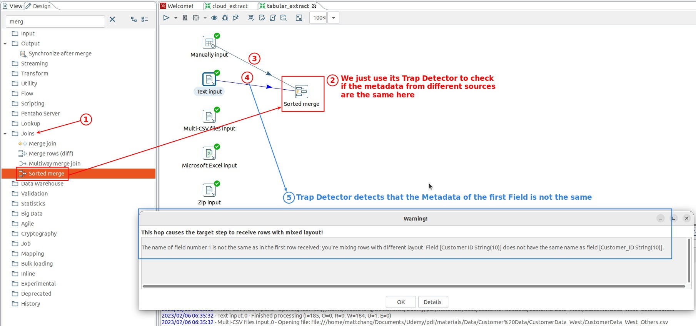
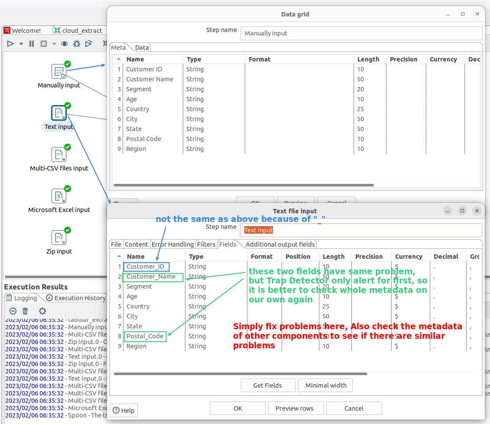
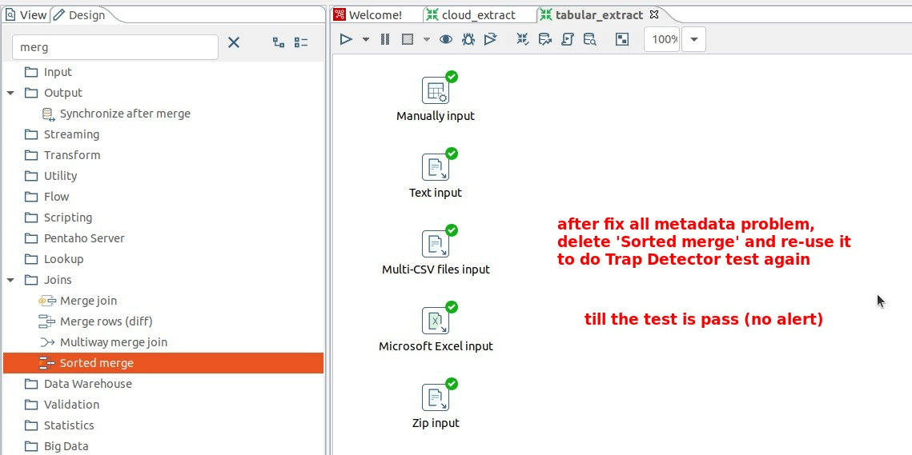
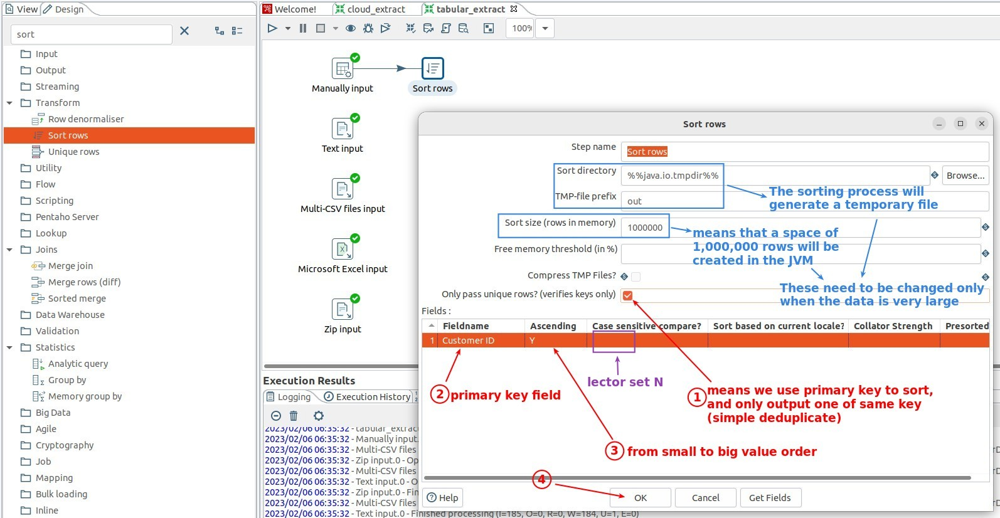
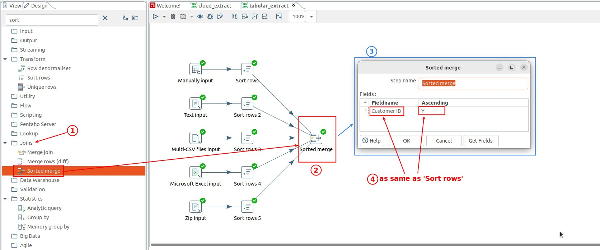
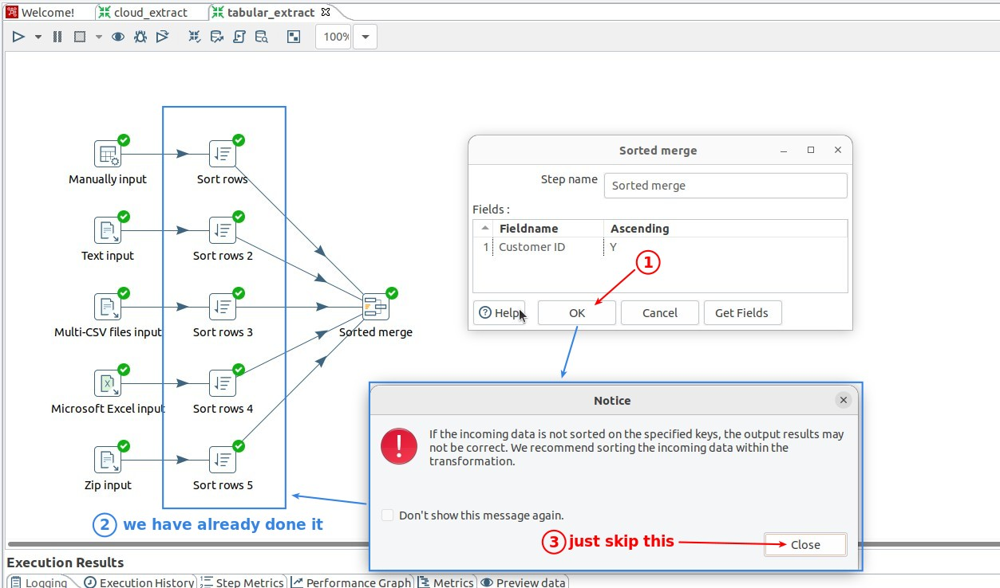
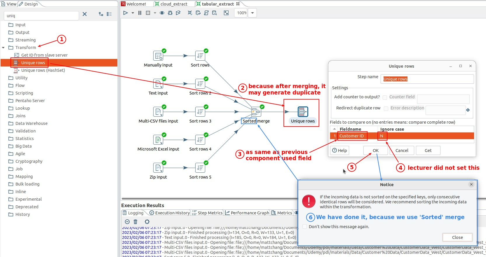
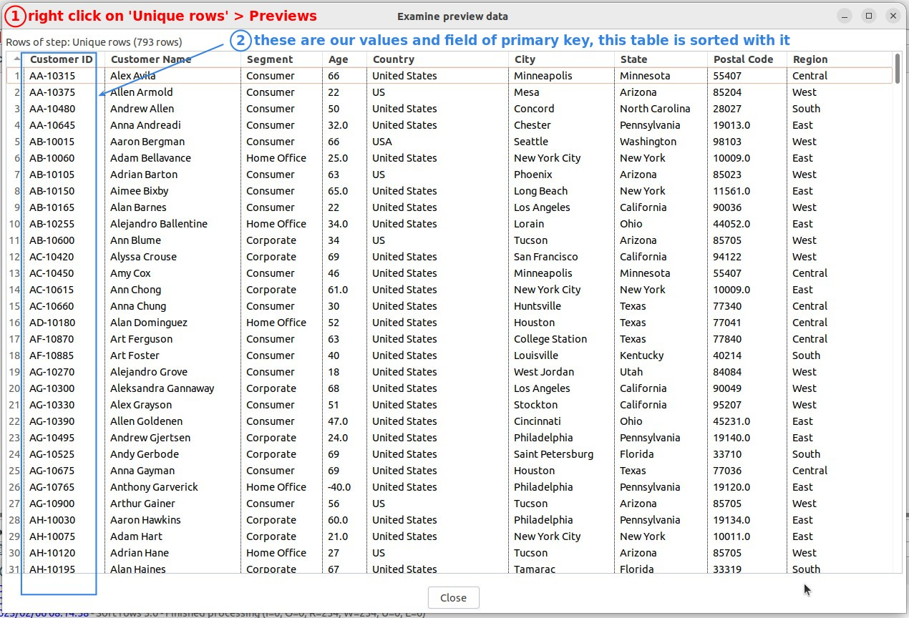

## **Compare metadata** 

### *Trap Detector from 'Sorted merge'*

### *Compare metadata on our own*

## **Sort separately** 

## **Sorted merge**

- The reason for the alert is related to the logic of sorted merge mentioned in the previous lecture.

  - It is important to sort separately before sorted merging.

## **Deduplicate after merging**

## **Final Preivew** 

