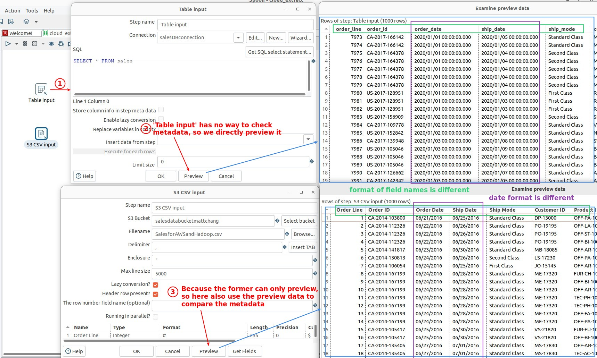
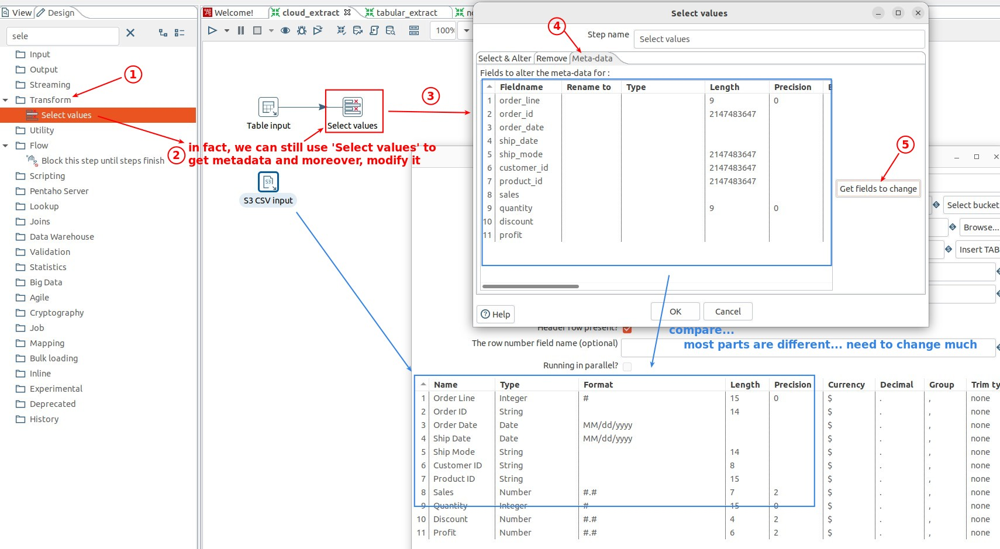
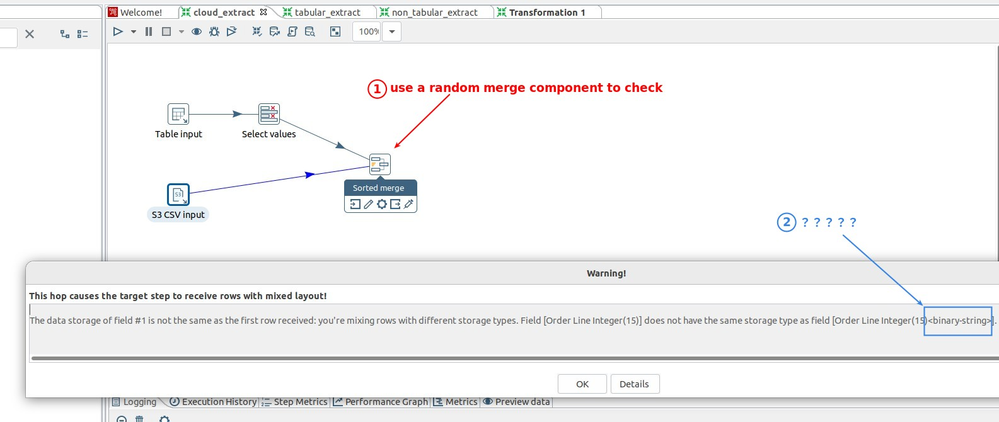
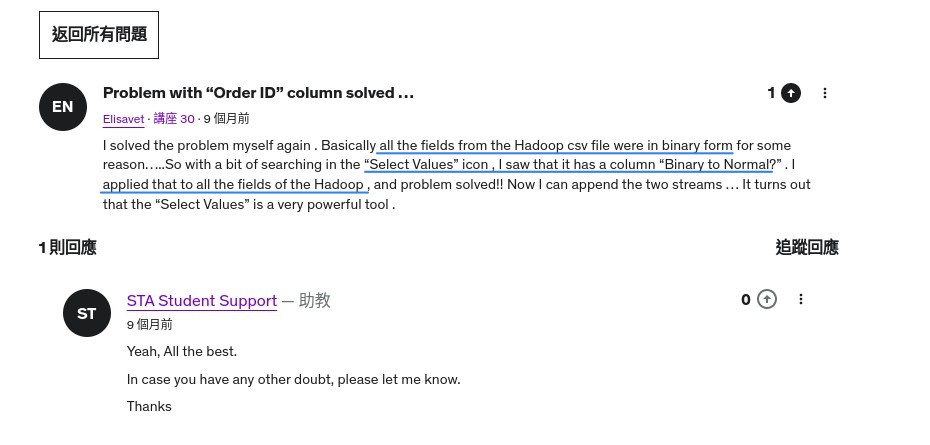
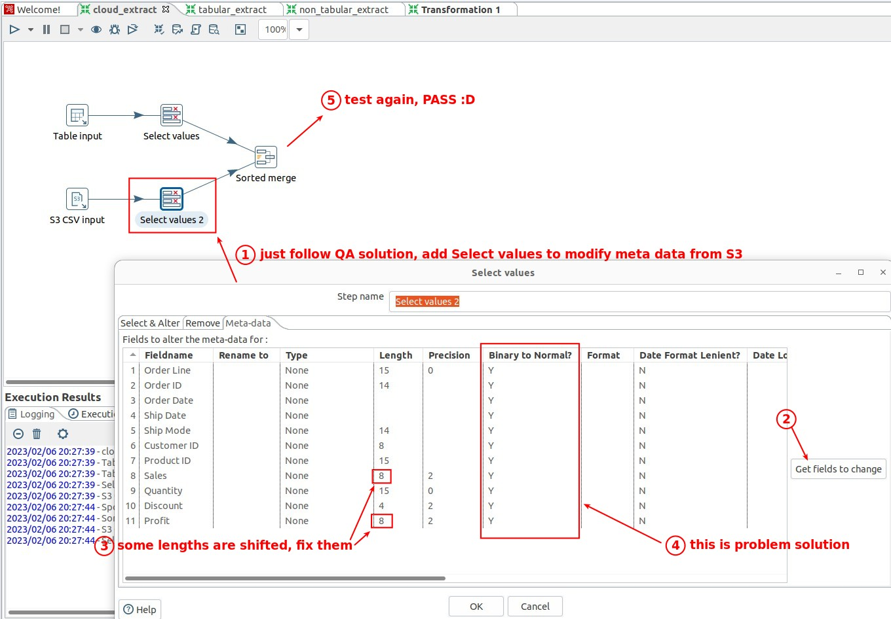
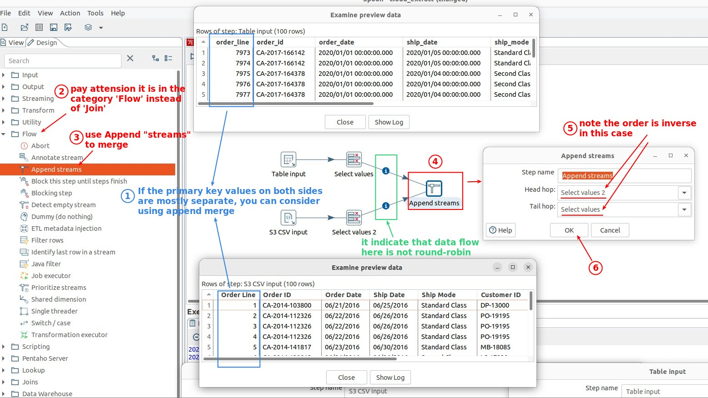
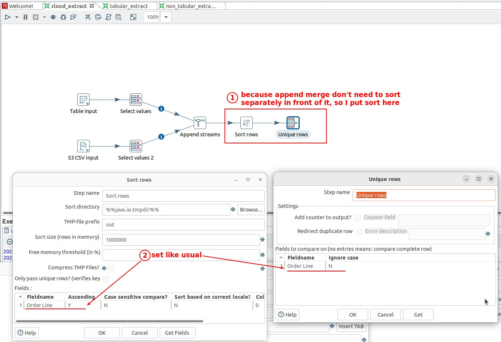

## **Metadata compare/modify**

### _compare with previews instead of metadata_

### _power of 'Select values'_

## **Trap Detector and \<binary-string\> problem**

### _Trap detector_

> There are some small differences between metadata that must be observed using the trap detector.

### _QA solution_

## **Append merge**

## **Sort and Deduplicate**

