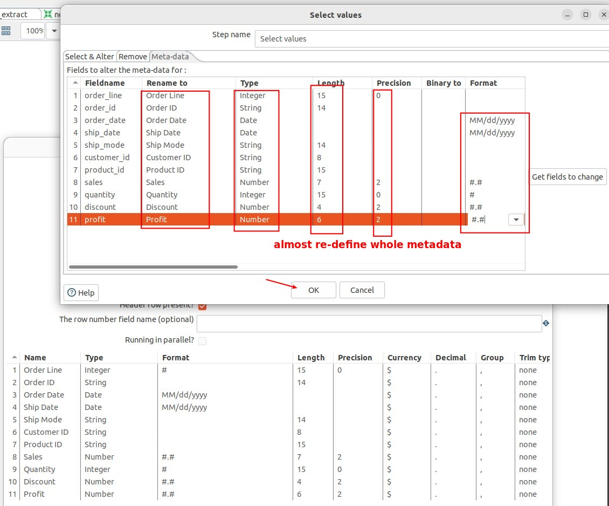

## **Metadata compare/modify**

### _compare with previews instead of metadata_

### _power of 'Select values'_

## **Trap Detector and \<binary-string\> problem**

### _Trap detector_

> There are some small differences between metadata that must be observed using the trap detector.

### _QA solution_

## **Append merge**

> Because there is almost no overlap between the primary keys of the two data, it doesn't make sense to use Sorted merge to compare row by row, so we choose to make one method merge.

## **Sort and Deduplicate**

> Note that the position of 'Sort rows' is different from the previous lecture.

