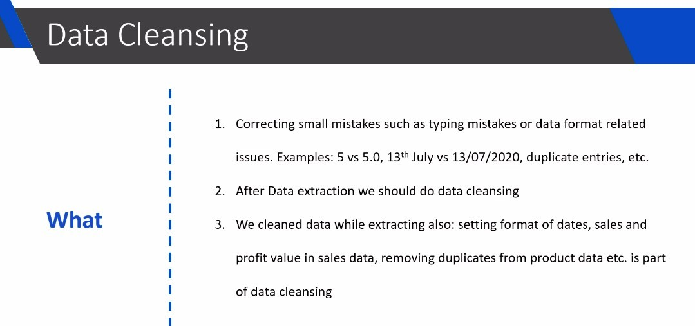
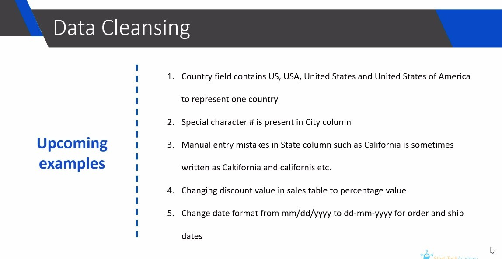

## **What is data cleansing?** 

- We have done some cleansing in the data extraction part, but we can still make some minor modifications to improve the data quality.

- Nowadays, the steps used for data cleaning, validation and conversion are almost the same, so in practice there is no such distinction anymore, but in the traditional ETL process, once the data is extracted, the next action is cleaning.

## **Upcoming Examples of this Chapter**

- The first point is somewhat similar to the third point, but the third point is a human input error, so it is not possible to use the mapping method to handle it, only fuzzy matching can be used.
