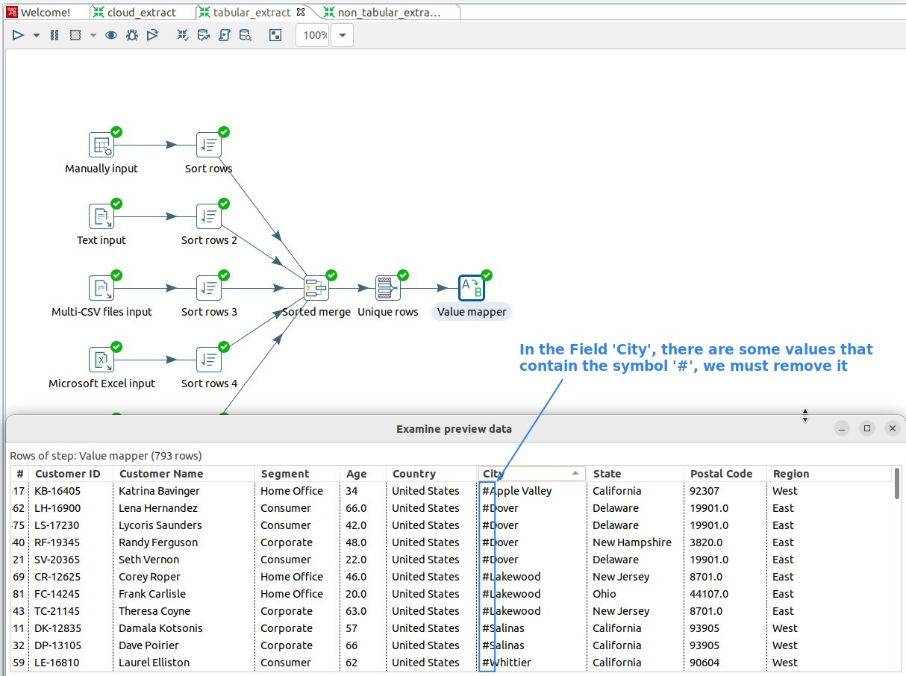
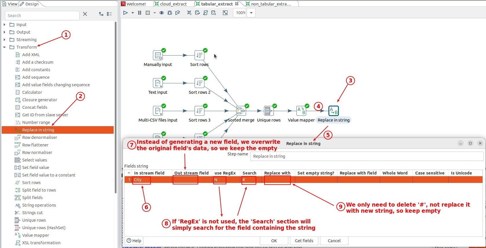
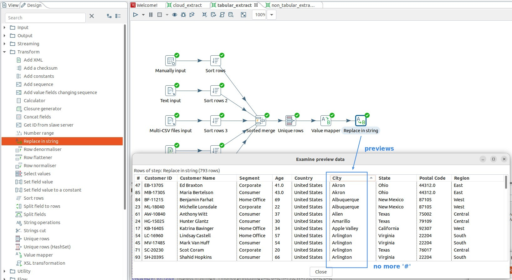

## **Problem: Uwanted characters or symbol**

## **Transform: Replace in string**

- If RegEx is enabled, we can precisely select the value of, for example, Email or Domain name, which is a very powerful feature.

- Throughout ETL, we will often use this step, so do some exercises to familiarize yourself with it as much as possible.

## **Previews**

