## **Lookup: Fuzzy Match**

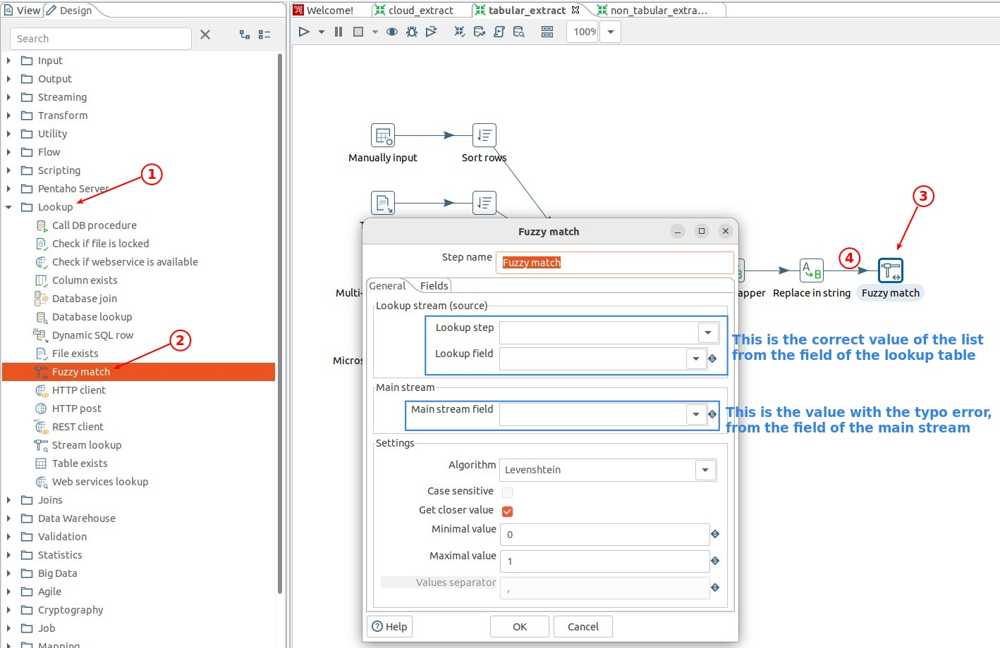

## **Extract Lookup value table**

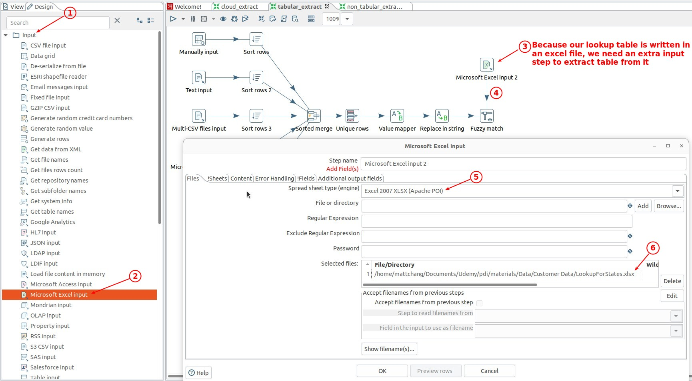

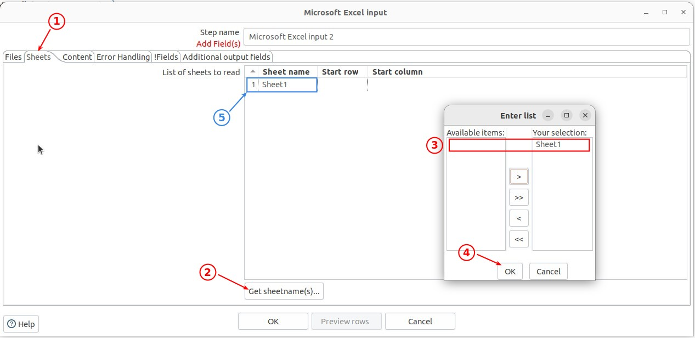

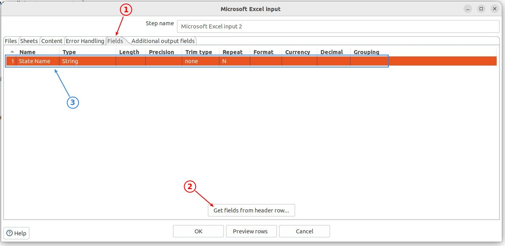

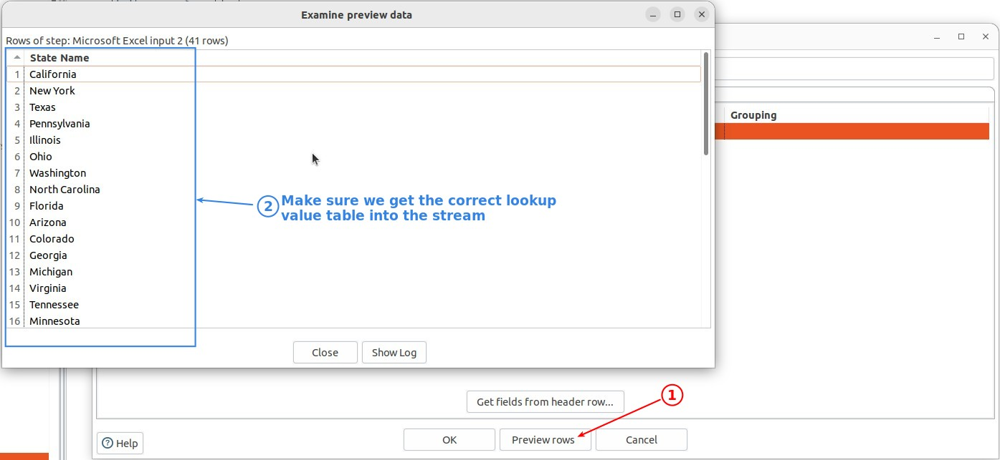

## **Lookup: Fuzzy Match**

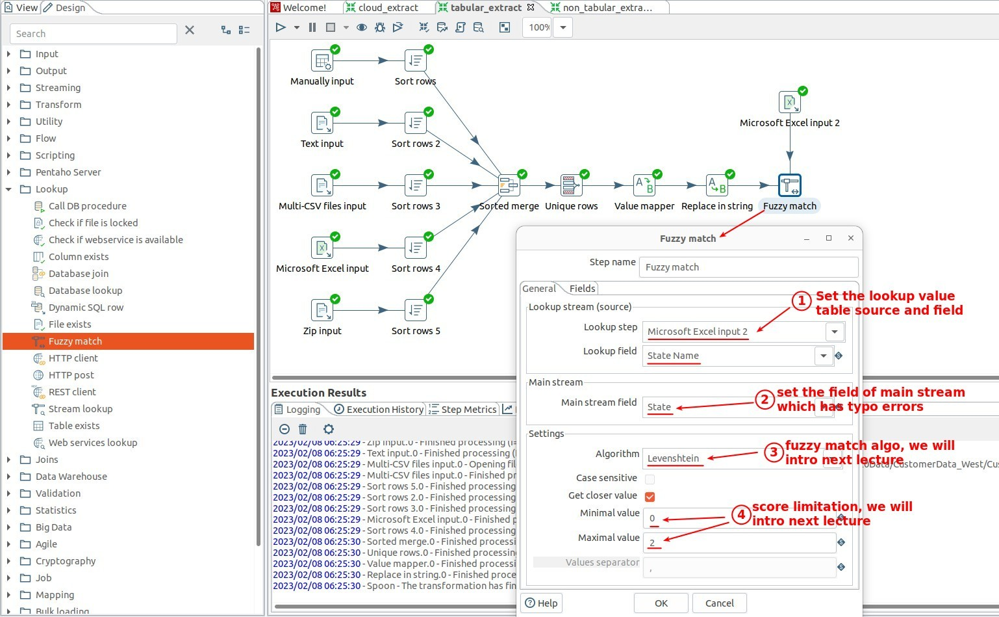

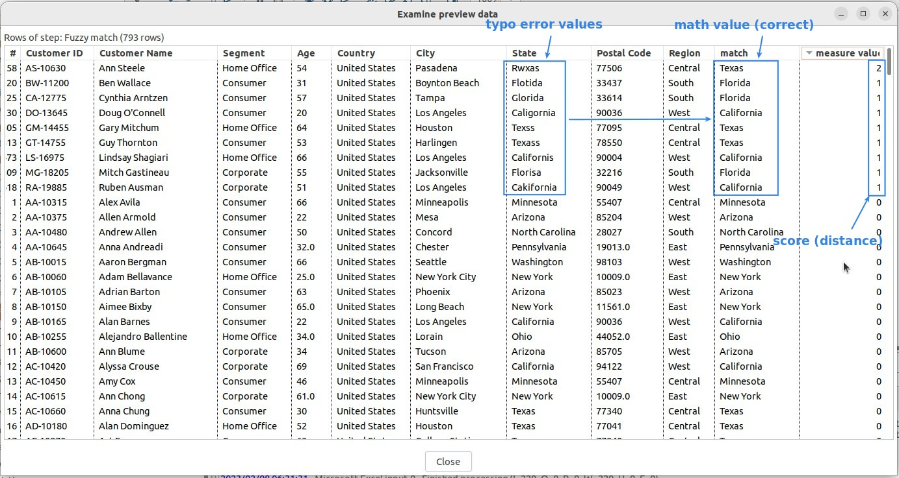

## **Replace column of typo errors with match column**

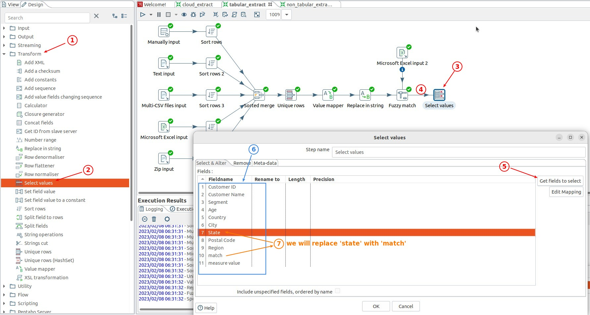

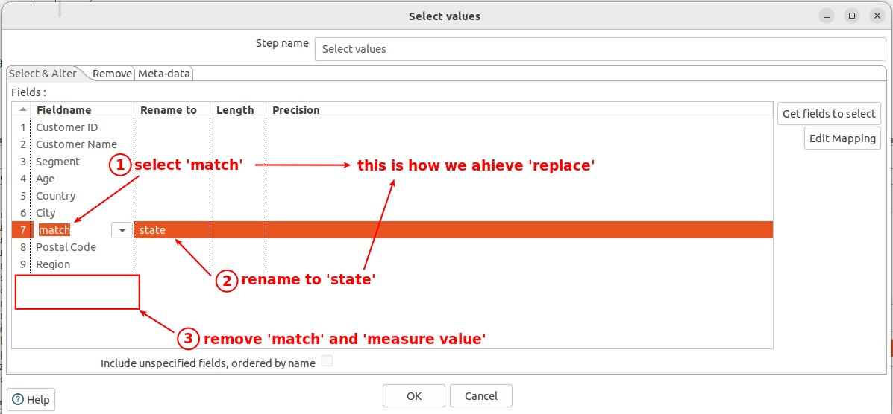

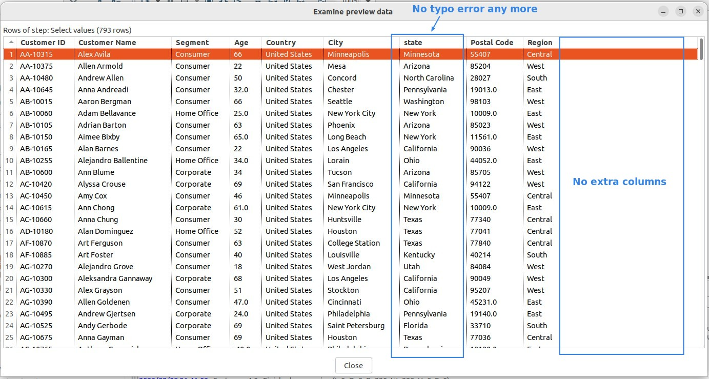

## **Another practice**

### _Lookup value table_

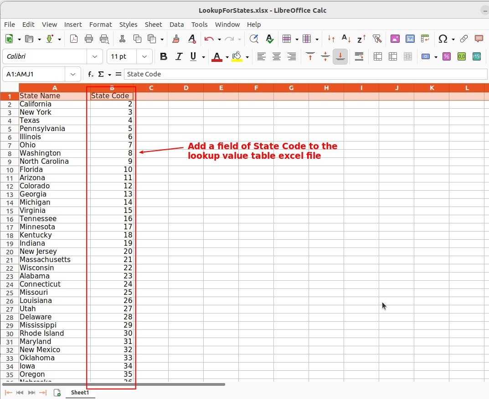

### _Fuzzy match settings_

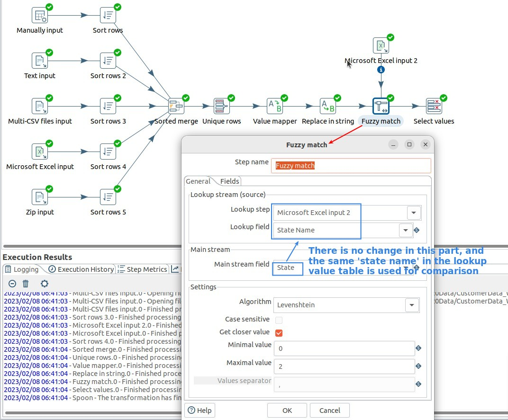

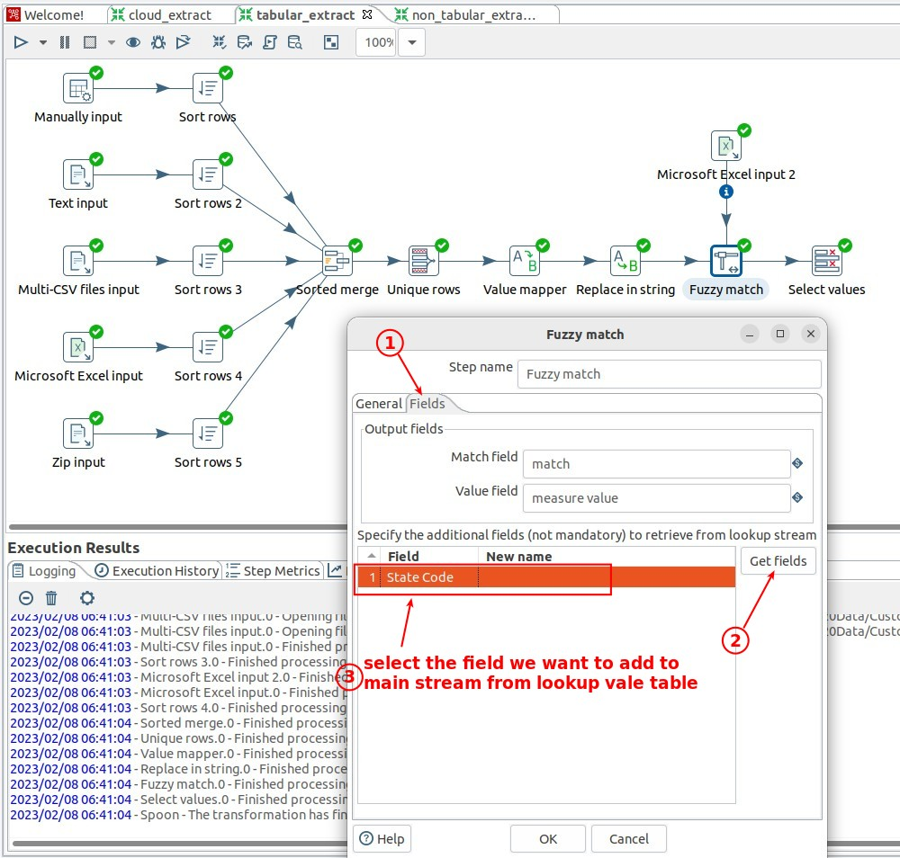

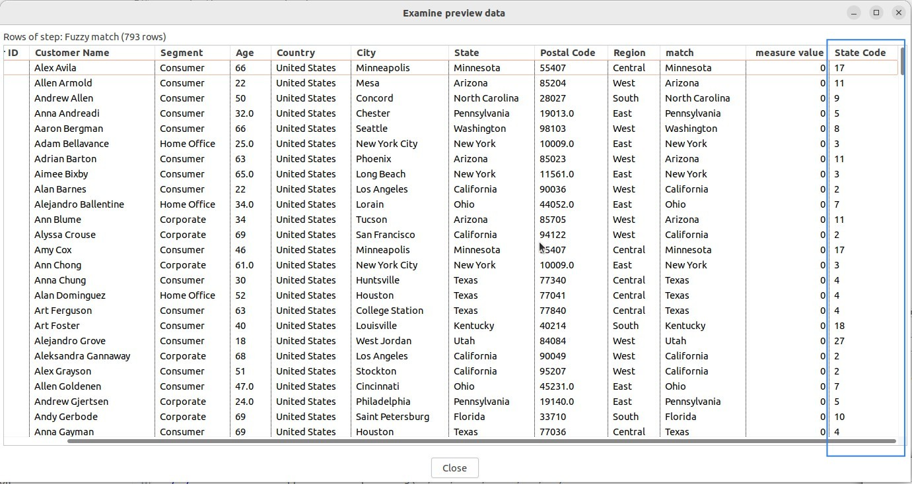

### _Replace column of typo errors with state code_

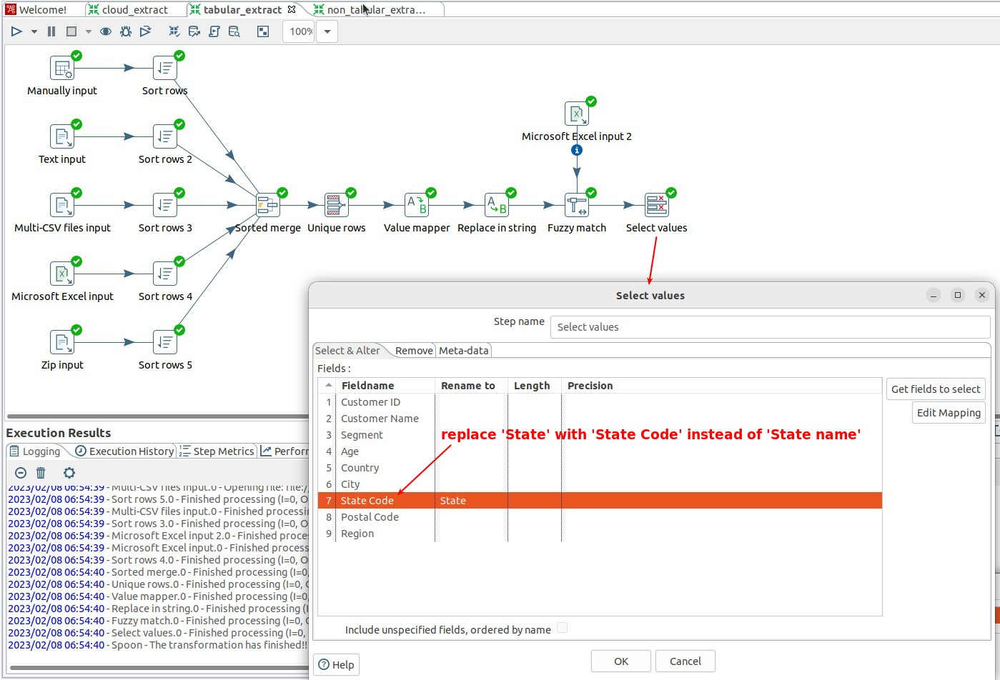

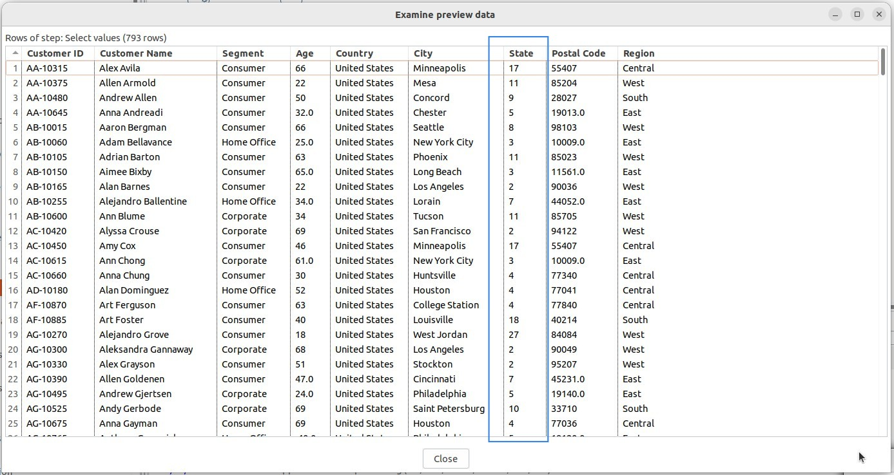
