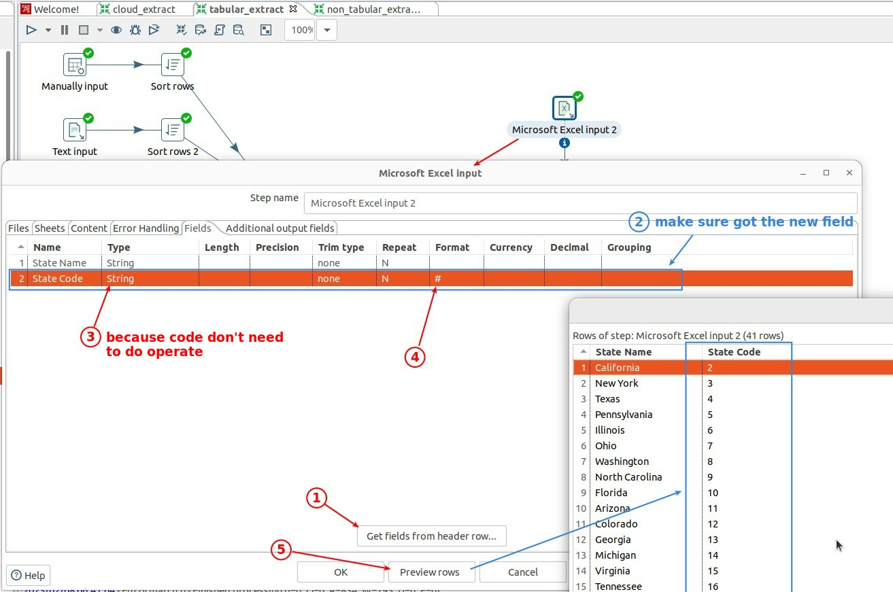

## **Lookup: Fuzzy Match**

## **Extract Lookup value table**

## **Lookup: Fuzzy Match**

## **Replace column of typo errors with match column**

## **Another practice**

### _Lookup value table_

### _Fuzzy match settings_

### _Replace column of typo errors with state code_

