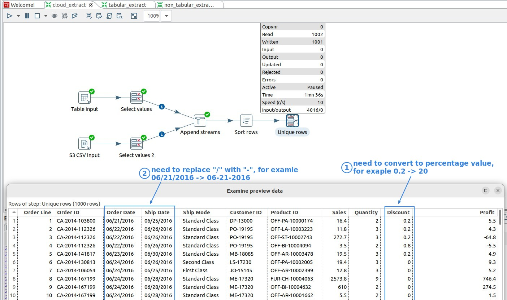
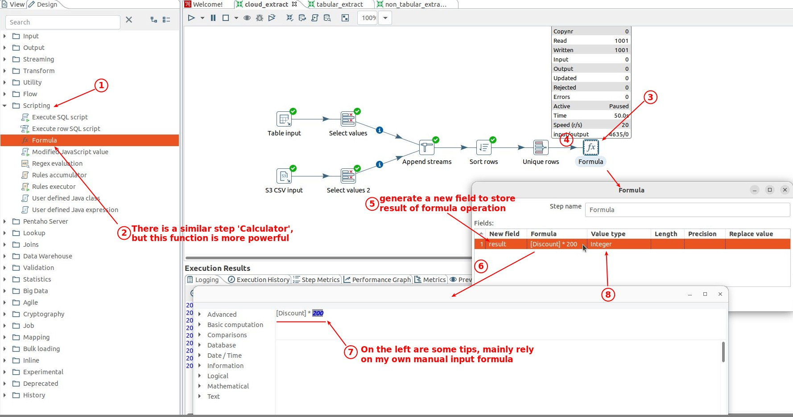
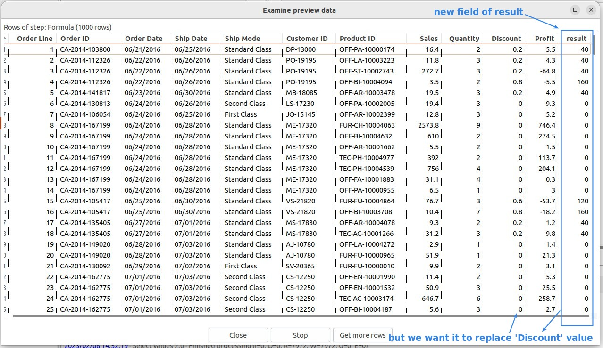
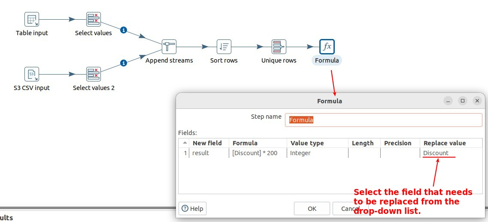
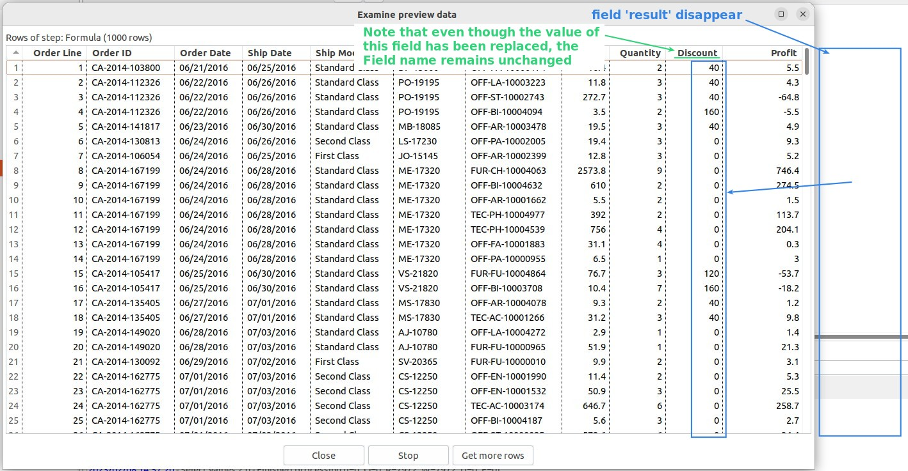
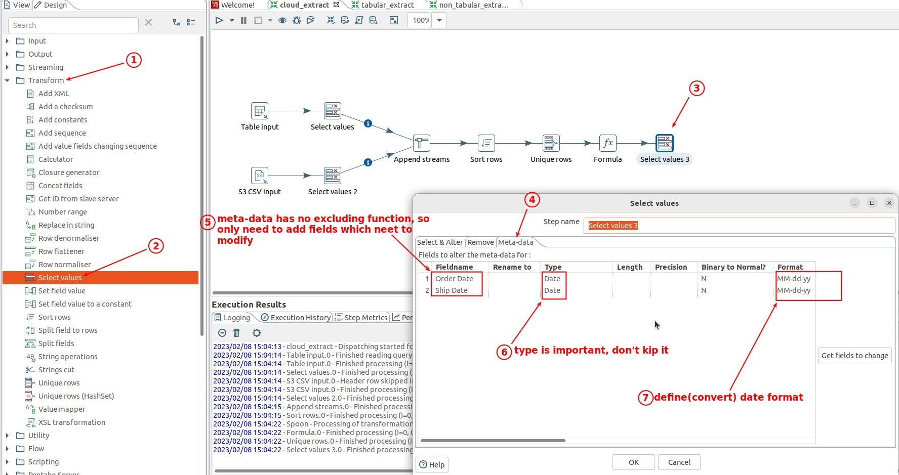
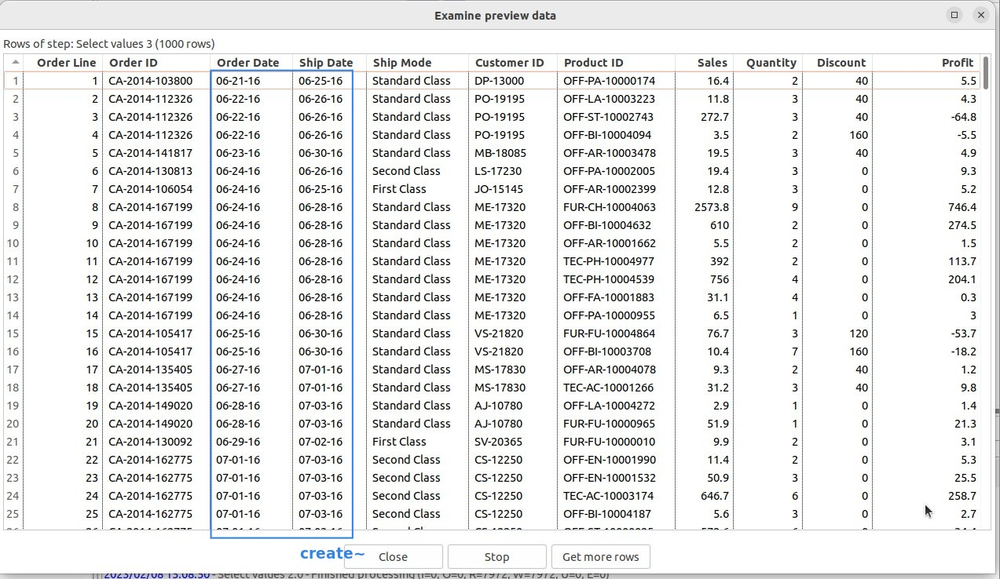

## **Goals**

## **Decimals -> Percentage value**

### _Formula w/o replace feature_

### _Formula w/ replace feature_

## **YY/MM/DD -> YY-MM-DD**

### _Select values_

> Simply use 'Select values' to modify the metadata format of the data type field and you're done!

