## **Check Refence table**

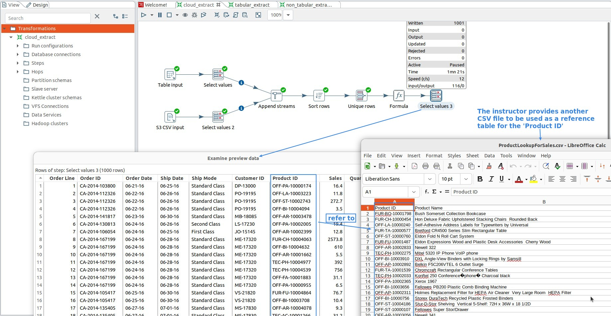

## **Extract from CSV to get Lookup table**

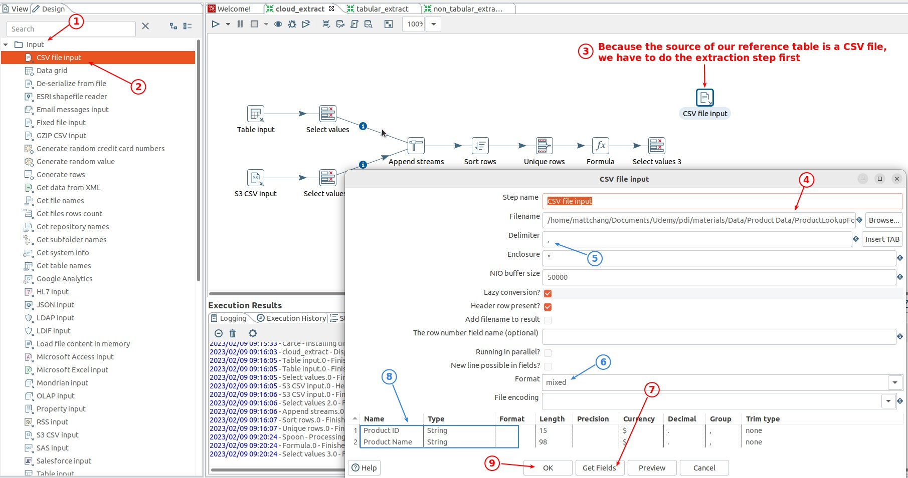

## **Lookup: Stream lookup**

**Prepare**

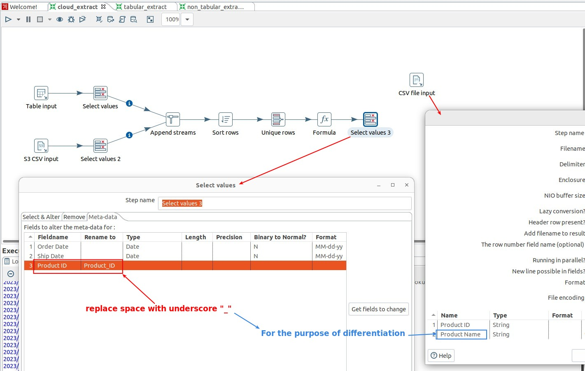

- In fact, there is no need to rename, because the name brought in the 'Field' option of the 'Stream lookup' will be taken from the mainstream Field by default if there are duplicates field names.

**Stream lookup**

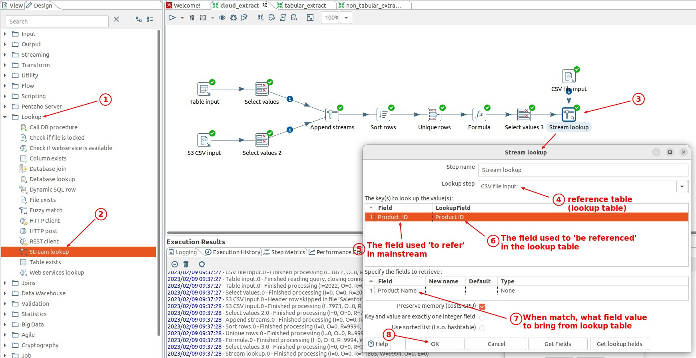

- The seventh step is very important, we must take a field from the lookup table and use it to determine whether it matches or not, instead of just using the reference field to determine.

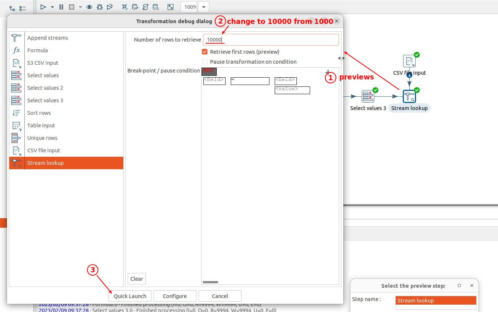

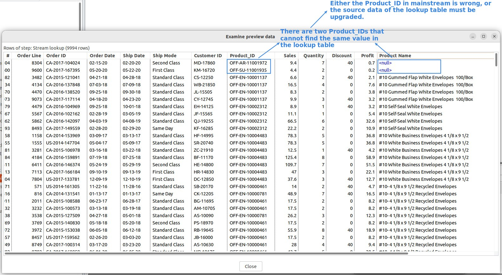

## **Filter out un-match rows**

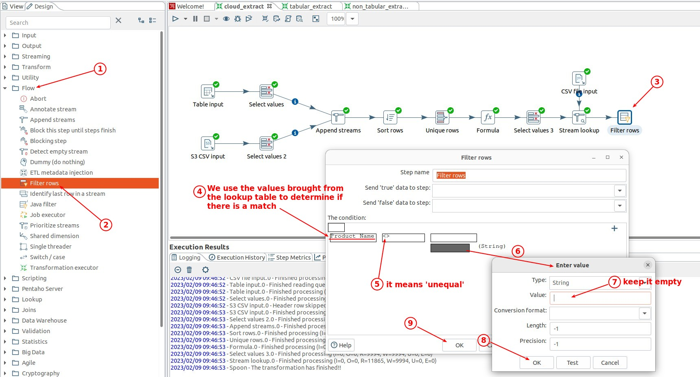

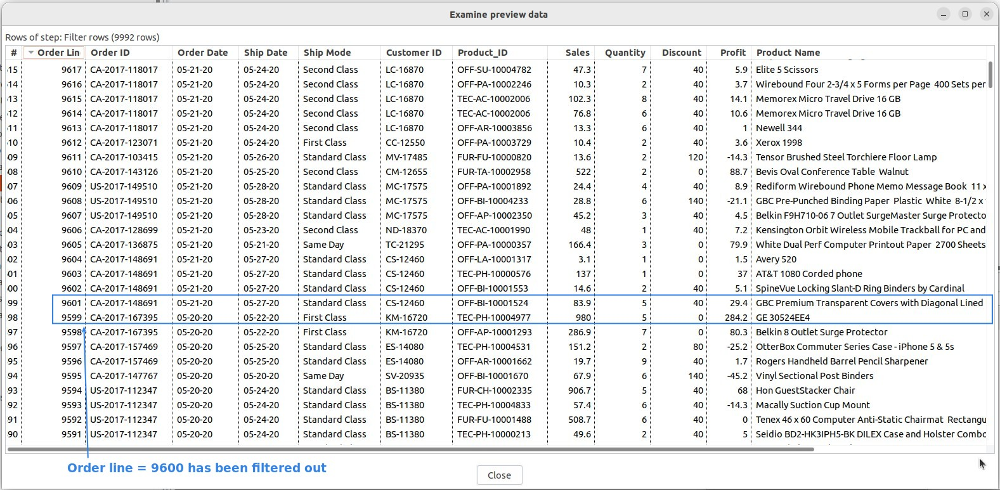

## **Remove lookup field from mainstream**

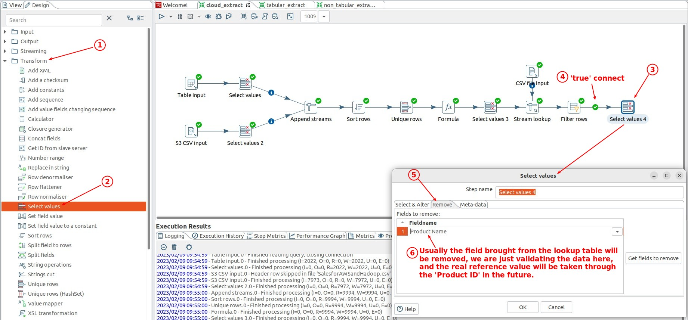

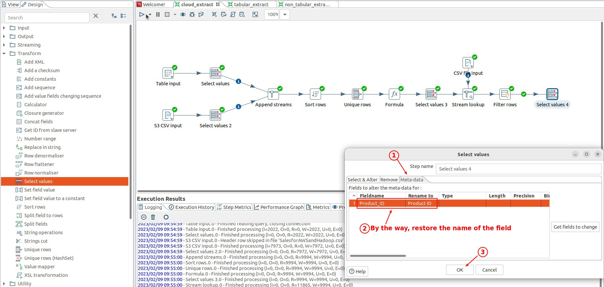

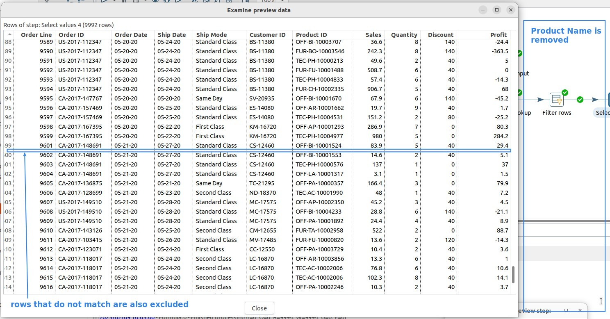
