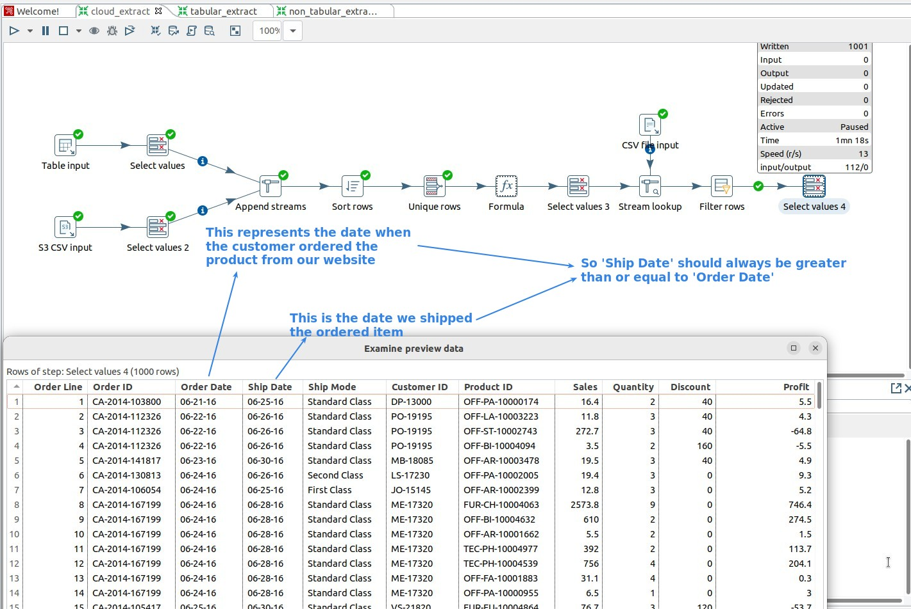
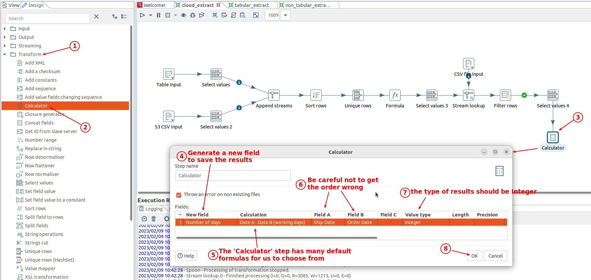
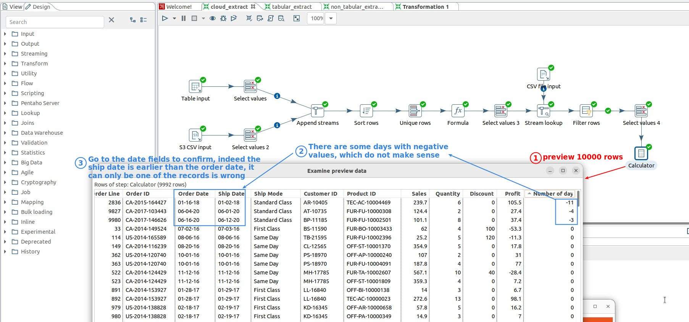
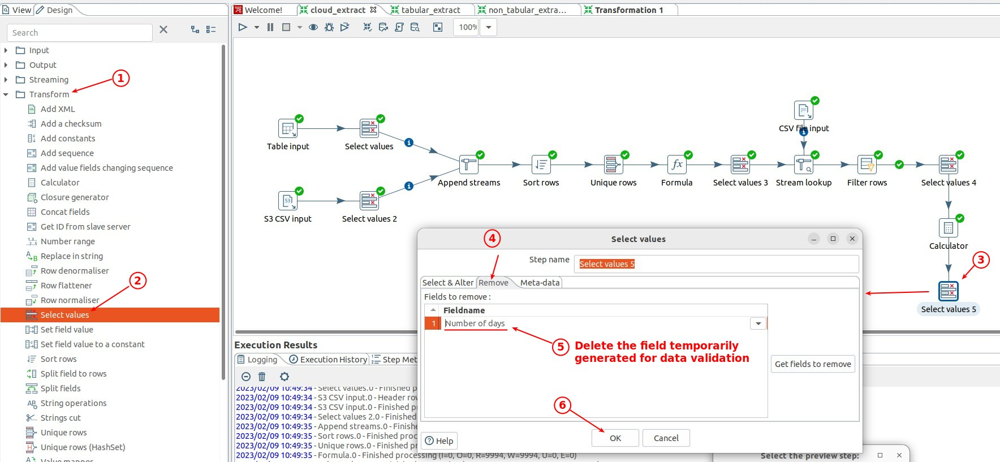
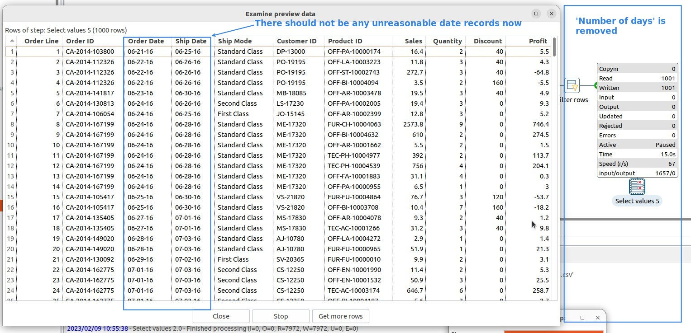

## **Explain the business logic about date fields**

- This is a small example of business logic, which we can handle in data validation.

## **Transform: Calculator**

- The difference between 'Calculator' and 'Formula' is that the former must be selected from a pre-defined formula, while the latter is a self-defined formula.

## **Remove the field temporarily used for data validation**

