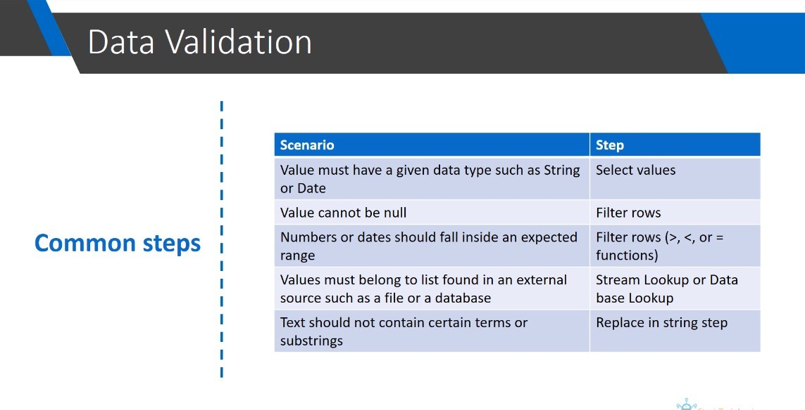

> You can see that there are some steps that are repeatedly used in different processes.

## **Transform: Select Values**

- Sometimes the date or number extracted from the source is saved with a 'String' type to tolerate errors, but this step is used during data validation to return it to its original type.

## **Flow: Filter rows(<> null)**

- There are some fields that cannot be null (no value) and must be excluded using this step, these fields are:

  - Primary key: Product ID, Customer ID, ...

## **Flow: Filter rows(>, <, or =)**

- Many examples have been given in the previous lectures.

## **Lookup: Stream lookup or Database lookup**

- If the data source of lookup table is external database, you can directly use step 'Database lookup', which can save one input step.

## **Transform: Replace in string**

- A common example is the use of this step on a customer comment field, where there may be some insulting words in the comment that you wish to replace with this step.
