## **Error Handling of 'String to Integer'**

### _Check error rows_

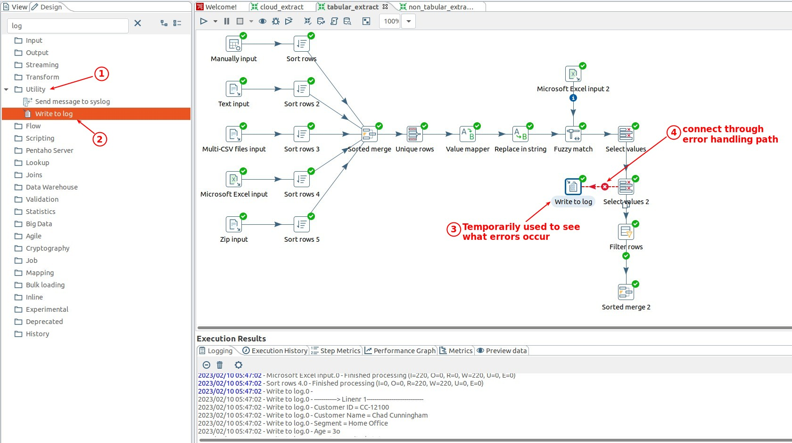

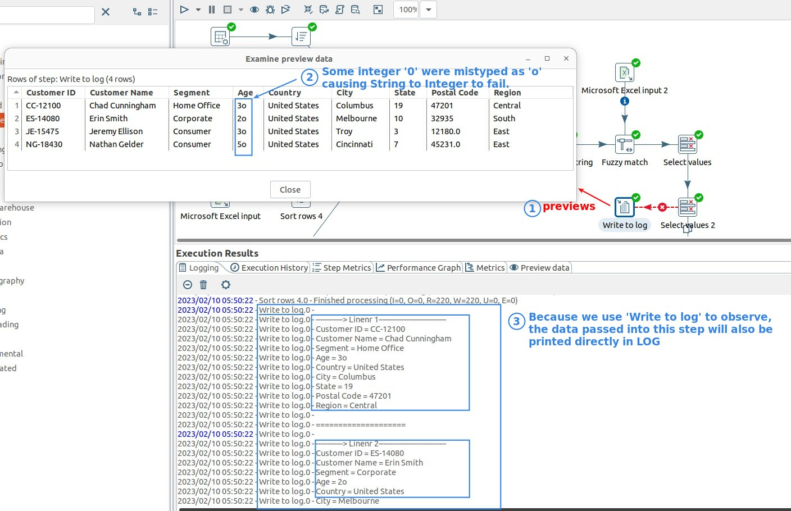

### _Correct error rows_

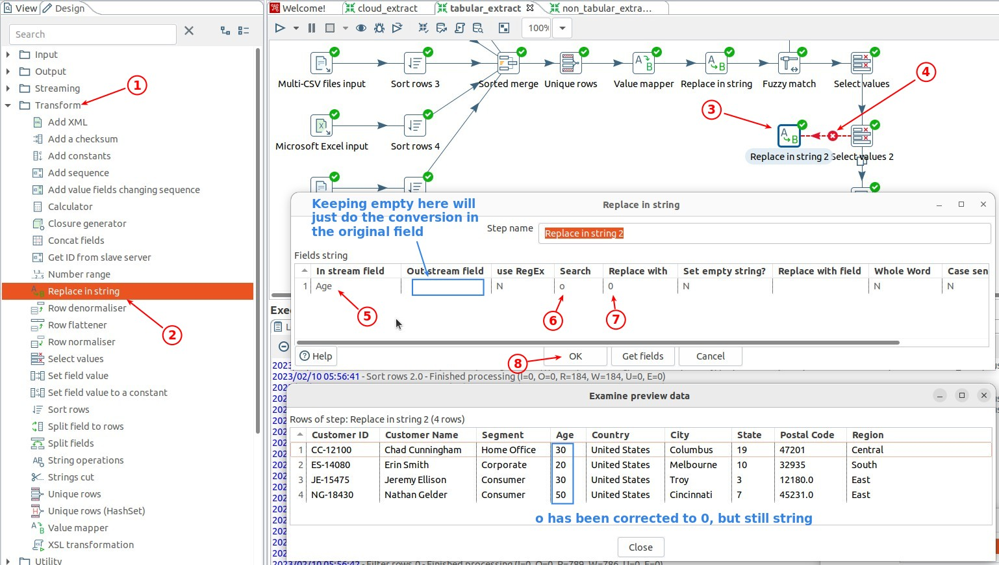

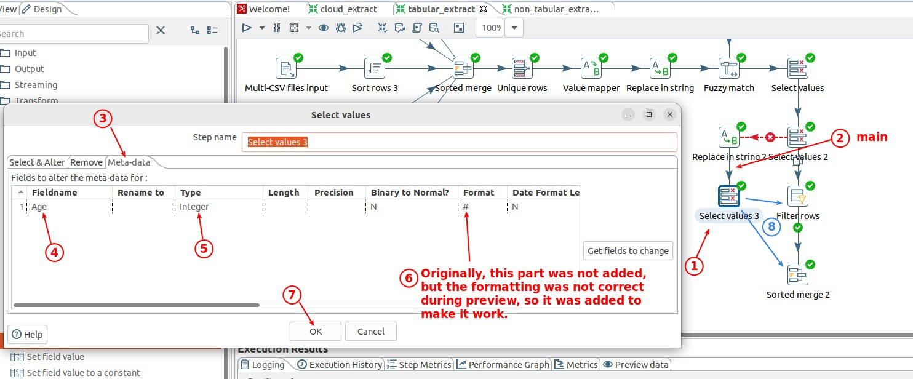

### _Merge back_

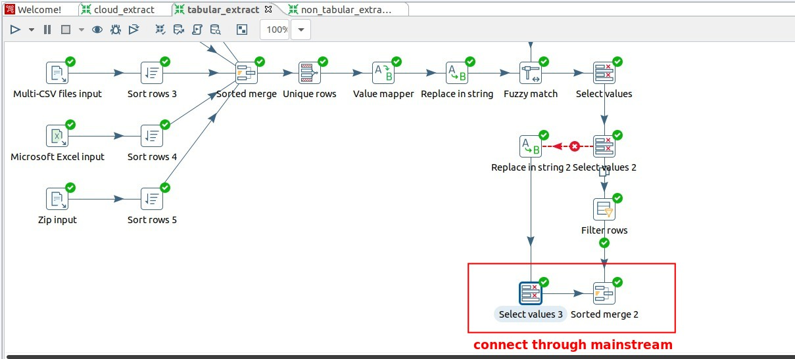

- There are two options for the targets that can be merged here:

  - Filter rows

    - The advantage is that you can continue to verify the positive value of the data after exception processing.

    - However, an additional 'Sort rows' step should be added later, because the order of the data after merge will be disrupted.

  - Sorted merge

    - If you are sure that the negative value will not occur in this exception, you can merge directly to this step.

    - Because the sorting is not disrupted, there is no need for an additional 'Sort rows'.

## **Error Handling of "Positive number"**

### _Check error rows_

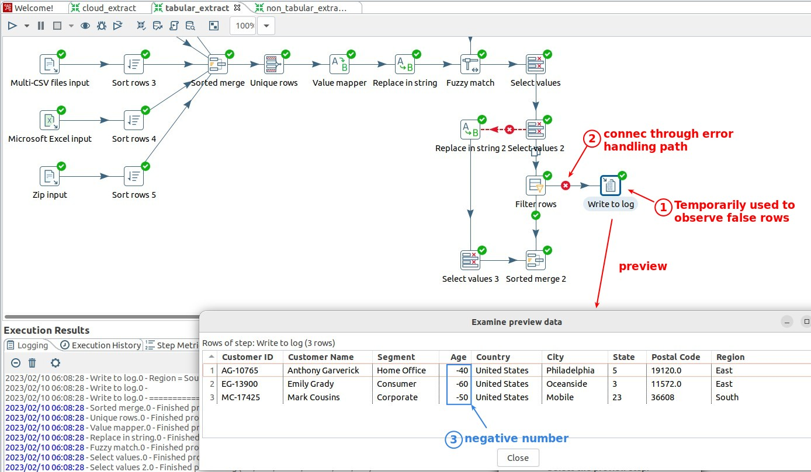

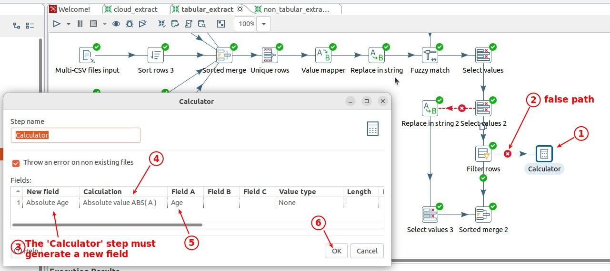

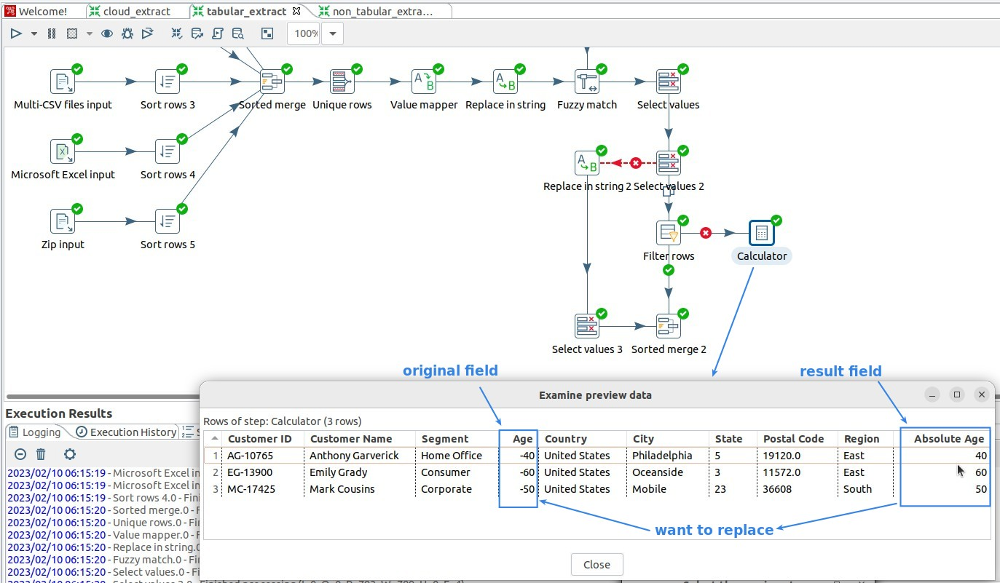

### _Correct error rows_

> Unlike 'Replace in string', 'Calculator' must store the result in a new field, so there is an additional 'Select values' to handle it.

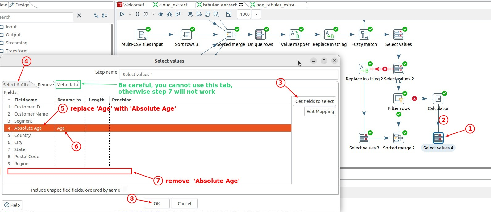

- Be especially careful not to misuse tab 'Meta-data', which has no ability to add or subtract fields.

### _Merge back_

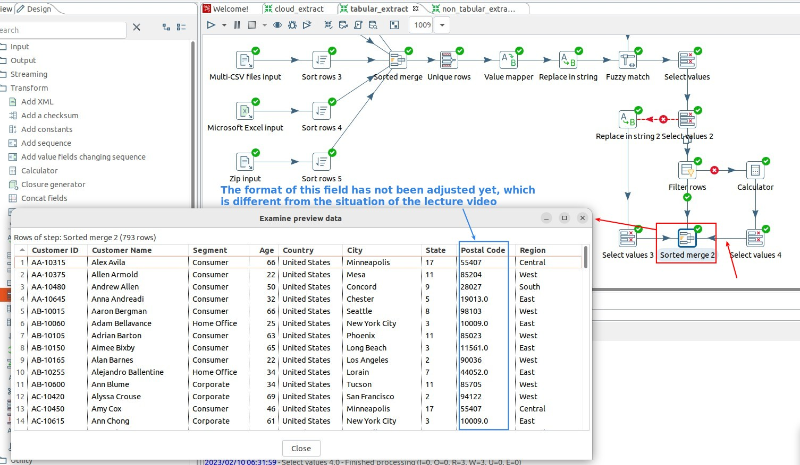

## **Postcode format problem**

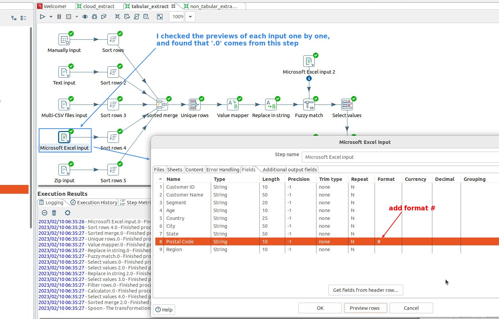

- This format setting only works when added to the 'input' step.

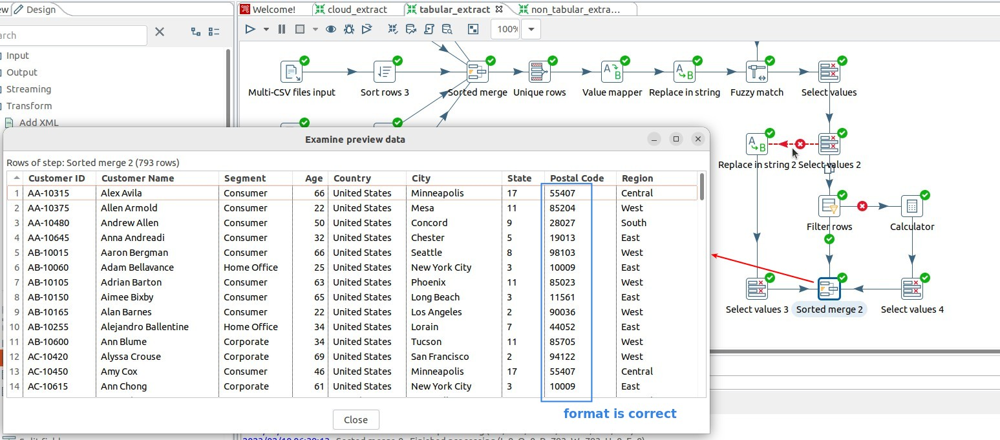
