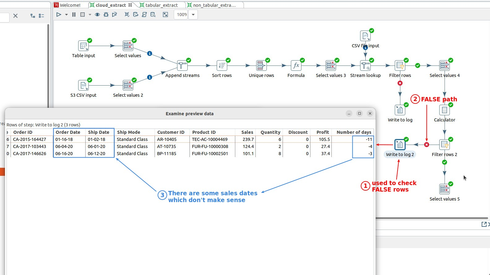
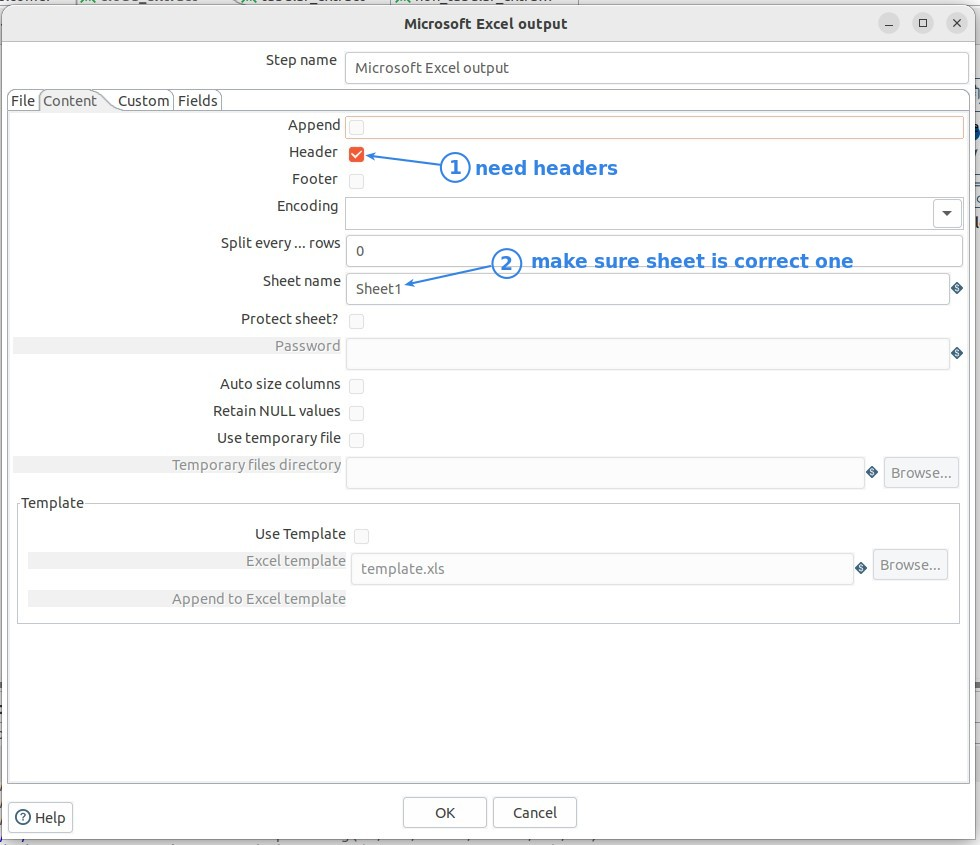
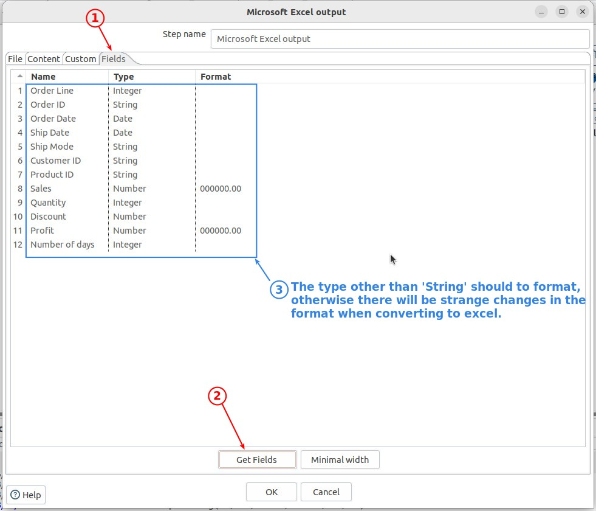
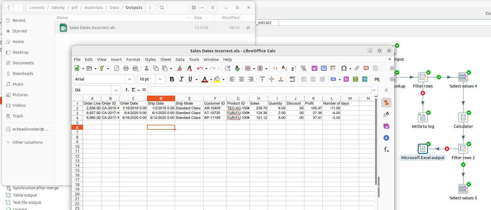

## **Check Error rows of sales date validation**

- It is important to know at which step the exceptions in this data validation will be generated.

  - Calculator - only calculate and store result in new field.

  - Filter rows - filter values in new field, so exceptions will be generated in this step.

## **Error handling - Output: Microsoft excel output**

- Be careful of setting pages with both filename and extension fields, it is best to use the 'Show filename(s)' button to do a double check.

- The practical result is that even if the type is set to 'String', the format will still go wrong, so may need to spend more time on this part.

## **Check result file**

