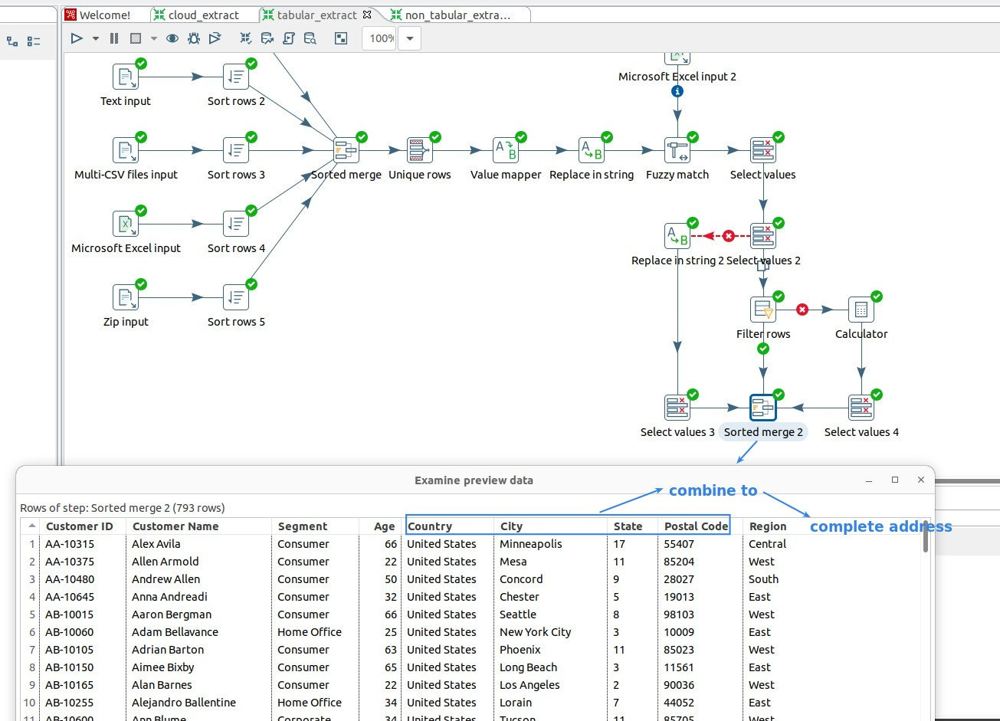
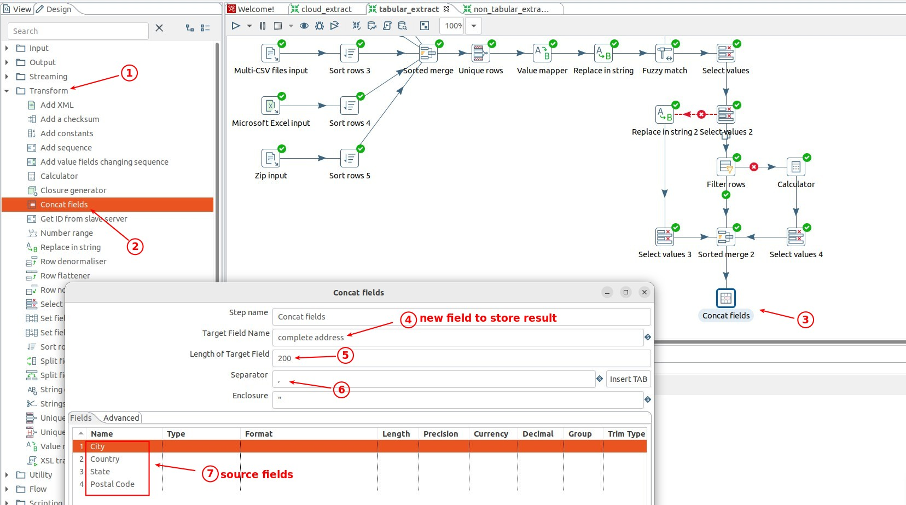
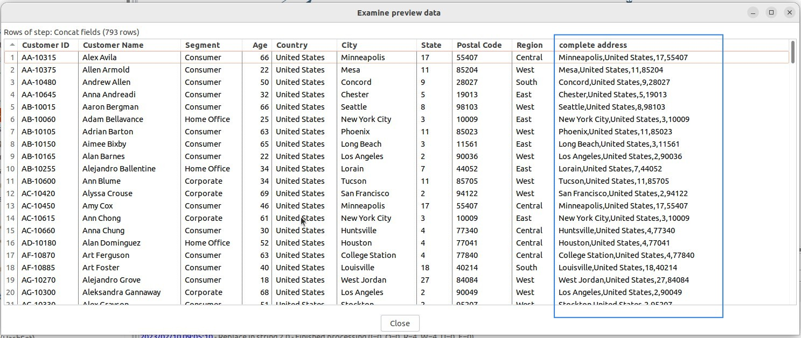

## **What to do?##

- To assemble a new field from existing fields to get more information.

## **Transform: Concat field**

## **Result**

## **Concept**

- The process to combine or analyze existing fields to get new fields to get more information is Transformation.

  - This is usually not done before the data is sent into the data warehouse, but afterwards.

    - So this part is just an example, it will be deleted.
