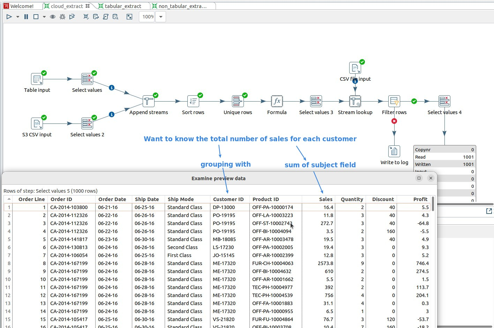
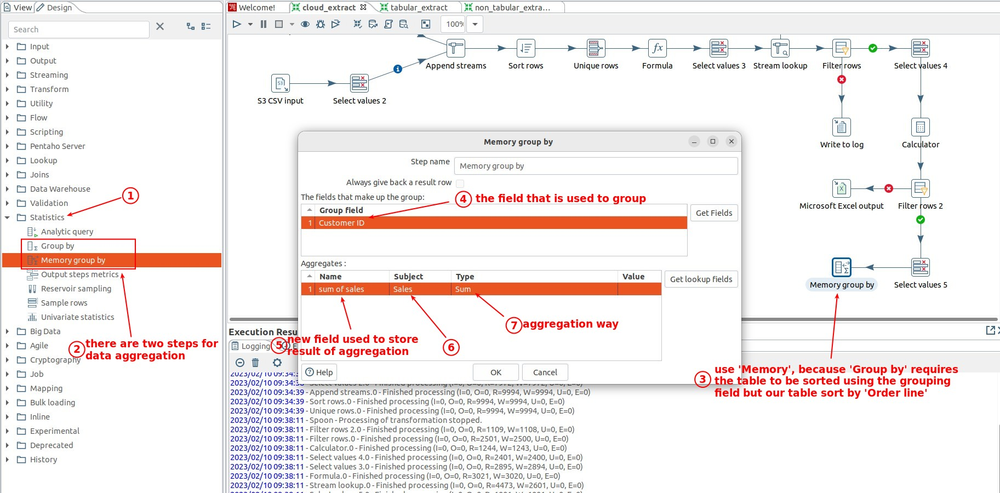
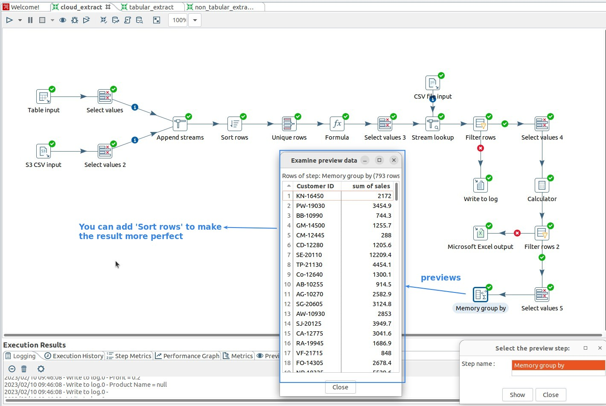
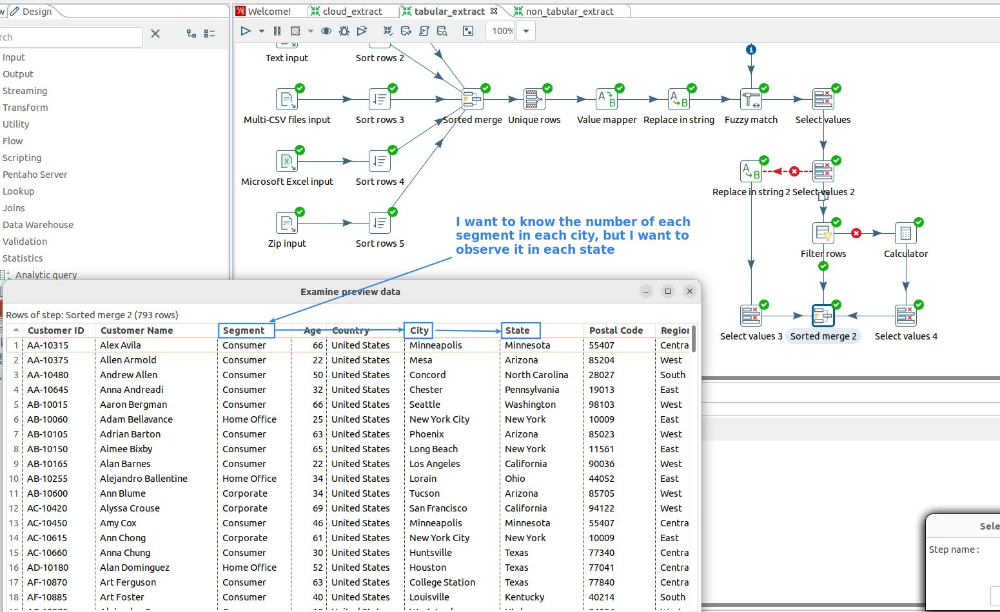
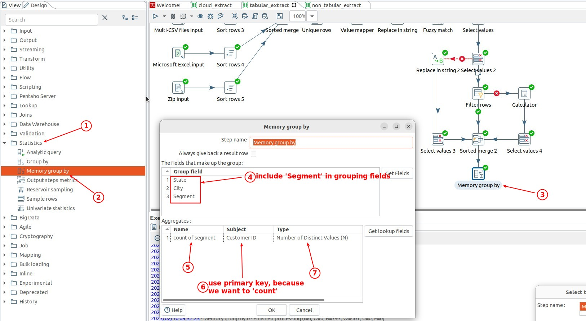
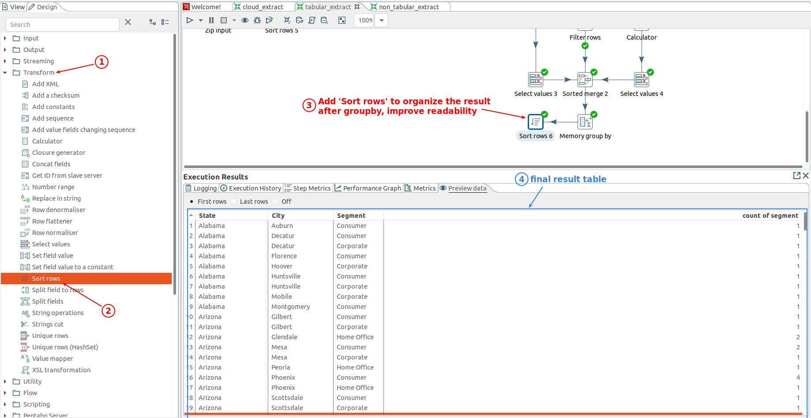

## **Data Aggregation of Sales table**

### _Instruction_

### _Grouping_

### _Result_

## **Data Aggregation of Customer table**

### _Instruction_

### _Grouping_

- So there can be more than one Group field.

- Note that the primary key field is used here for the subject field, because it is necessary to do so in the use case of counting, so be careful.

### _Result_

