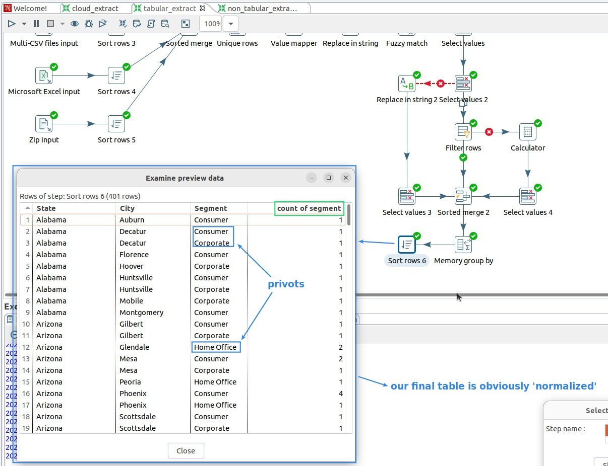

## **Concept**

- We may need to switch between these two tables because:

  - Some software tools, such as drawing, may require different table formats.

  - The two types of tables have different features such as retrieval speed and capacity, which need to be used according to the requirements.

**Our currently table is?**

## **Transform: Denormalizer**

## **Transform: Normalizer**

