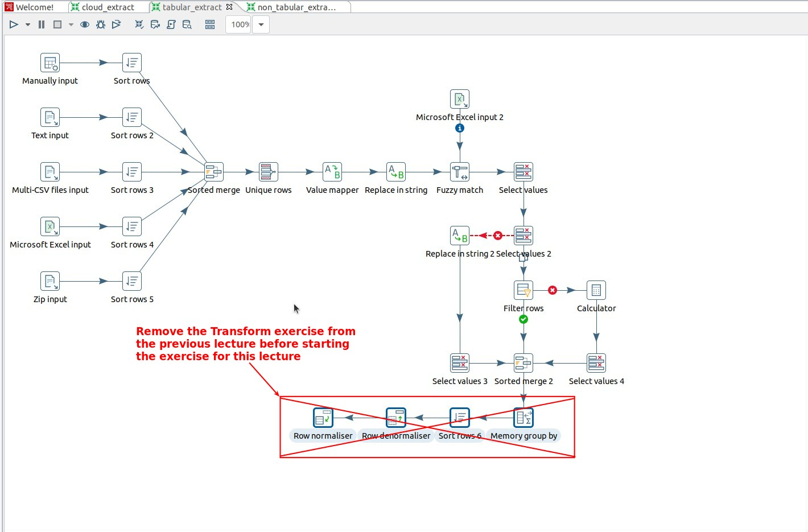
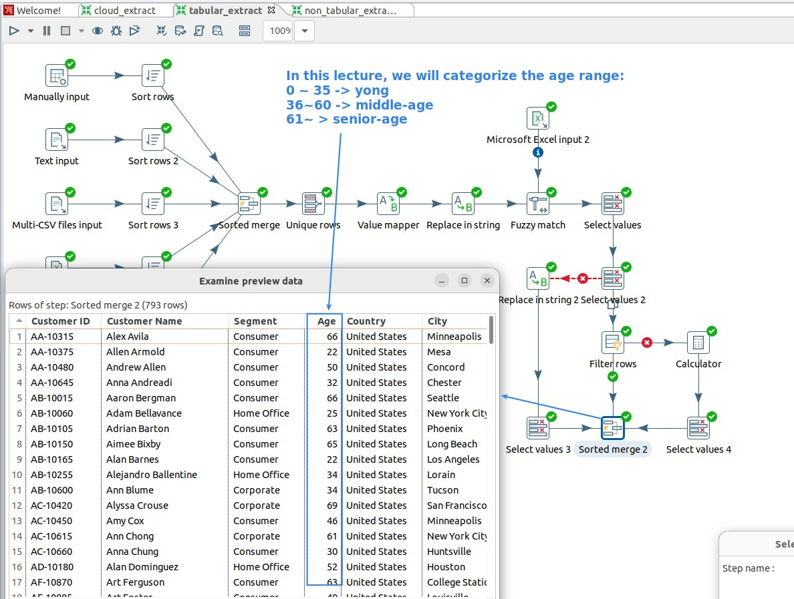
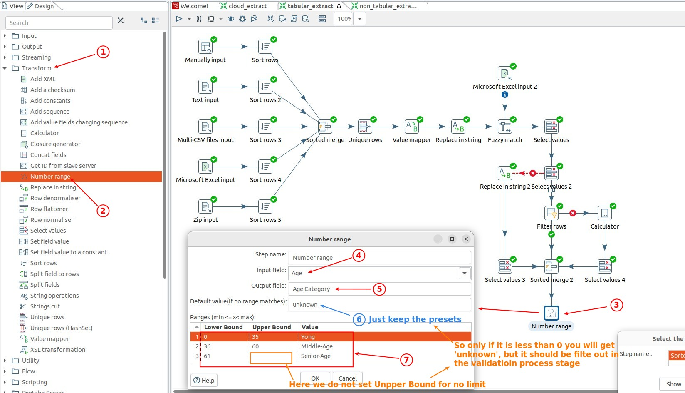
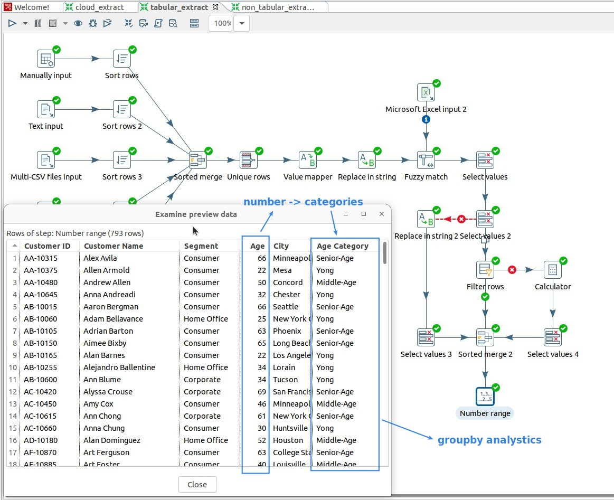
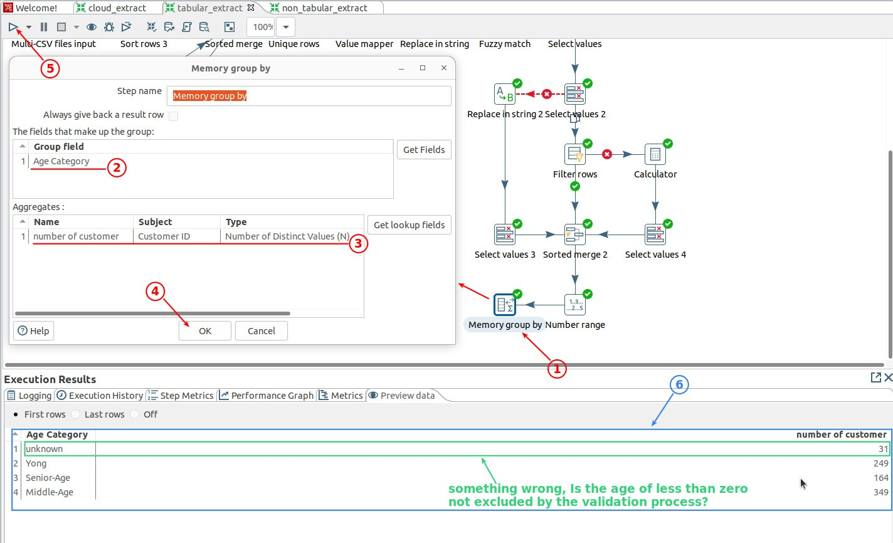
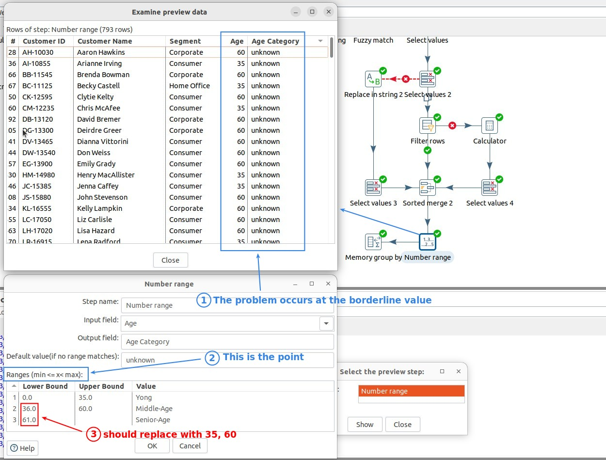
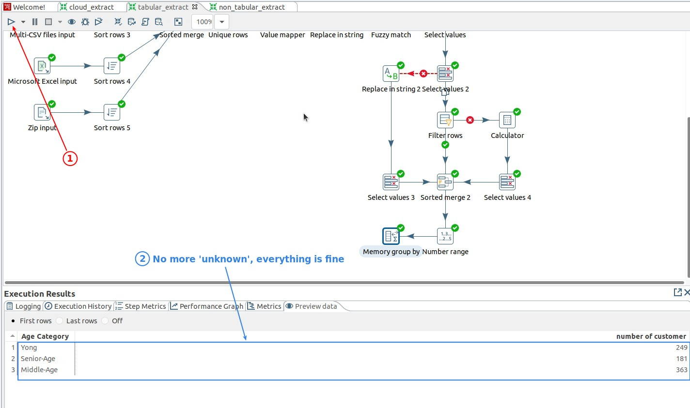

## **Prepare & Objective of this lecture**

**Remove Transform steps from the previous lecture**

- Transform steps cannot be processed in another series of Transform steps, so usually we don't put the Transform process here directly, but the course does so for illustrative purposes.

**Explain the goal of this lecture**

## **Transform: Number range**

- When we want to analyze the value of the field, it is very common to classify the field first and then analyze it with groupby.

## **After the category, continue to Groupby Analytics**

