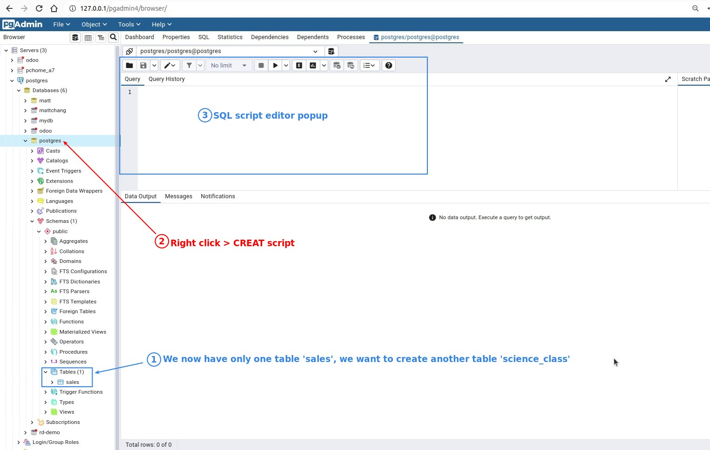
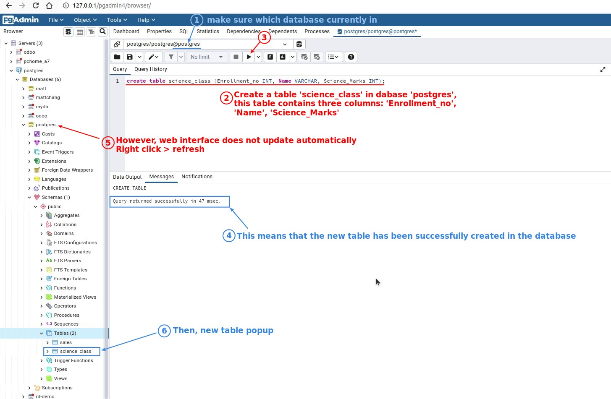
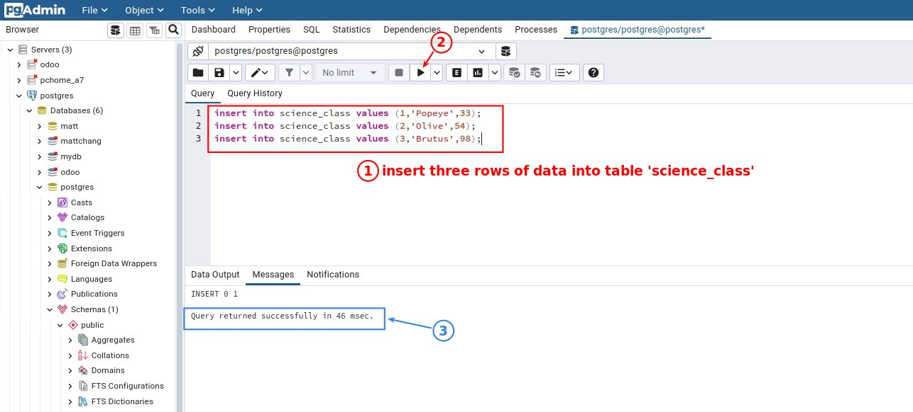
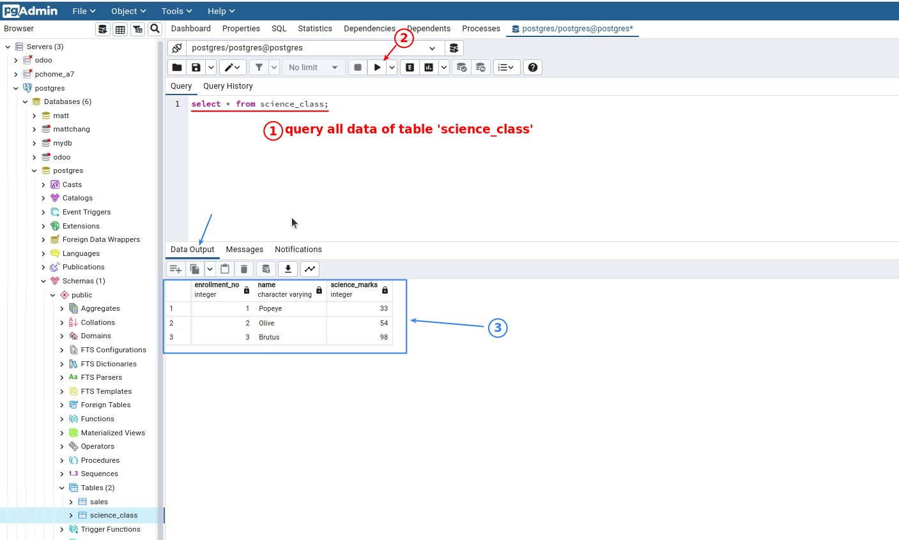
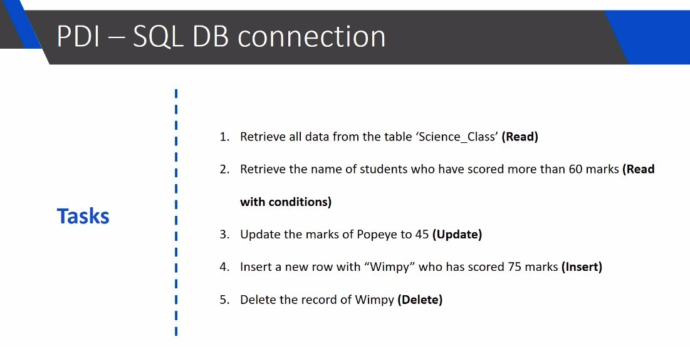

## **Prepare: Create a table with some data in database**

### _PGAdmin SQL script editor_

### _Create table_

### _Insert data_

### _Query all data_

## **Plan to do in following lectures**

> We will do the following four operations on the above table through PDI, in the subsequent lectures.

