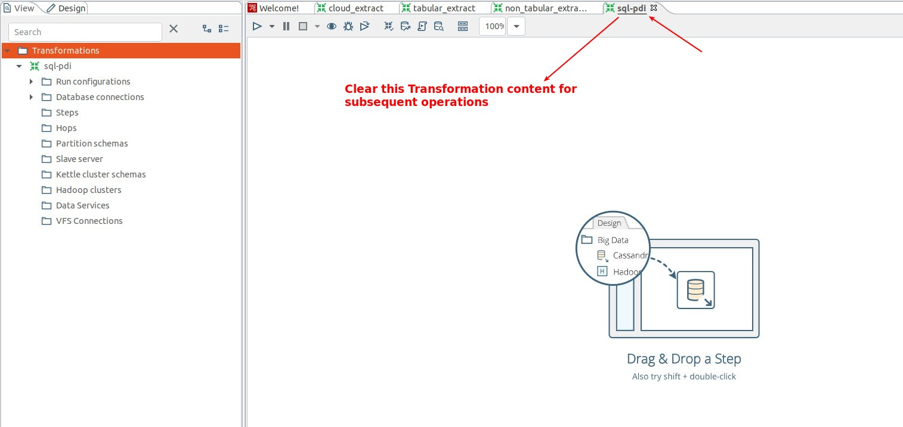
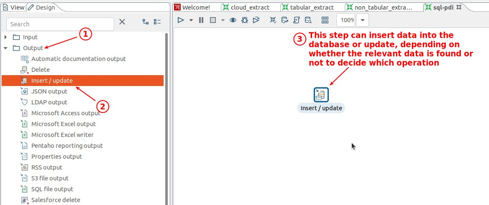
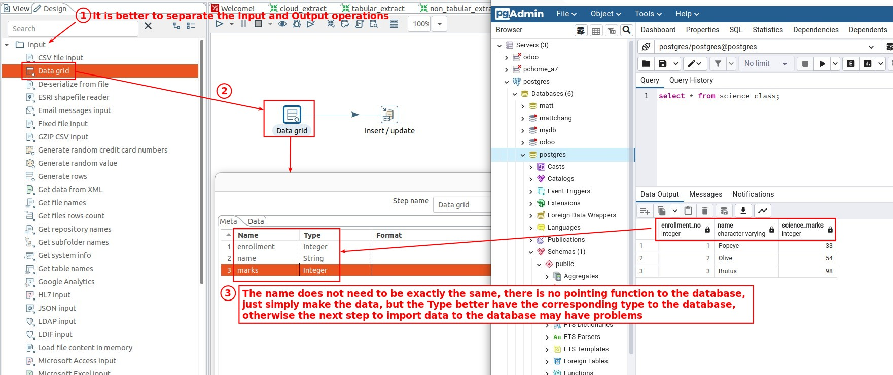
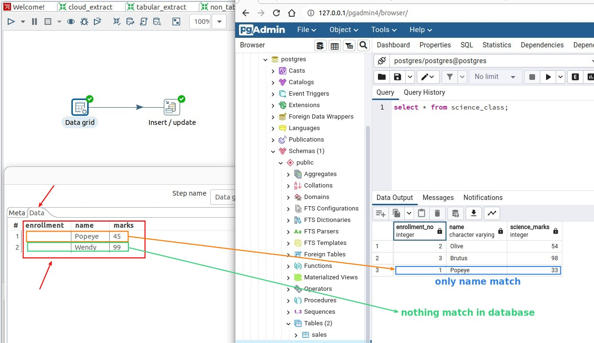
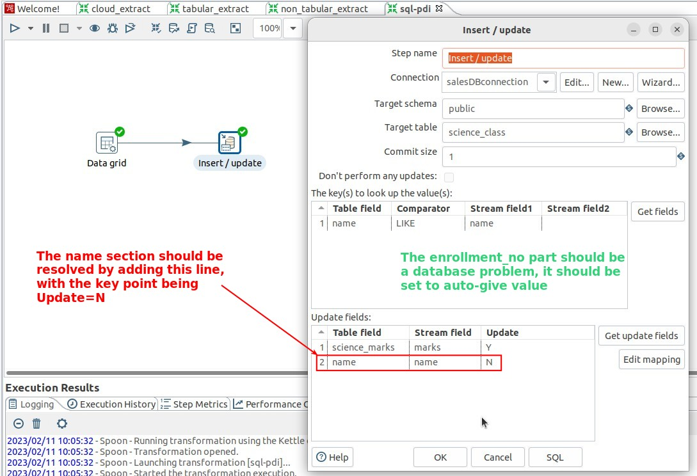
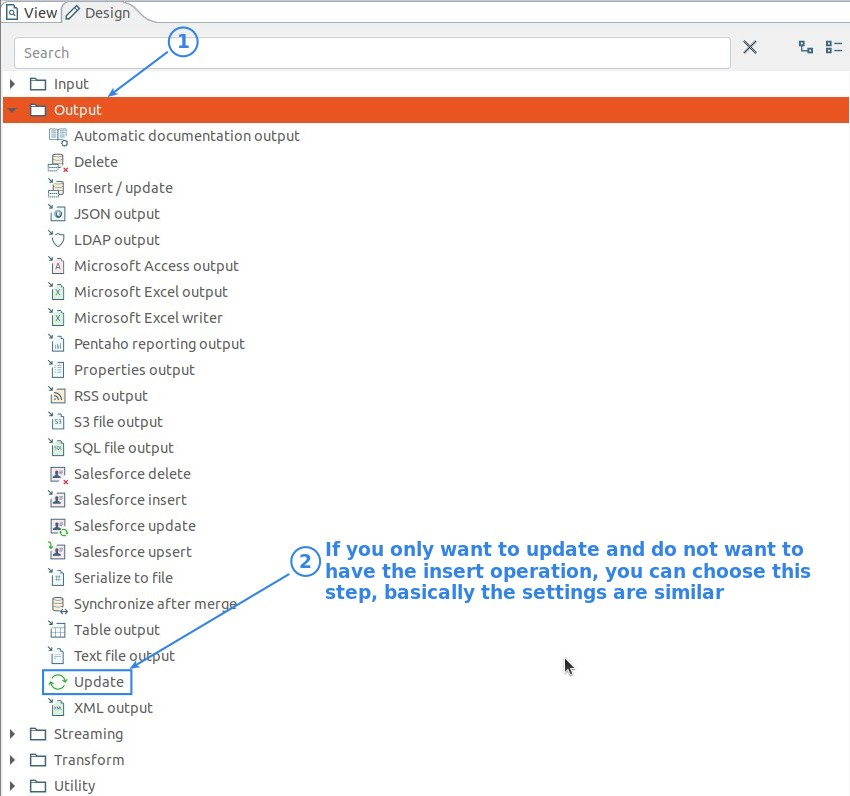

## **Prepare**

## **Output: Insert/update**

> The insert or update database data is an output operation, so the step is classified as 'Output'.

## **Input data by Grid data**

### _metadata_

### _data_

- I intentionally left the enrollment field empty in the above image to see what happens.

## **Configure Insert/update**

- So I got two conclusions:

  - The data in mainstream doesn't have to be complete, as long as the fields that need to be used to match or to update and insert have values.

  - Only fields that are populated in 'update fields' will be updated or inserted, other fields will not be updated or inserted even if they have values in mainstream.

    - So in 'update field', fill in as many fields as you can, and if there are some fields that are not allowed to be changed if they already have values in the database, then Update must be set to N.

## **How to fix the problem**

## **If only need to update**

- The lecturer is directly suggesting to use only 'Insert/update', but I think you can use this step if you want to avoid accidental insert.
