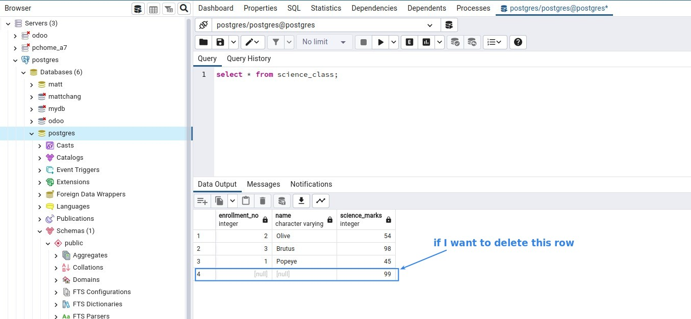
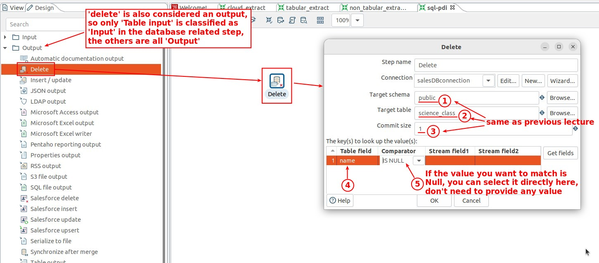
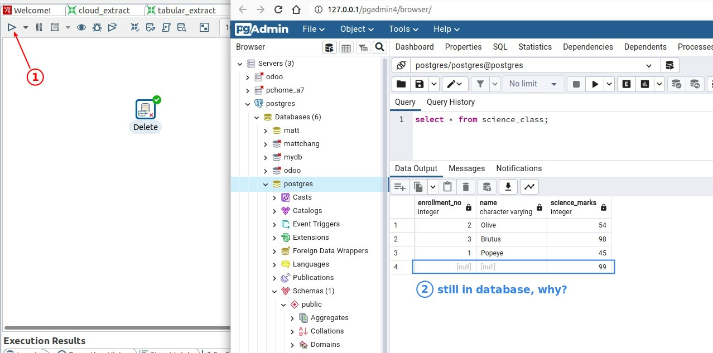
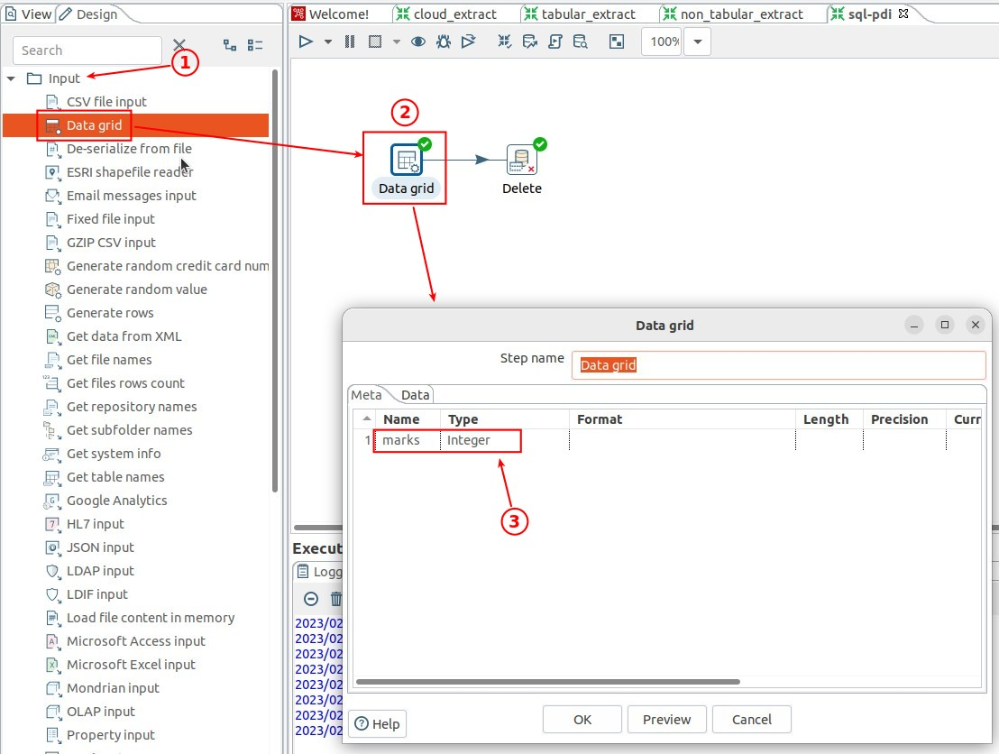
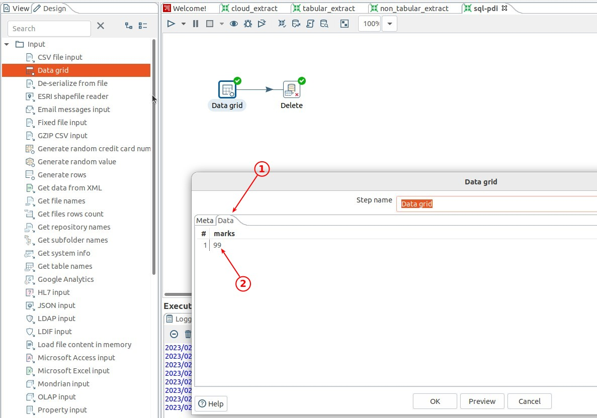
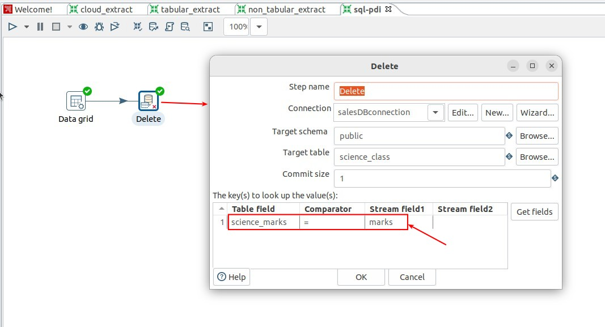
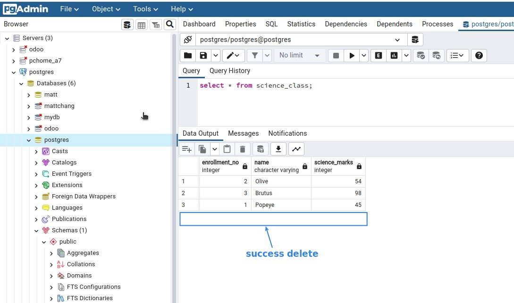
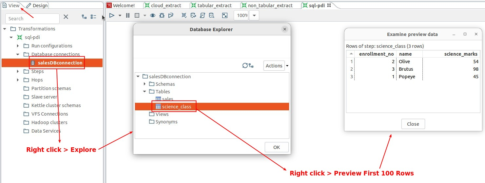
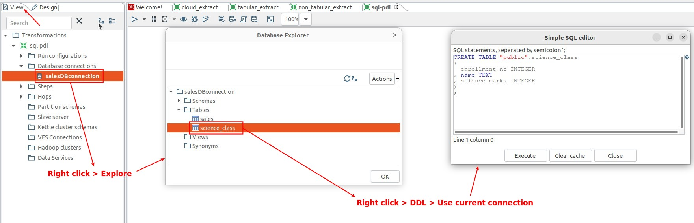

## **Plan**

## **Output: Delete**

### _Delete by 'Comparator' = 'Is NULL'_

### _Detete by comparing table data with mainstream data_

## **Explore database through PDI**

### _data_

### _DDL_

