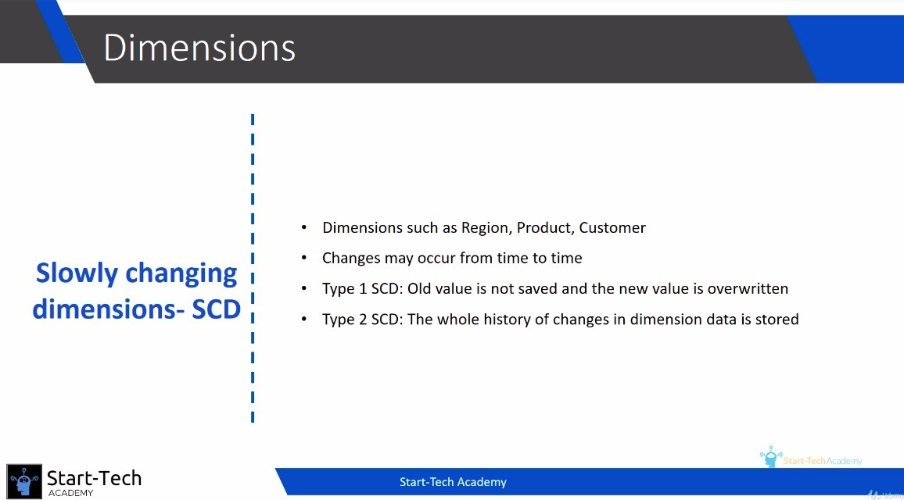

## **What is SCD dimension table**

**Not SCD dimension table**

- Such as time timension table, It will never change.

**Type 1 SCD dimension table**

- In our case, the customer table falls into this category.

  - The only time customer data needs to be changed is when it is incorrect.

    - So we don't need to save the past data, that is Type 1 SCD.

**Type 2 SCD dimension table**

- In our case, the product table falls into this category.

  - Product information may be to be changed, such as category, price, etc.

    - But we want to preserve the historical data, which is called Type 2 SCD.

      - In order to save the historical data, the data will have the update time and version field, the historical data and the current data will be saved in the same dimension table.

## **How PDI treats different dimentaion tables**

**To type 1 SCD**

- When loading it, it DO NOT store the update date and version.

**To type 2 SCD**

- When loading it, it DO store the update date and version.

