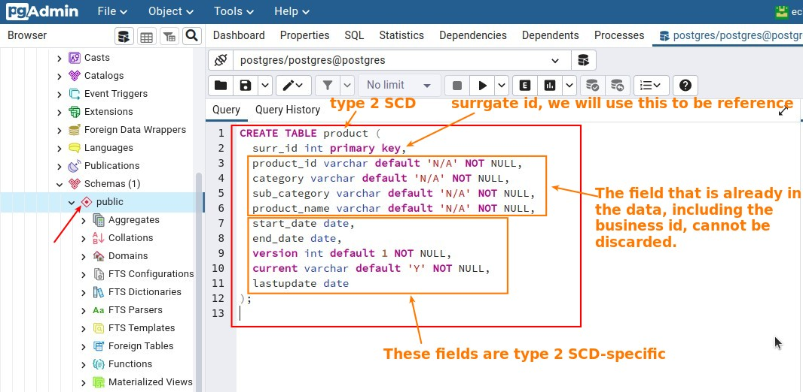
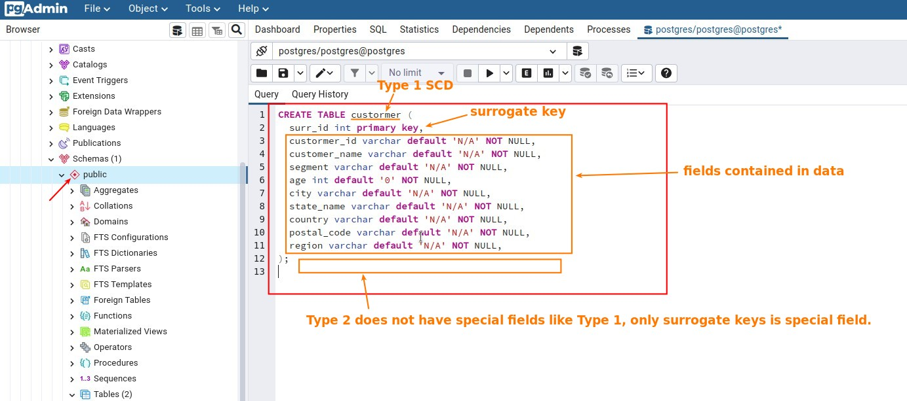
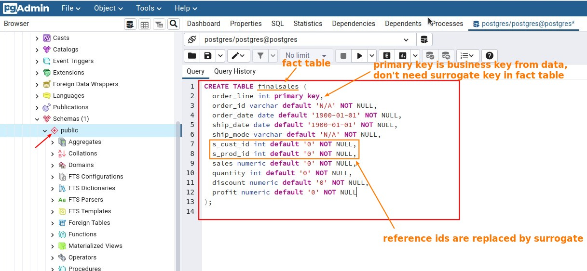
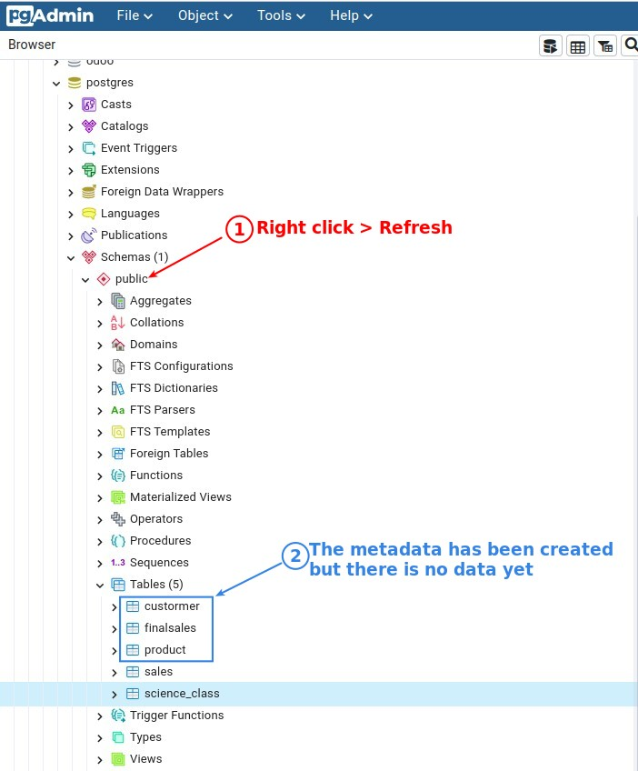

# ***Create Tables for loading data in PDI***

> We will create three corresponding tables in the database to simulate the data mart, so that the data we processed in PDI will have a load destination.

## **Dimansion tables**

### _Type 2 SCD_

### _Type 1 SCD_

## **Fact table**

## **Check our tables in PGAdmin4**

