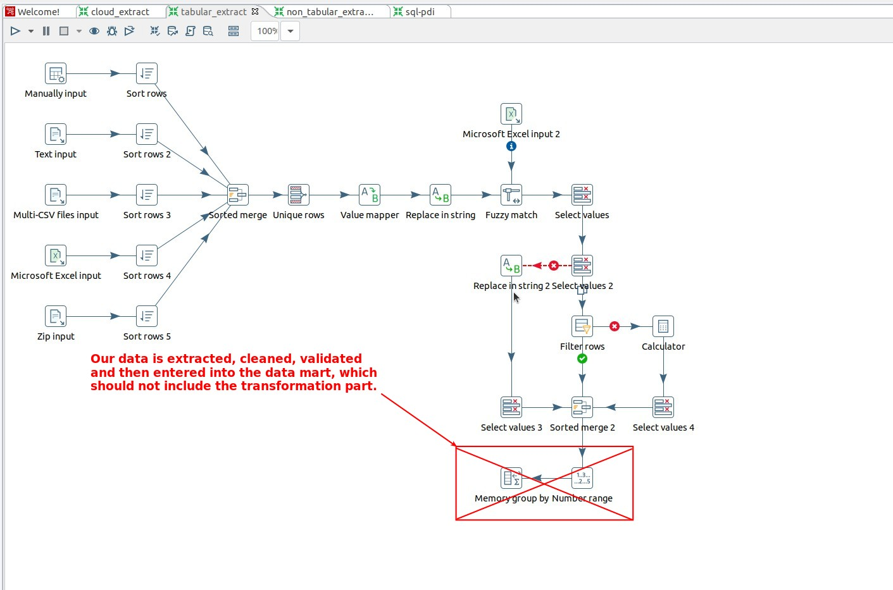
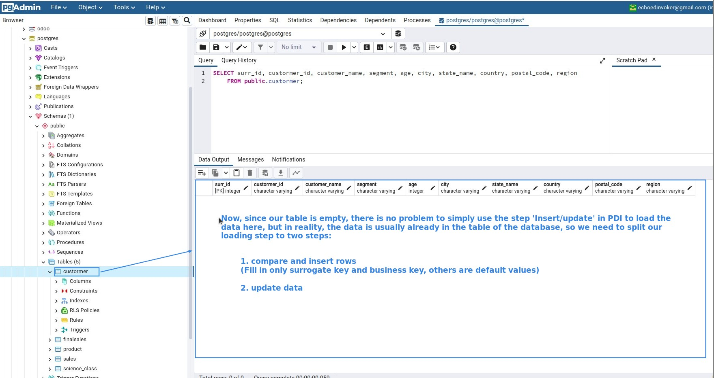
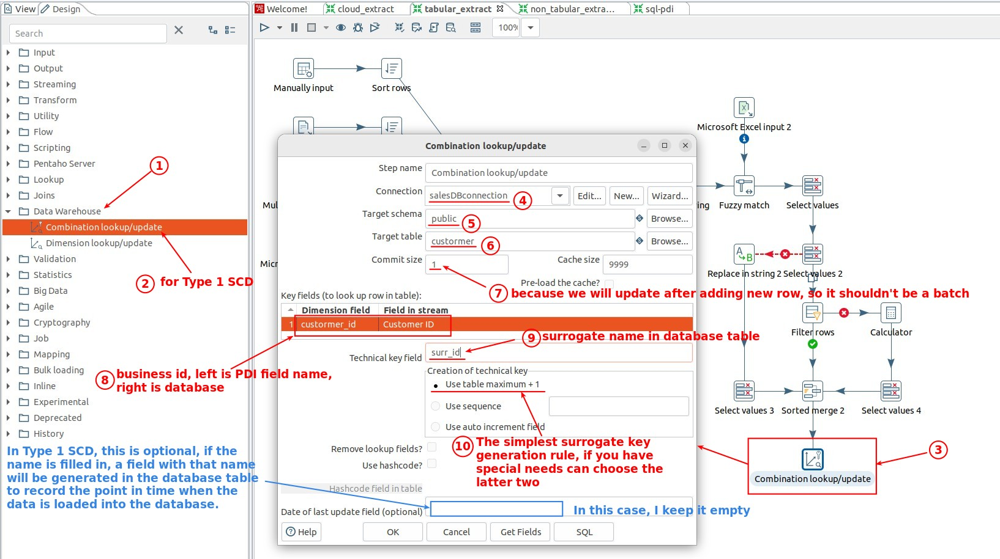
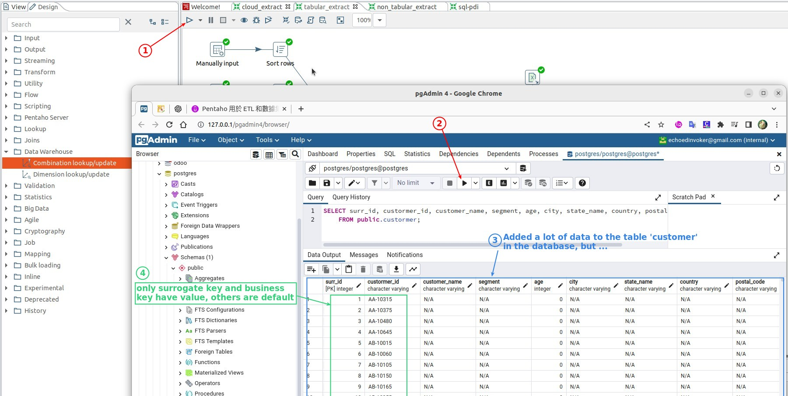
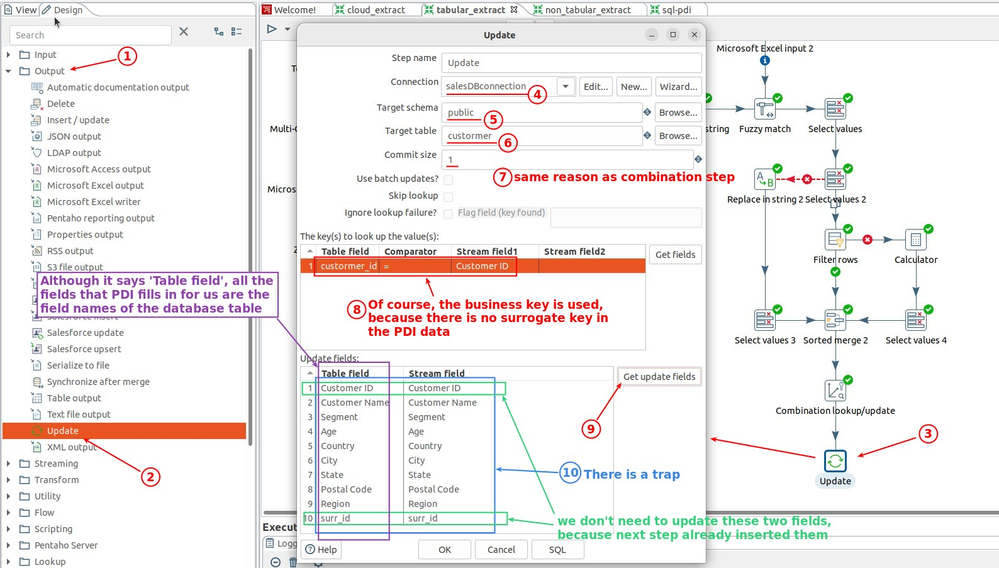
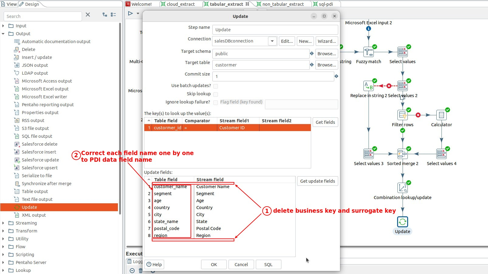
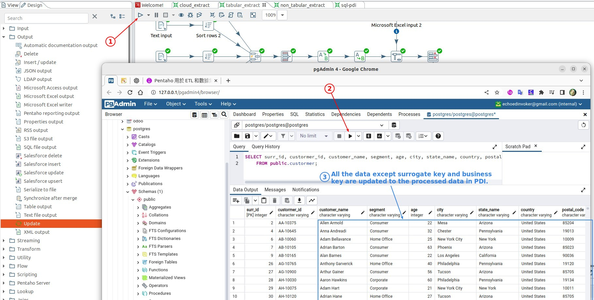

## **Prepare & Plan**

### _delete transform steps_

### _plain to split loading to two steps_

## **Data Warehouse: Combination**

### _setting_

### _check table in db_

## **Output: Update**

### _setting_

### _escape the trap_

### _check table in db_

