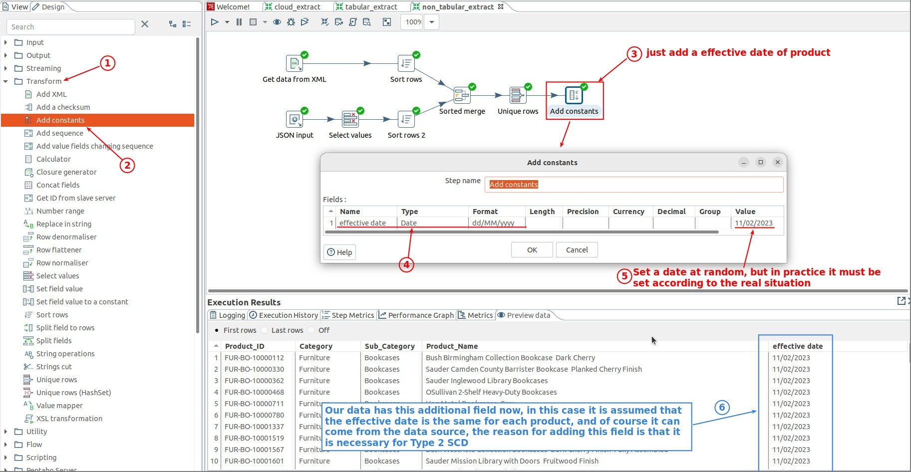
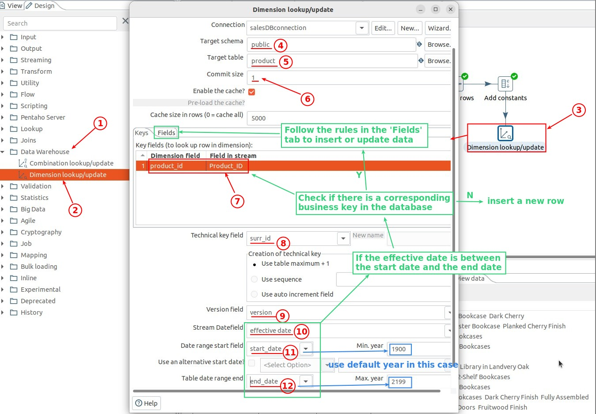
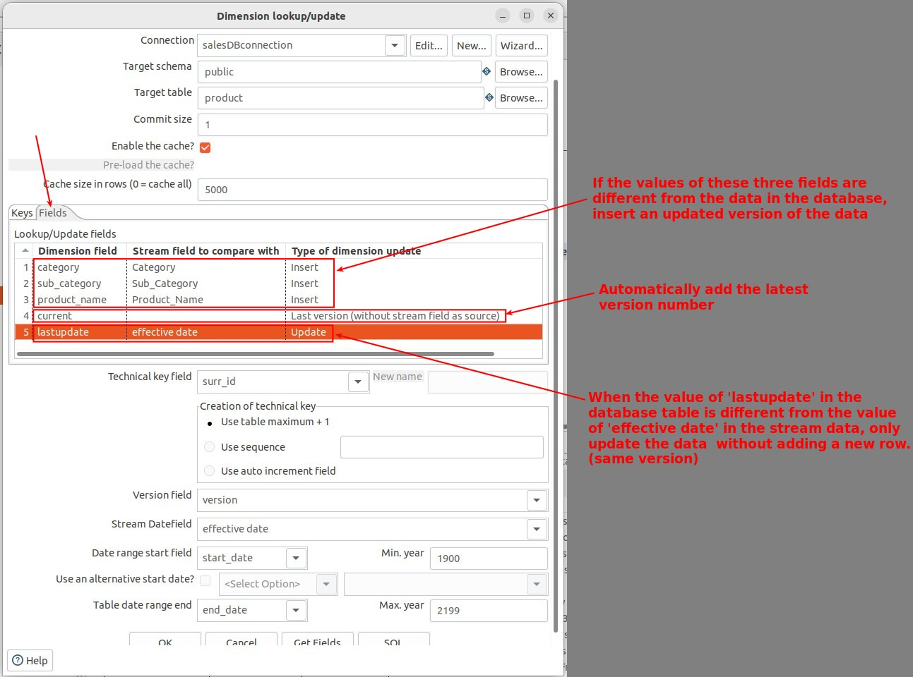
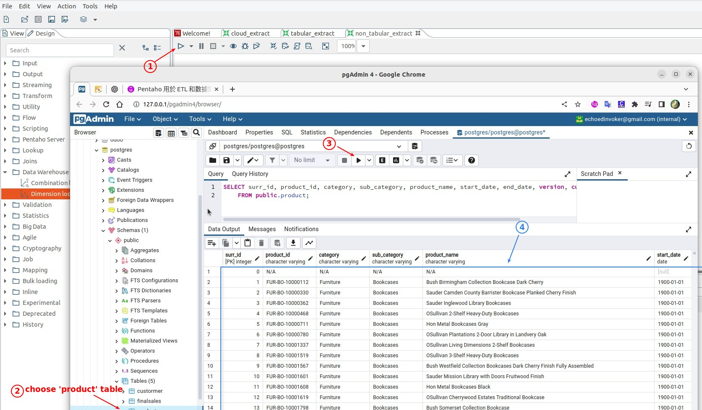

## **Add 'effective date' to mainstream data**

## **Data Warehouse: Dimension lookup/update**

### **Setting**

### **Setting: match rules**

> This tab is specifically used to set the business key to exist in the database (data is already exists).

## **Execute & Check the result**

- Compared to Type 1 SCD, Type 2 SCD only requires one step, but the setup is more complicated.
