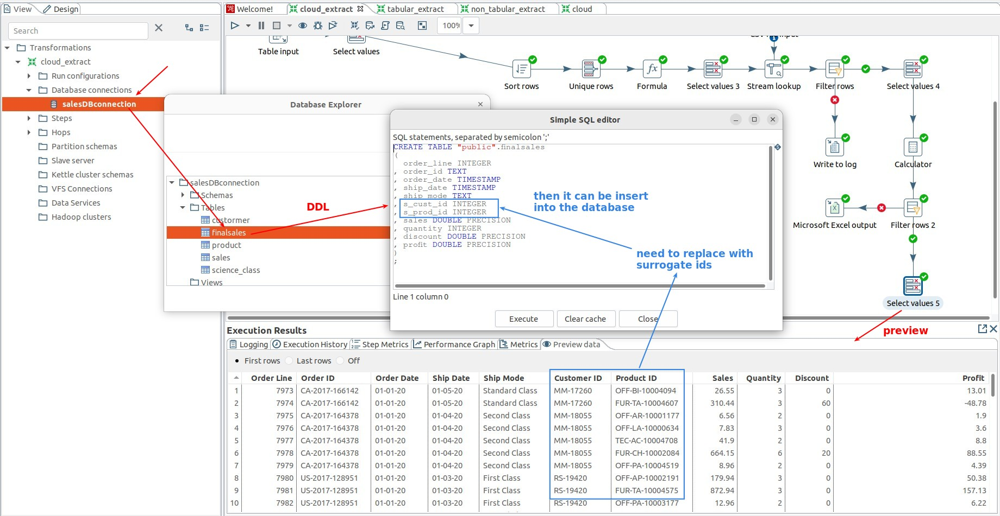
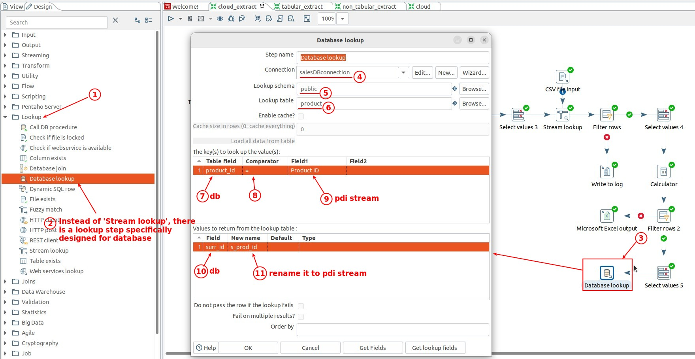
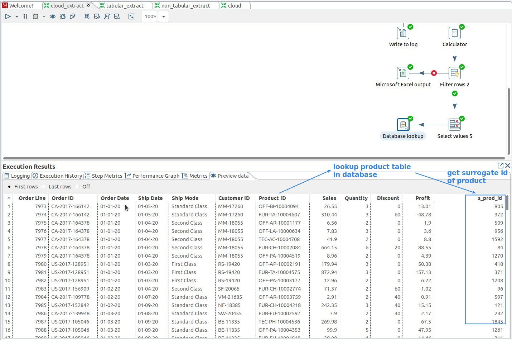
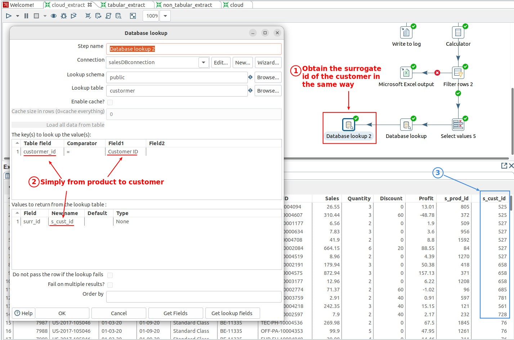
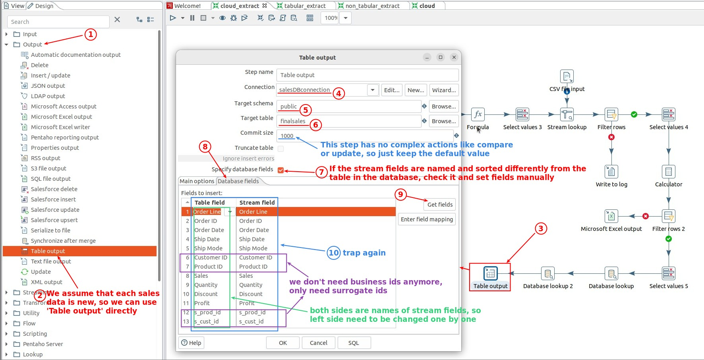
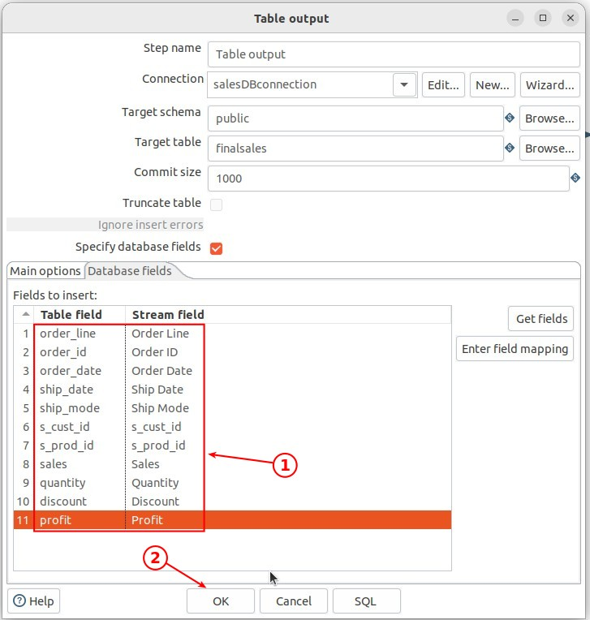
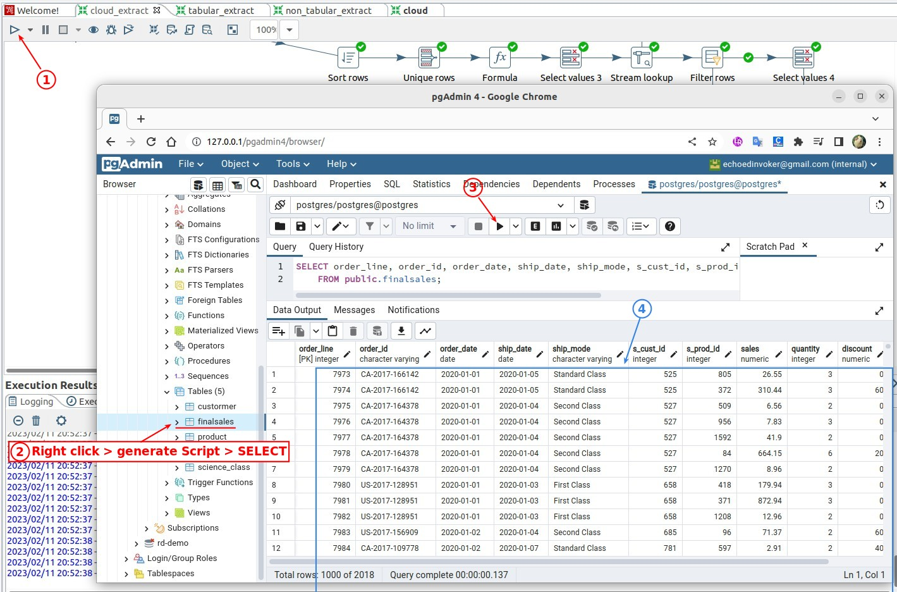

## **The Point of loading Fact table**

> The important point is that the original business ids of products and customers in the PDI stream have to be replaced with surrogate ids before they can be imported into the database table.

## **Get surrogate id with business id**

> Use the lookup step like the mapping process in data validation, but the database has a proprietary lookup step.

### _product_

### _customer_

## **Output: Table output**

> In this case we assume that each sales data is always new and there will be no need to update it, so we use this step.

> If in your own case, the fact table loading also needs to be updated, you should use a combination or dimension step depending on your needs.

## **Check result in database**

