## **Over views**

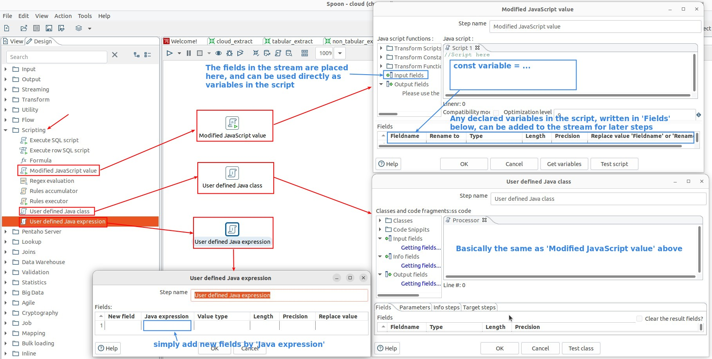

## **Create input data for test**

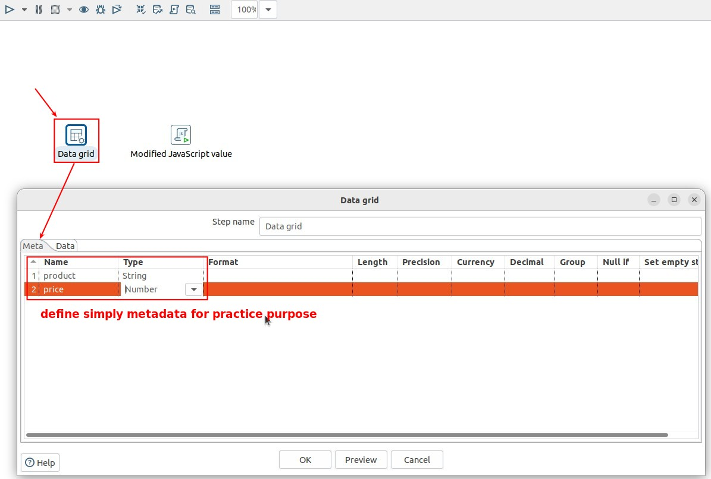

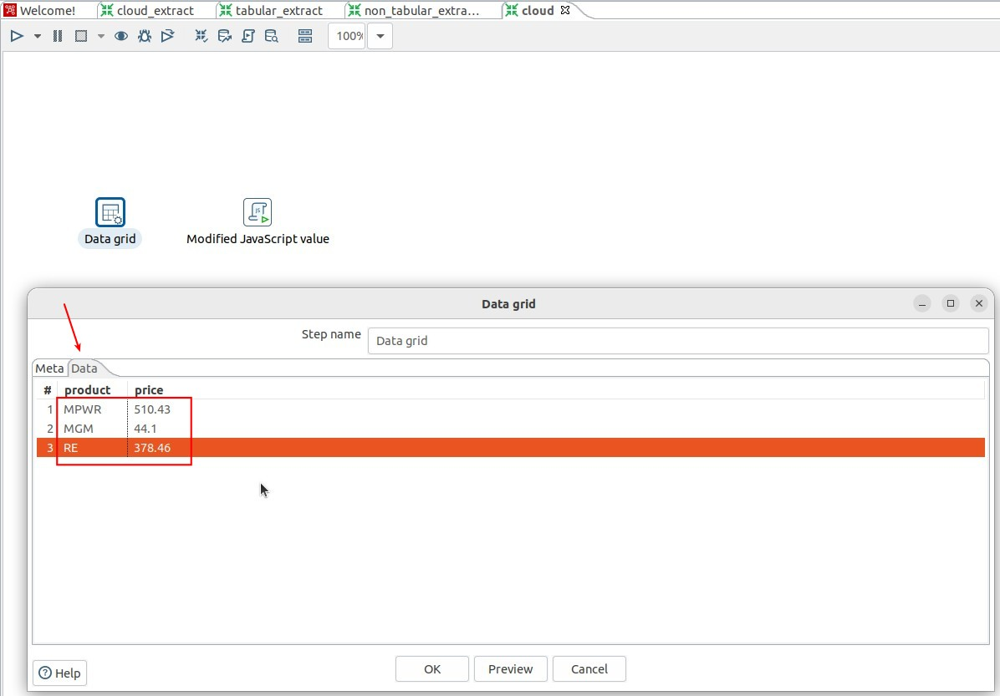

## **Javascript step**

### _Normal usage (row by row)_

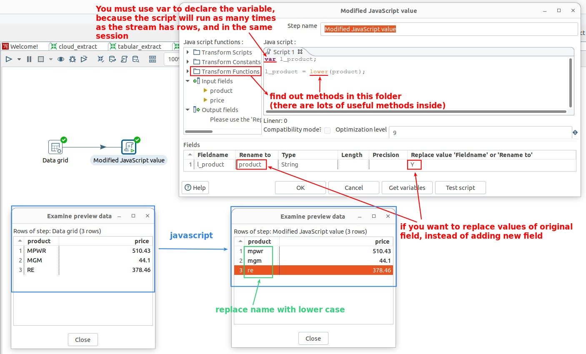

### _How to test script_

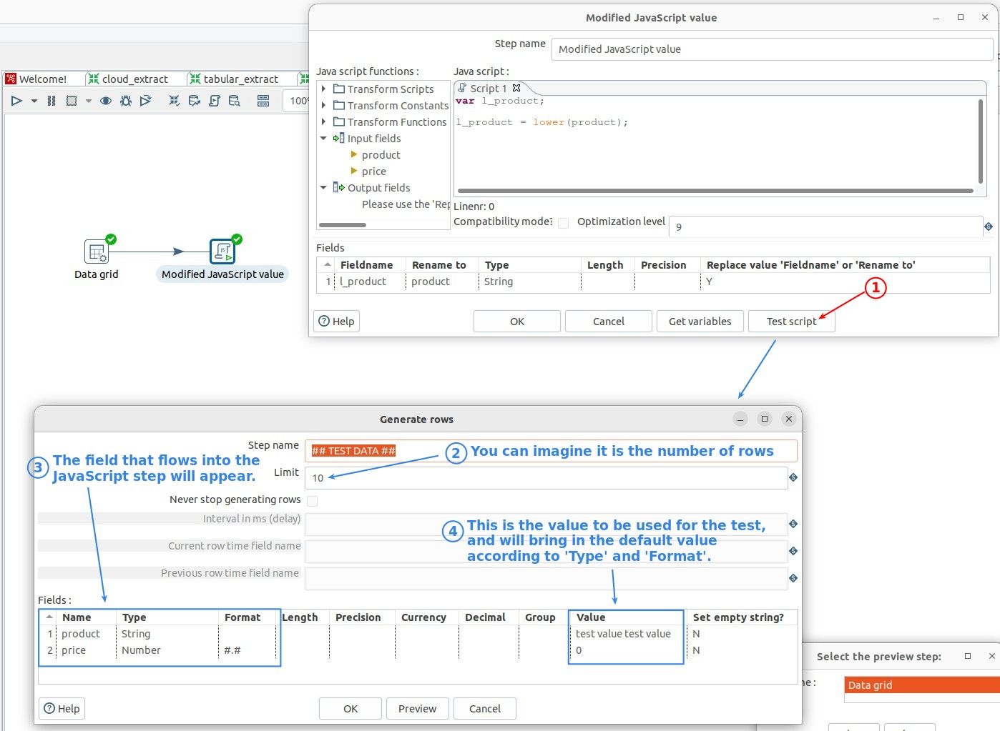

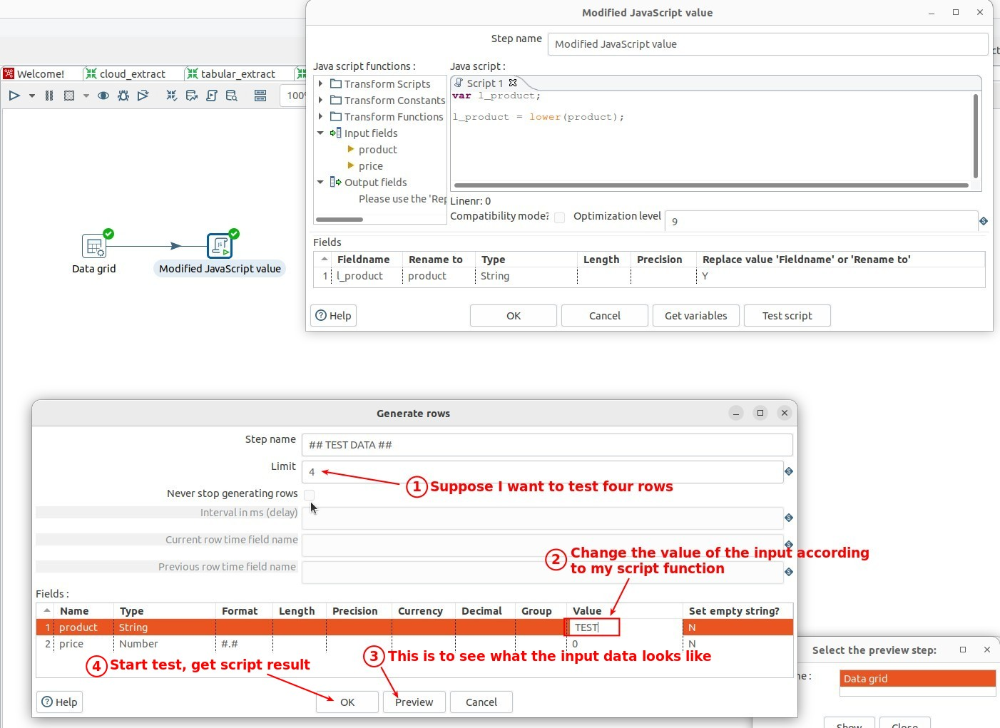

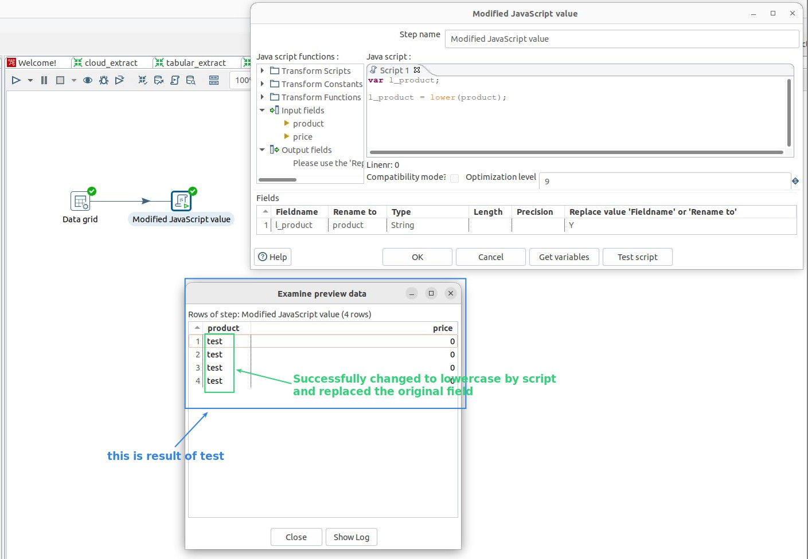

### _Advance usage (cross rows analystics)_

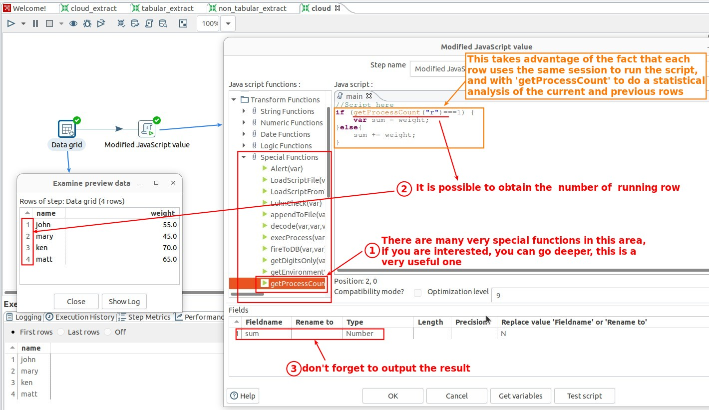

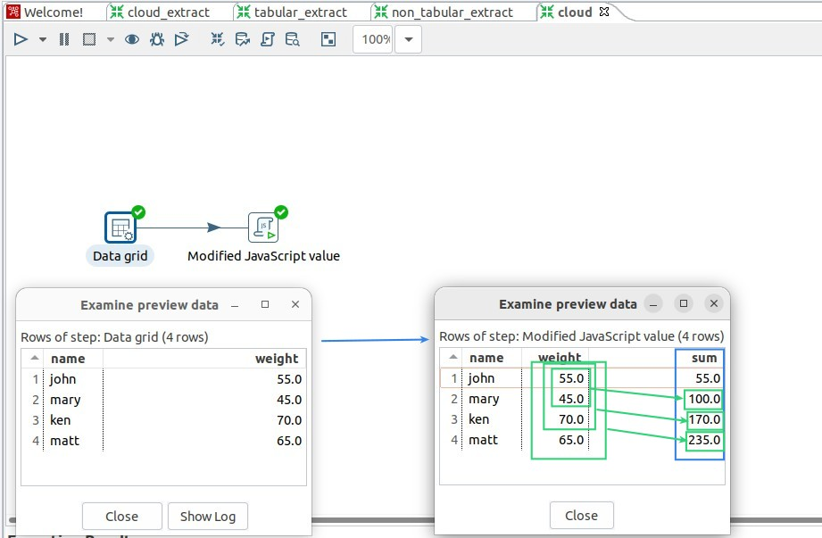

### _Flow control_

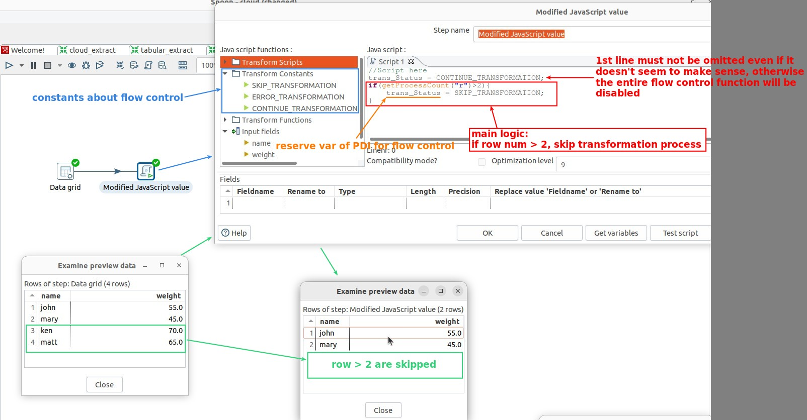

## **Java expression step**

> No script, simply use the 'expression' in java to generate new fields, so it's simple but relatively powerful.

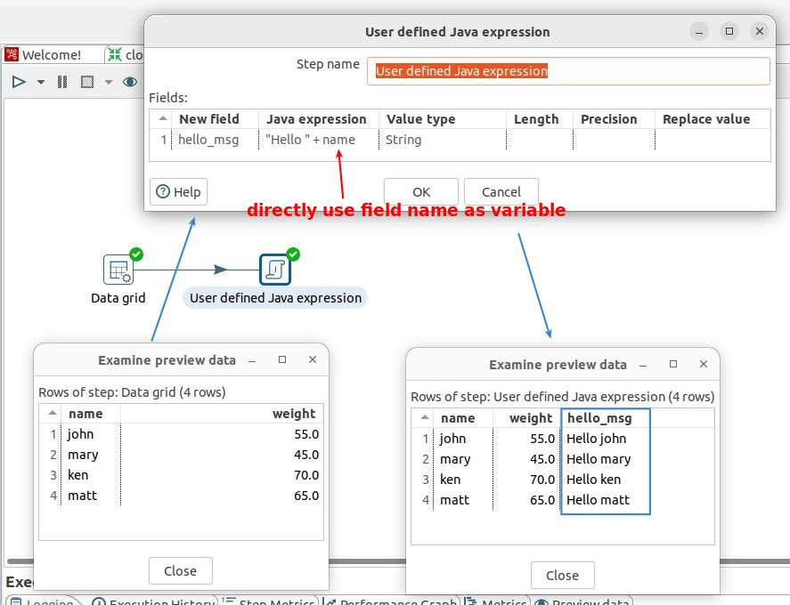
