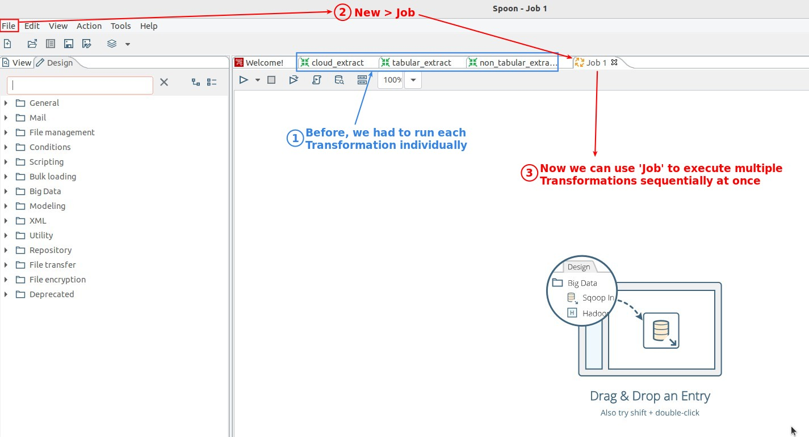
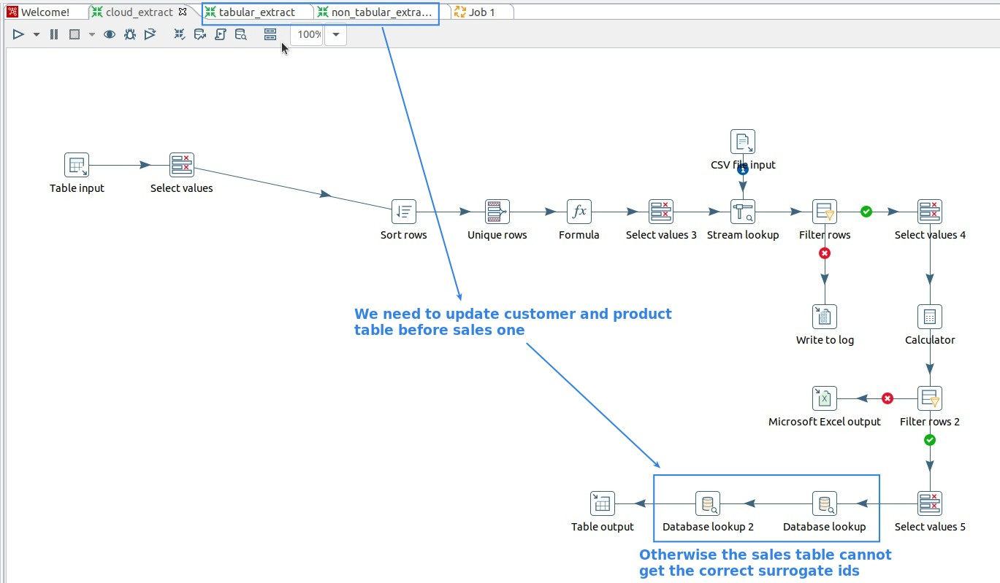
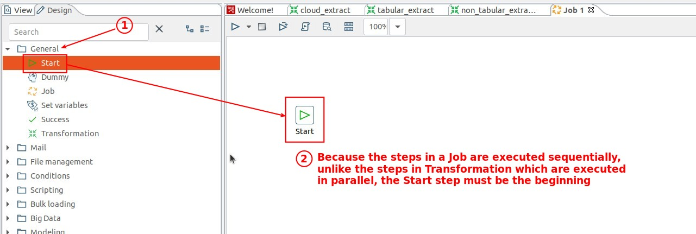
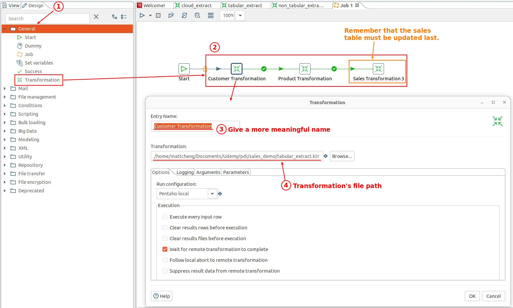
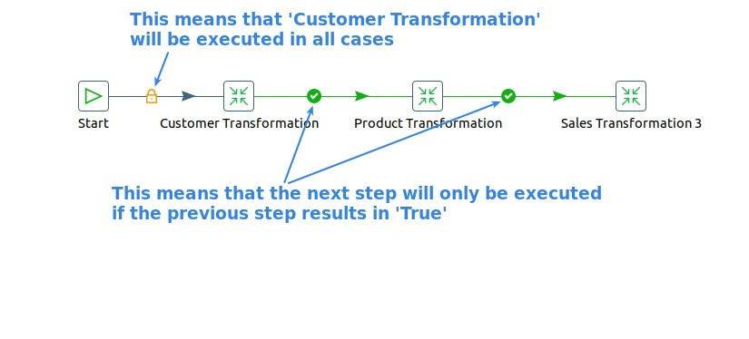

## **Open New Job**

## **Execution Order is important**

## **Start to build the Job**

### _First step: Start_

### _General: Transformation_

> This step is used to execute the Transformation.

### _Explanation of connection symbols_

- All the steps after step 'Start' must be executed, so the symbols on the link are 'lock'.
