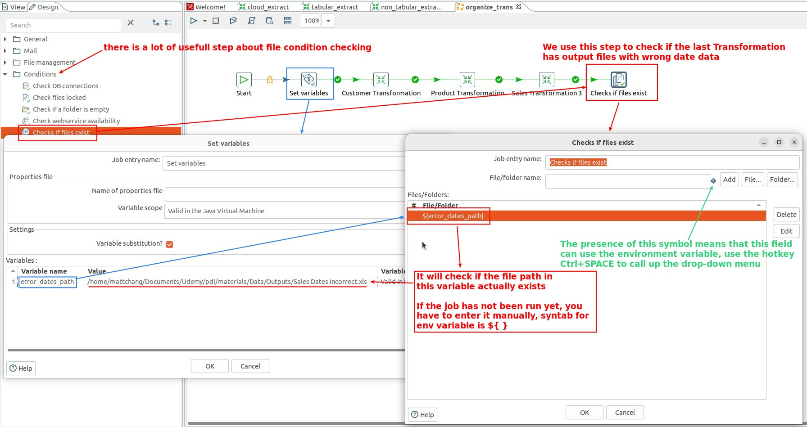
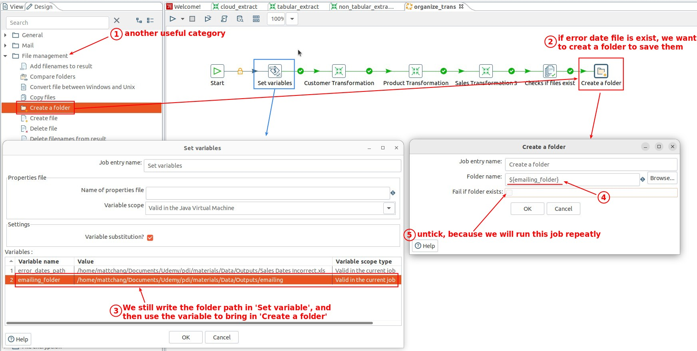
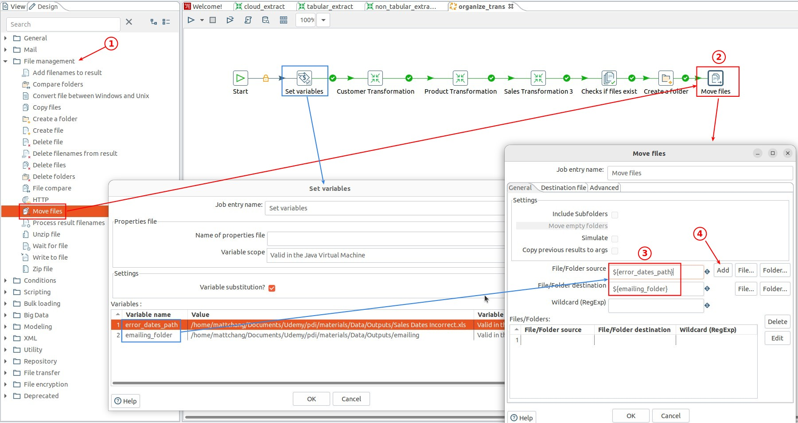
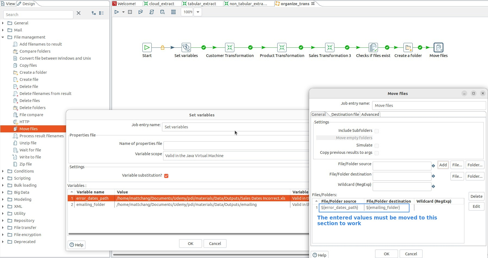
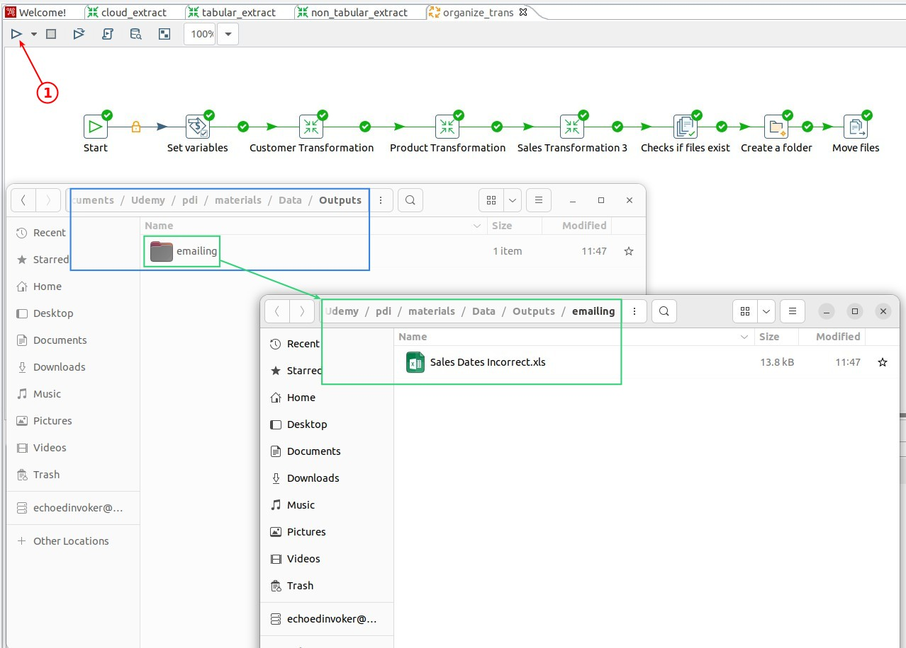

## **Condition: Check if files exist**

## **File management: Create a folder**

> In this category there are many steps to determine the status of the file system, and the step names are very straightforward, which is a very useful category.

## **File management: Move files**

> There are many steps in this category that deal with the file system, and the step names are very straightforward, which is a very useful category, usually used with the category 'Condition'.

## **Execute the Job & Check result**

