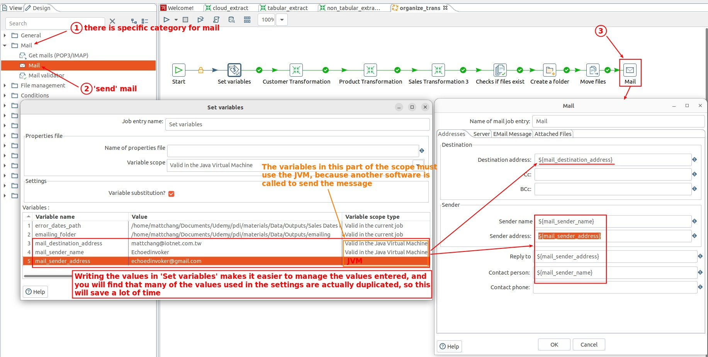
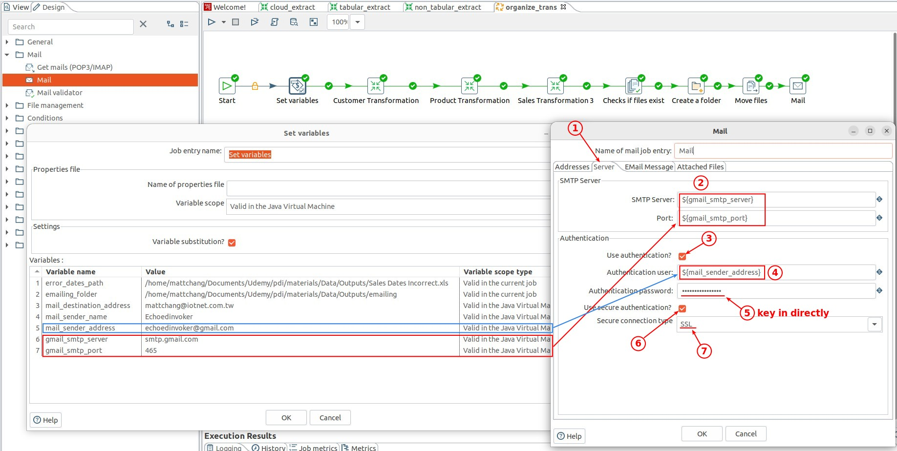
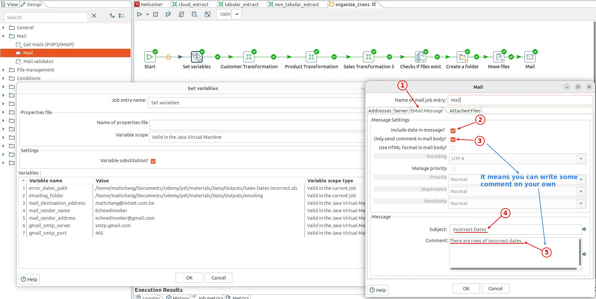
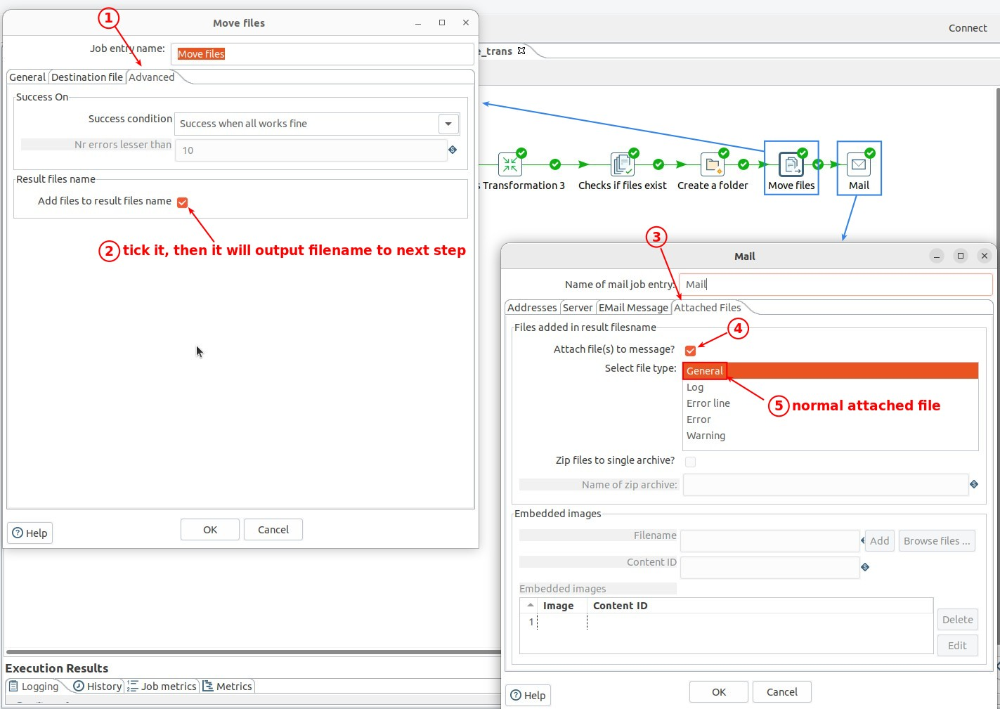
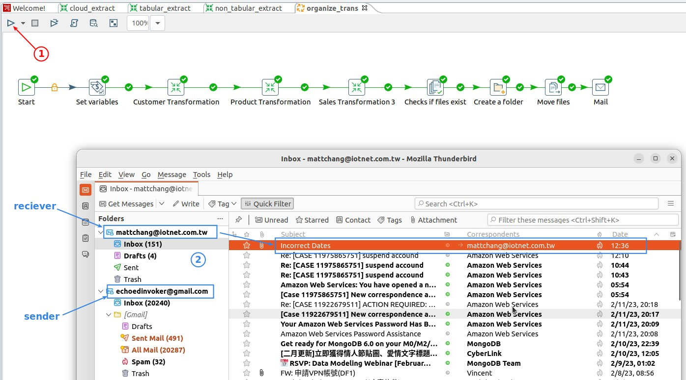
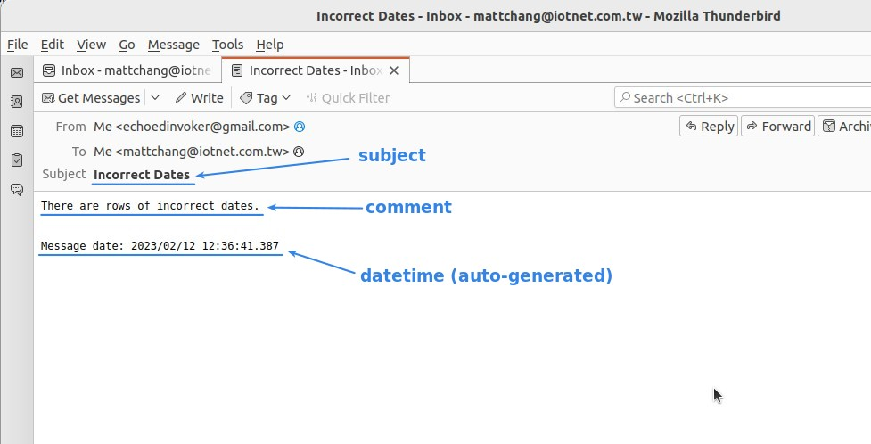

## **Mail: Mail(send)**

### _tab - address_

### _tab - server_

- The fifth step is the password, only direct key in to have the encryption function, so do not use the variable.

### _tab - message_

### _tab - attached files_

- step 'Mail' will automatically send this file as an attached file if it receives the file path from the previous step, so the second step is important.

## **Check mail**

