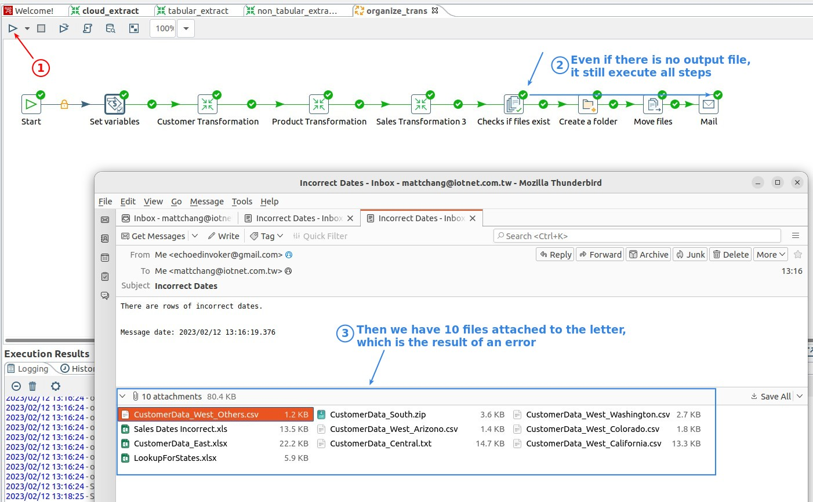
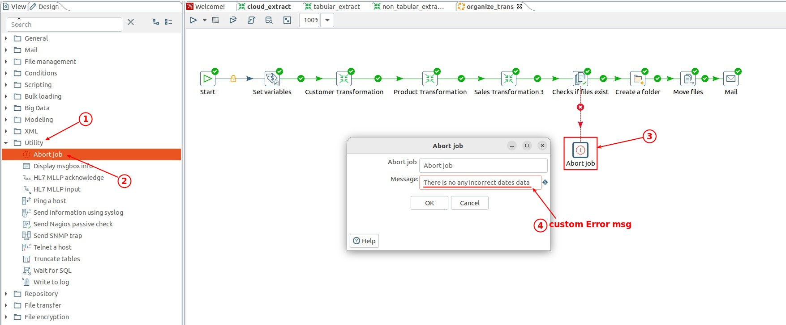
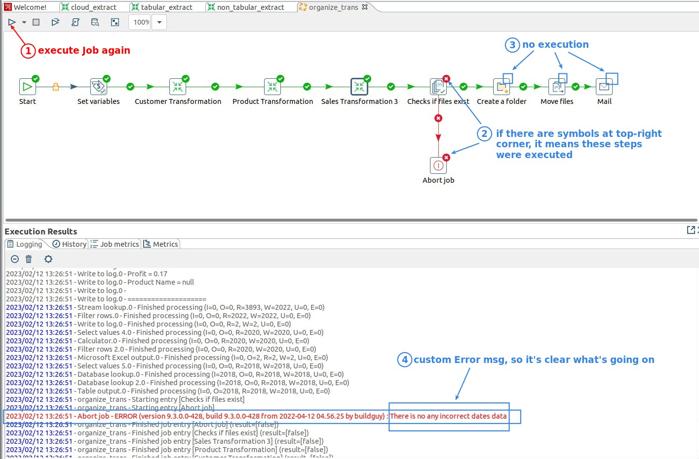

## **Make some mistake**

## **Utility: Abort job**

> We must use this step to prevent backward steps from being executed in the event of an exception.

> And generate a meaningful error message in LOG to tell us what happened.

## **In Real Project**

> Teaching purposes so only add a 'Abort job', but in fact ...

