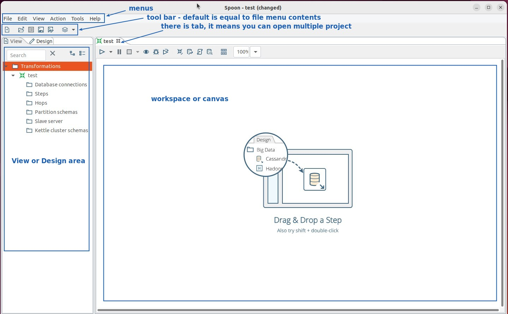
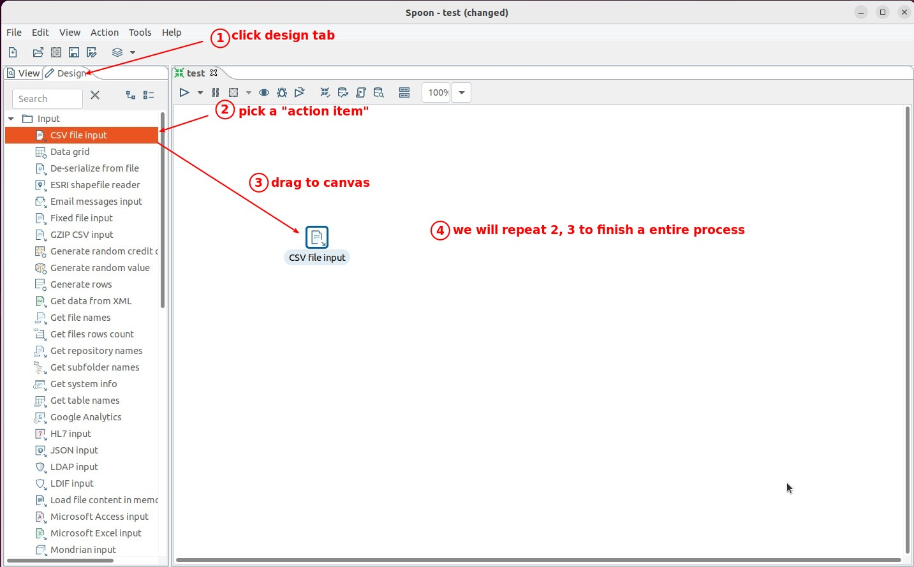

## **User Interface** ##

## **Standard way of operating** ##

## **Two project types**

- **Transformation**

  - anything related to data process

    - ex. Input data, output new data table, transforming data

- **Job**

  - mainly for supporting activities

    - ex. Email to someone, file management, check if file exist

