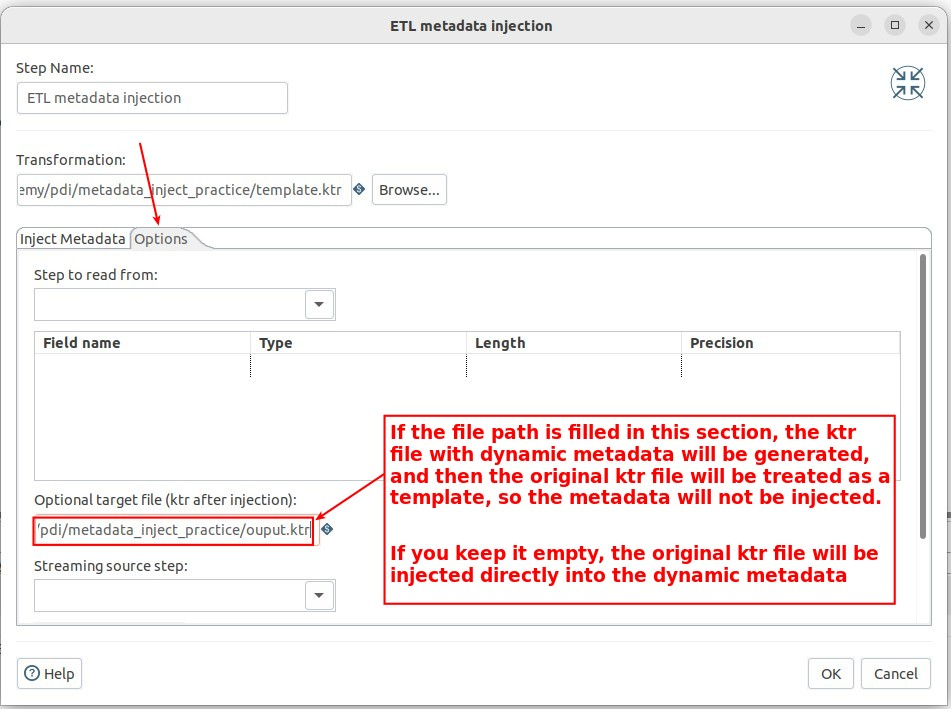

## **Problem: if metadata of data source is dynamic**

## **Template/Main Transformation**

### _Flow: Dummy_

- Our main processing will be in the main/template Transformation, where step 'Dummy' is used instead of those processes.

## **Metadata Injection Transformation**

### _Get system datetime_

### _Remove time of datetime_

### _Group 'products' with date to sheet name_

### _Flow: ETL metadata injection_

**tab 'Inject Metadata'**

**Main or Template?**

**Other settings of tab 'options'**

## **Check result**

