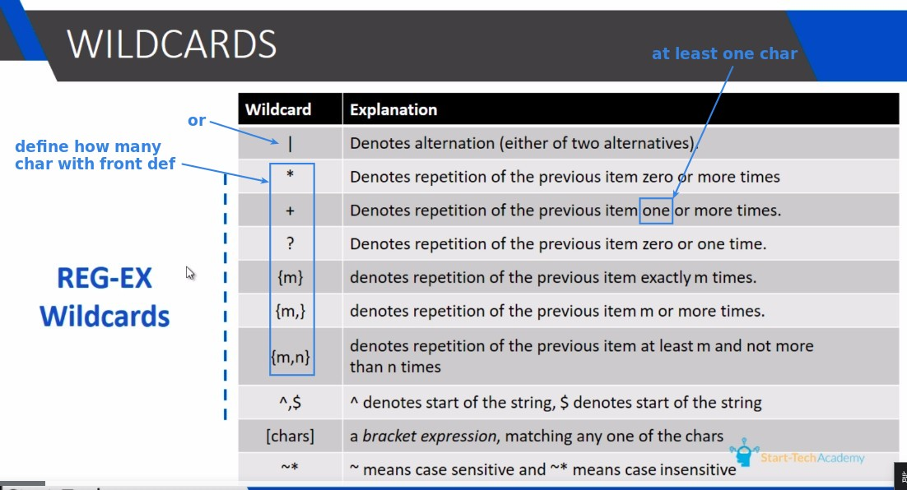
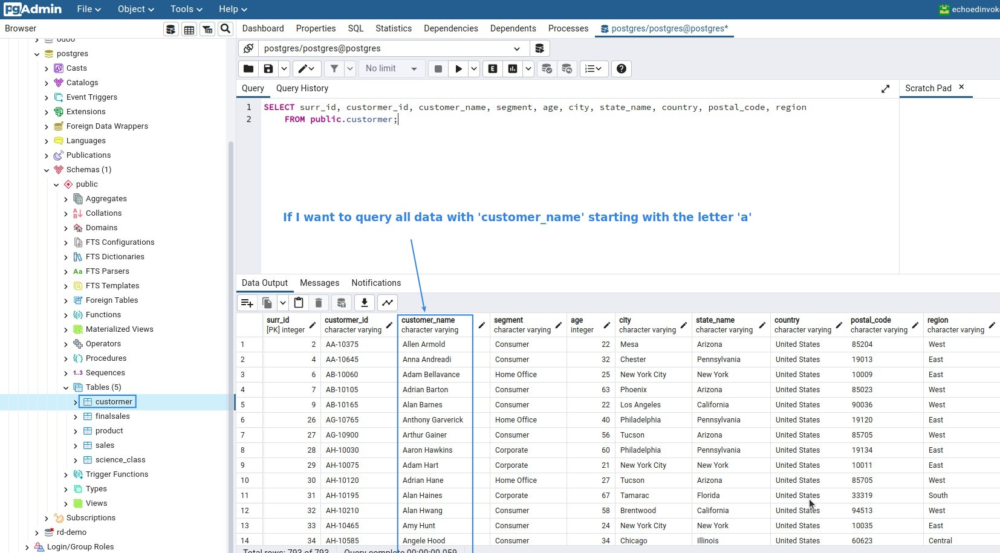
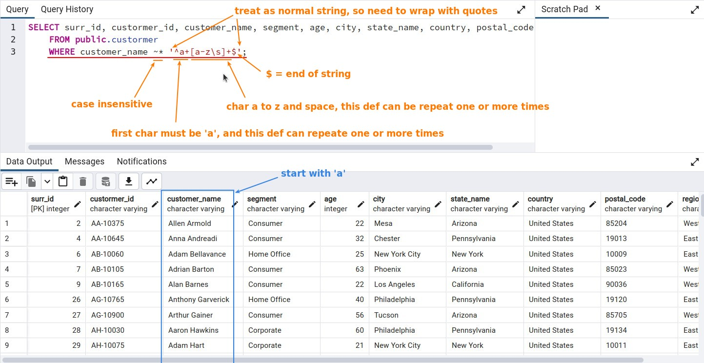
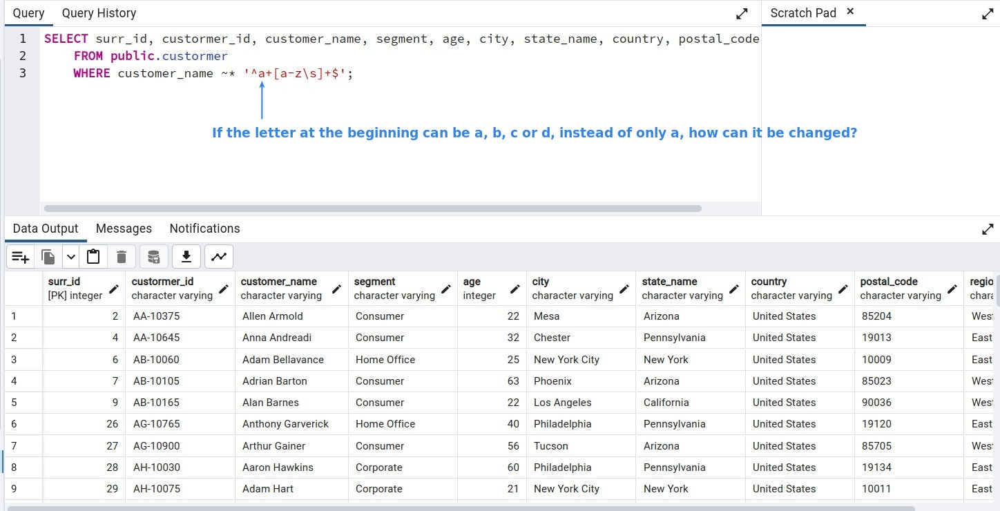
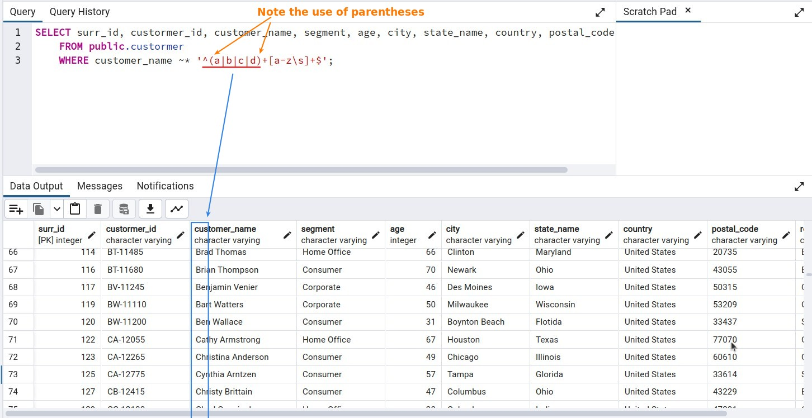
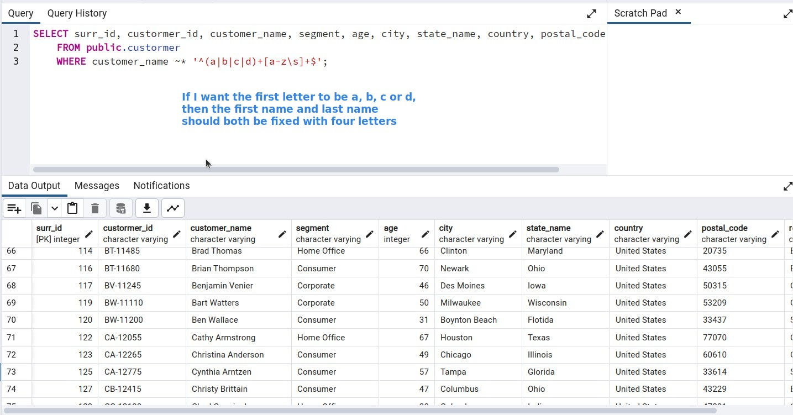
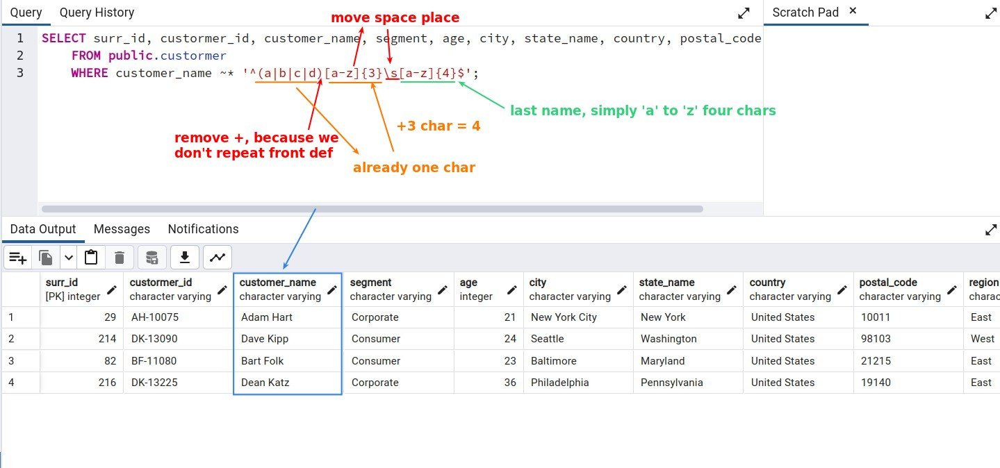
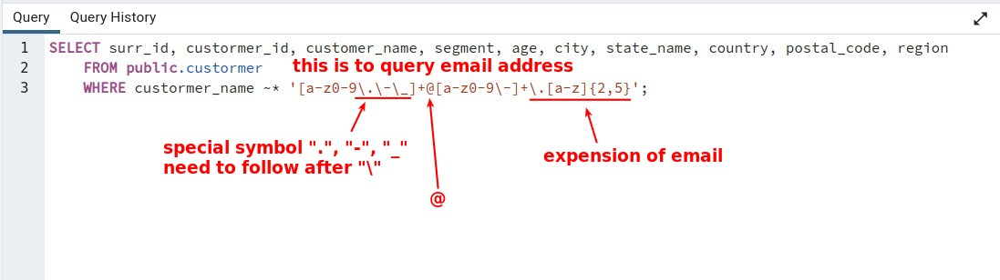

## **Regex Wildcards**

## **Exercises**

### _Q1: start with_

### _Q2: or_

### _Q3: fixed number of chars_

### _Q4: Email_

## **Conclusion**

- regex can save many lines when used in SQL script.

- Many Transformation/Job steps provide regex input for more precise selection of files or data.
