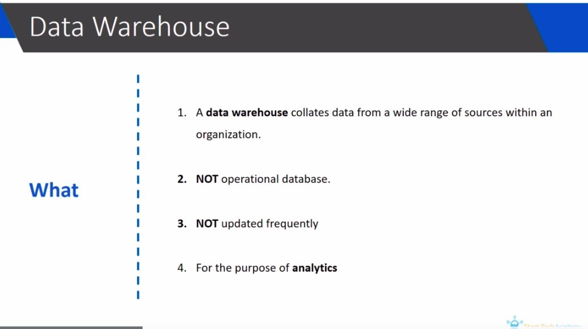
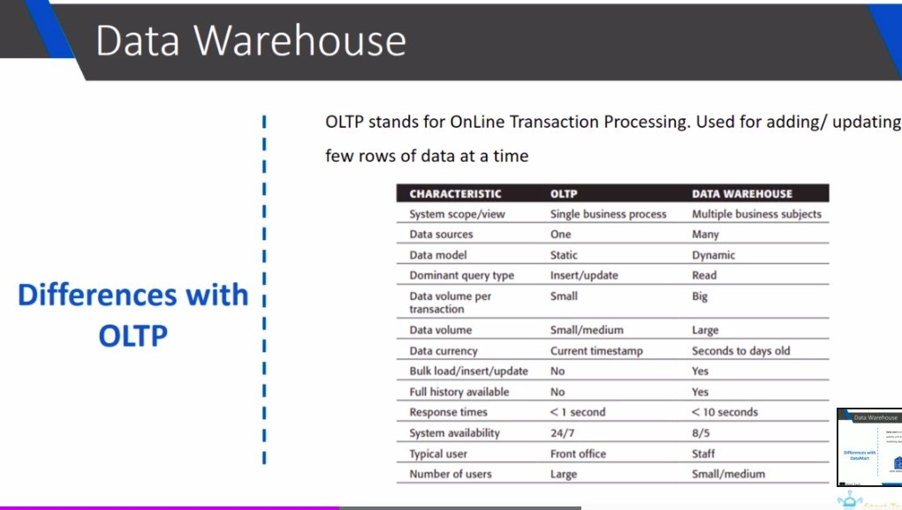
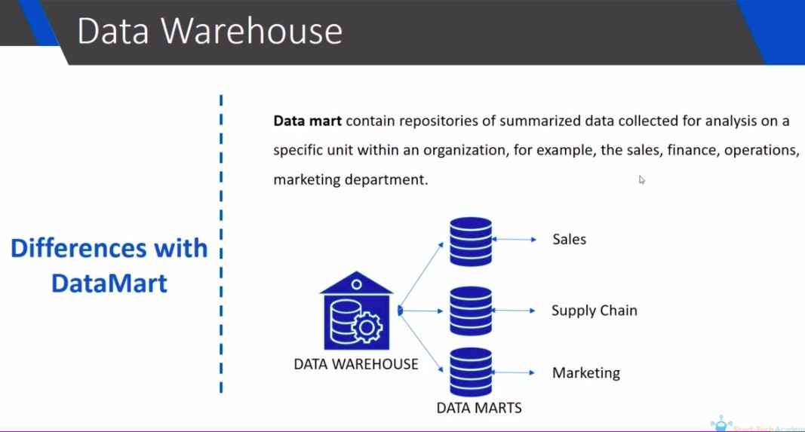

# **_Data Warehouse, Ops Database and Data mart_**

- In an organization, data is usually stored in two types of databases

  - Operational database (OLTP)

    - It stores real time information about one particular part of business

      - ex. when a customer puts an order in Amazon, that order is stored in an operational database

  - Data Warehouse

## **What is Data Warehouse?**

- not only for analytics, it is also for reporing

  - we using complex queries whithin a DW to create it

  - then use report to make business decision

    - this is ultimate aim of a DW

- DW will be updated once in a day or a weak and so on.

  - Operational update large numbers of short online transactions.

- DM is not operational database, it is similar to Data Warehouse.

  - but only support specific unit of organization
