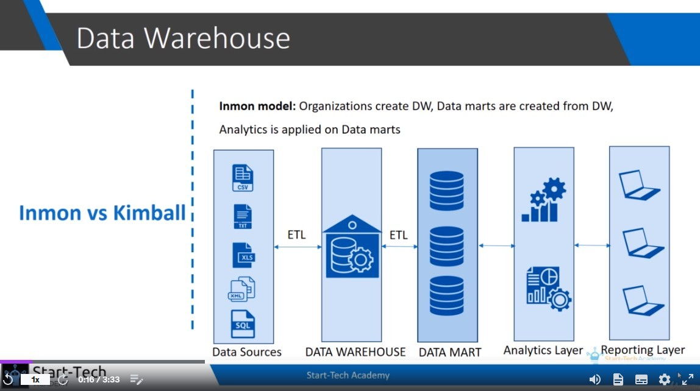

## **First ETL**

- lots of tansformation is not done yet.

- mostly data is extracted and loaded straight away

- data in raw format can be found in the data warehouse

## **Second ETL**

- data is processed and transformed mainly in this step

> this model is more popular.

## **Fist ETL**

- each department in the organization maintains its own data mart.

- data cleaning and vlidation has already been done in this proccess.

## **Second ETL**

- warehouse collect data from data marts of different departments

  - and also do some process to give data more meaning into data warehouse

    - the analytics and reporting is done on the data warehouse instead of data marts

  

