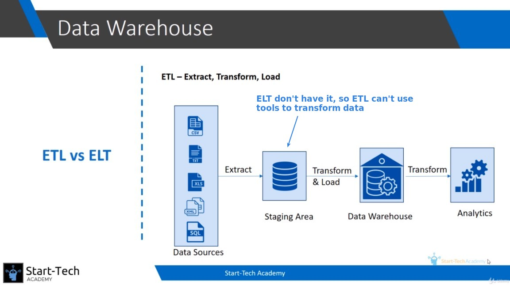
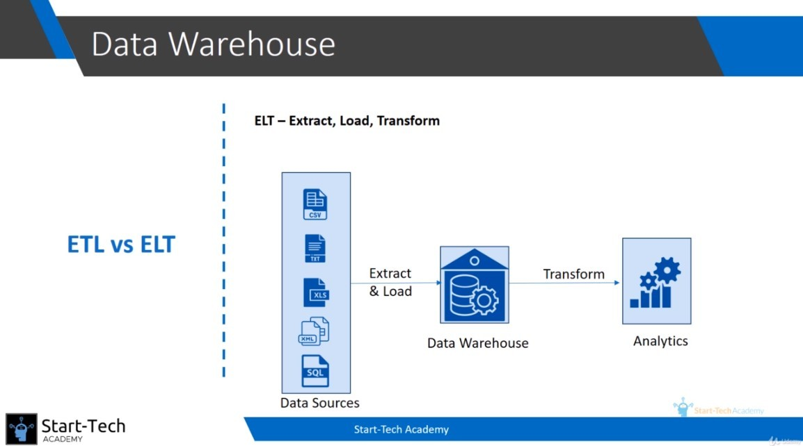

## **ETL**

- stagin area

> simply collect data from all data source and storing in the raw format

  - raw format

  - no processing applied on it

- typical flow of ETL

  - pentaho, informatica, ... all of these tool can be used to follow this idea process.

## **ELT**

  - no staging area

    - so data warehouse itself contain data in the raw format

  - transformations are done within data warehouse

    - then we use these data to do analytics and report

## **major different**

  - where does ETL being done

    - ETL is being done in the tool such as pentaho

    - ELT is being done in the data warehouse using complex sql queries

## **when and which**

### _ELT_

  - very large data, too large to make it is impossible to transform it in a tool

    - so we have to put data in the data warehouse and use SQL queries to transform it

### _ETL_

  - In most of the scenarios, data is not so large

    - that's why ETL is usually preferred

  - availability of comprehensive tools such as Pentaho, Teyland and Informatica

## **Conclusion**

  - for most practical purpose, ETL is preferred over ELT

