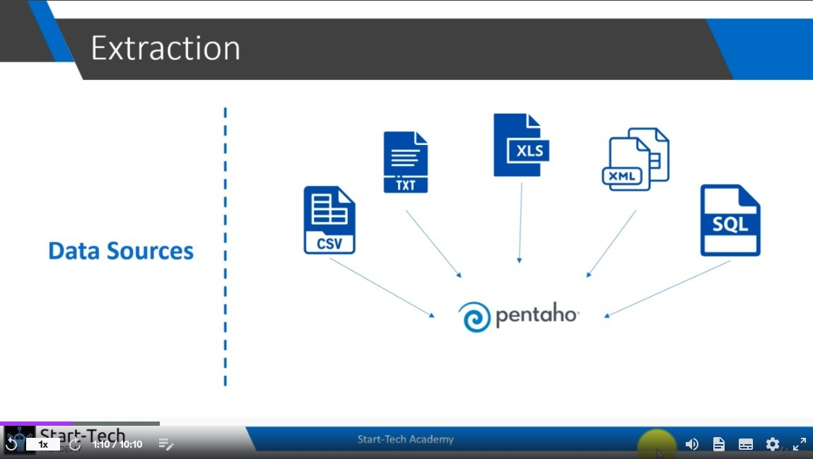
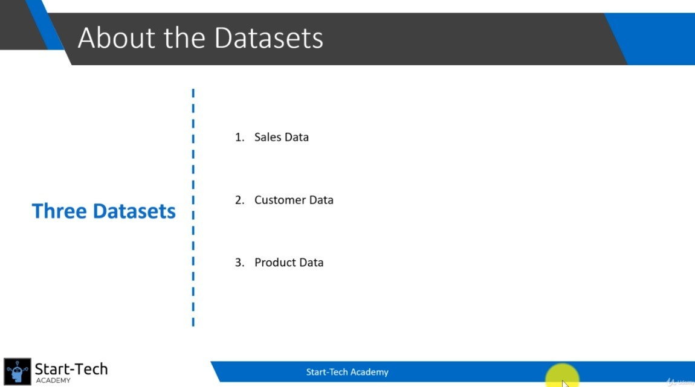
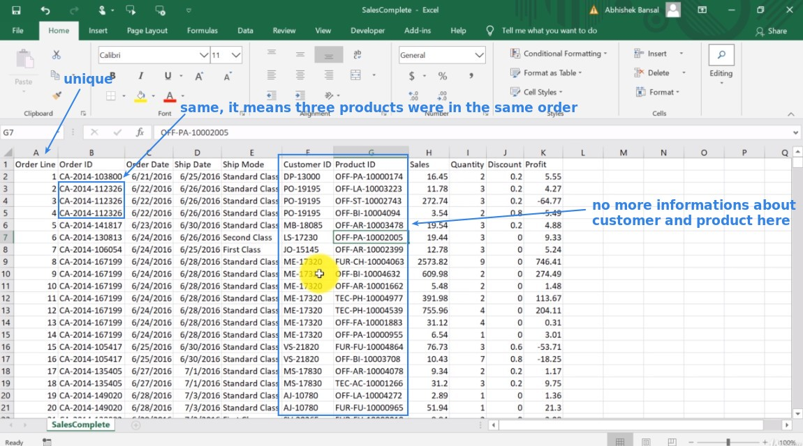
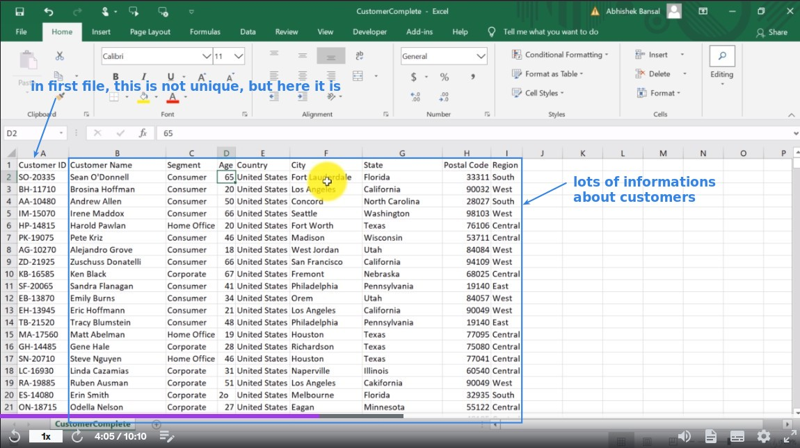
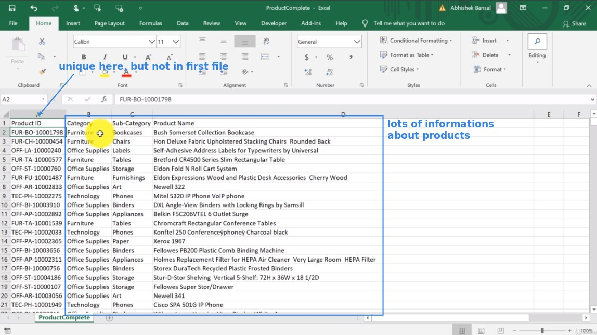
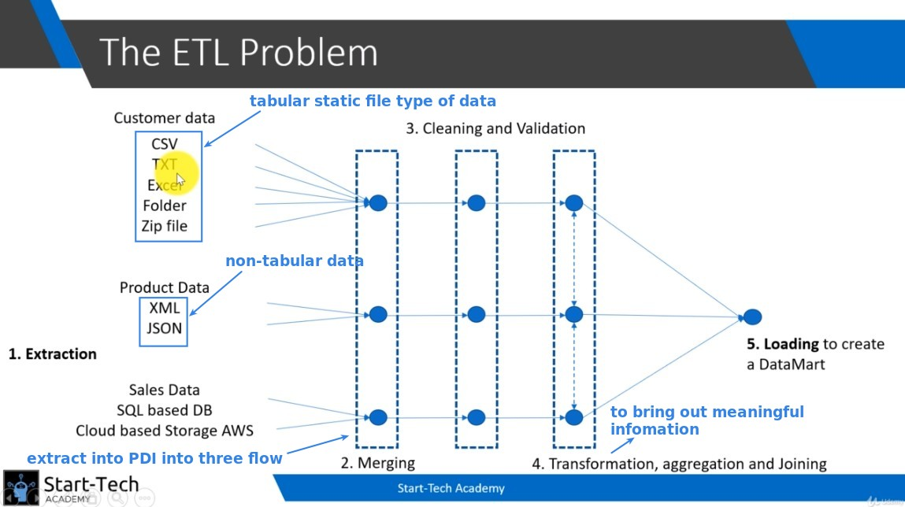

## **Extractoin is first step!**

> it means extracting data outside of PDI and put it into PDI.

- data source can be lots of type.

- good ETL tool such as Pentaho allow you extract much as type of data source as possible.

## **In Our follower case, Three datasets**

> We will use these three datasets to practice.

### _sales_

### _customer_

### _product_

## **ETL process**

