## **Data source: TXT file**

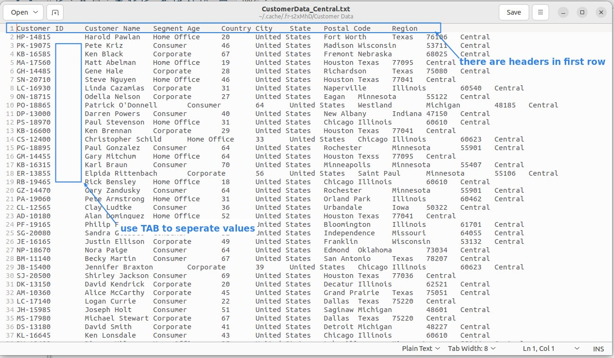

## **Component: Text file input**

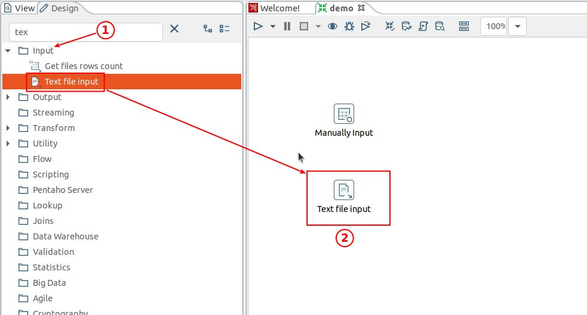

### _File tab_

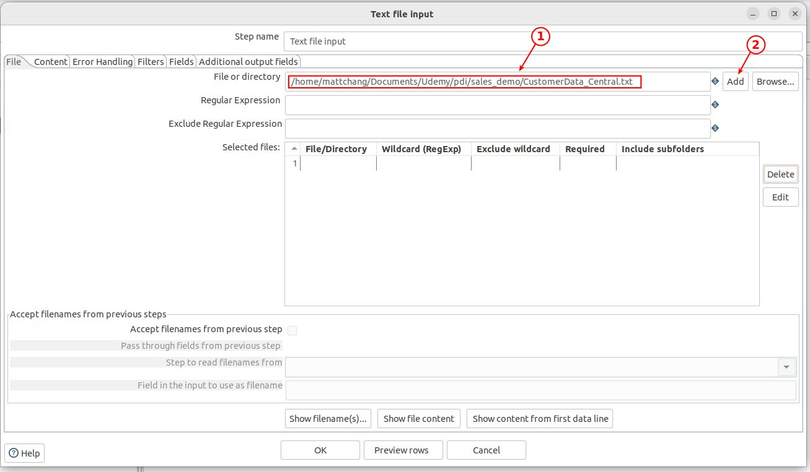

### _Content tab_

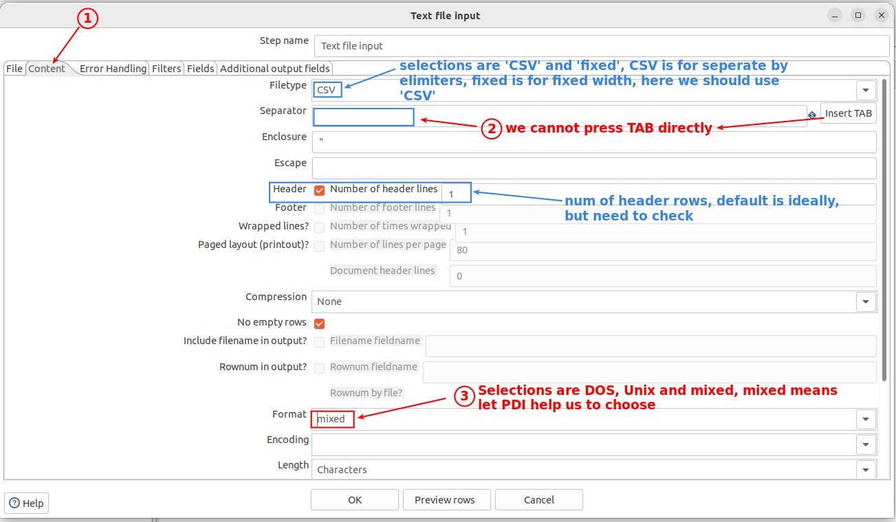

### _Fields tab: metadata_

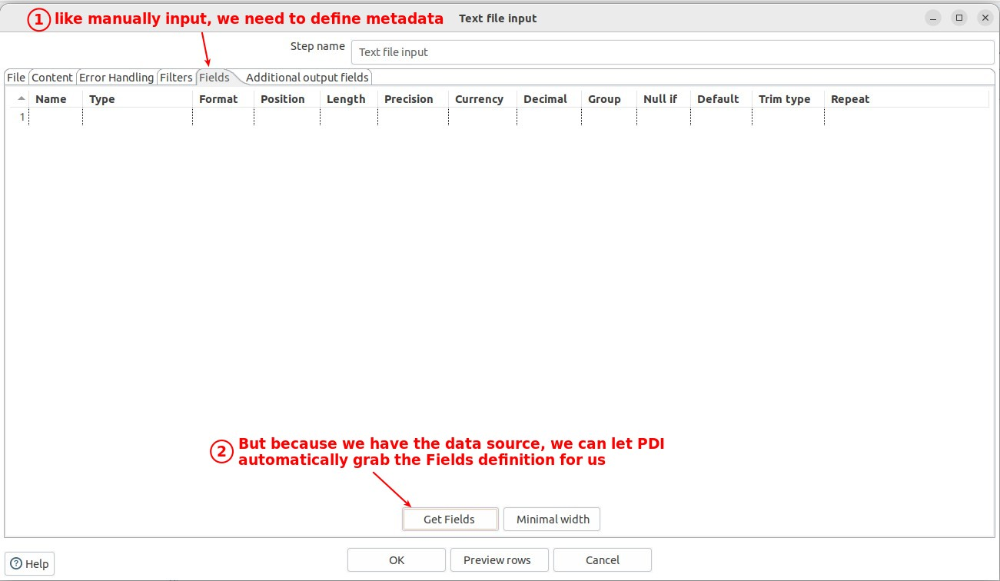

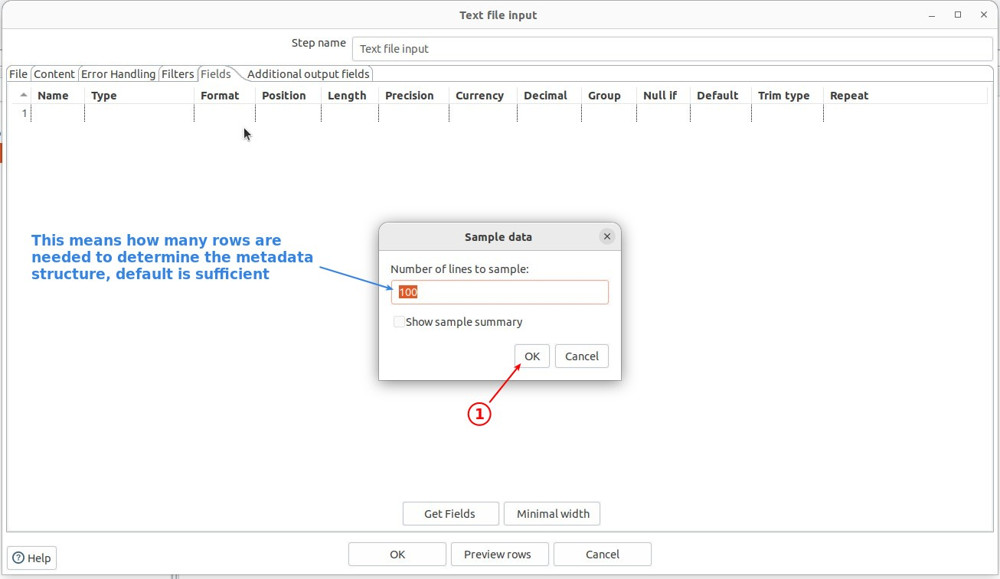

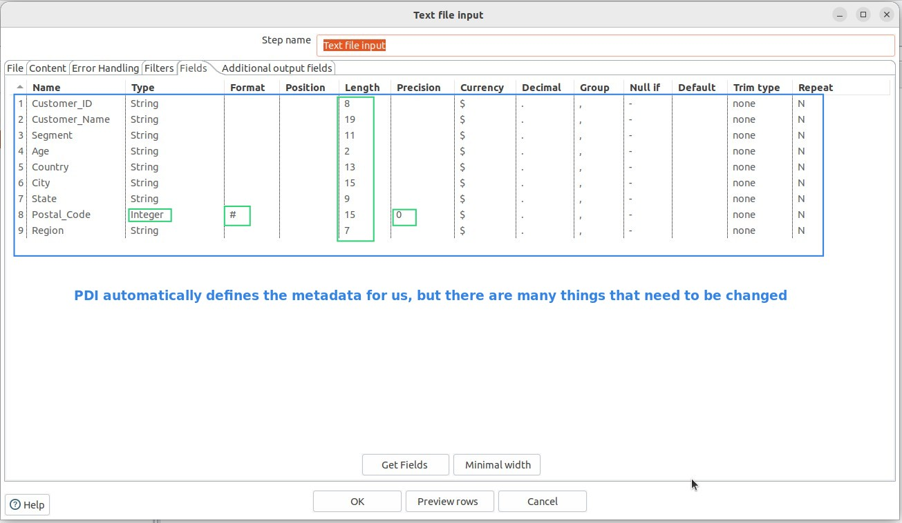

## **Preview**
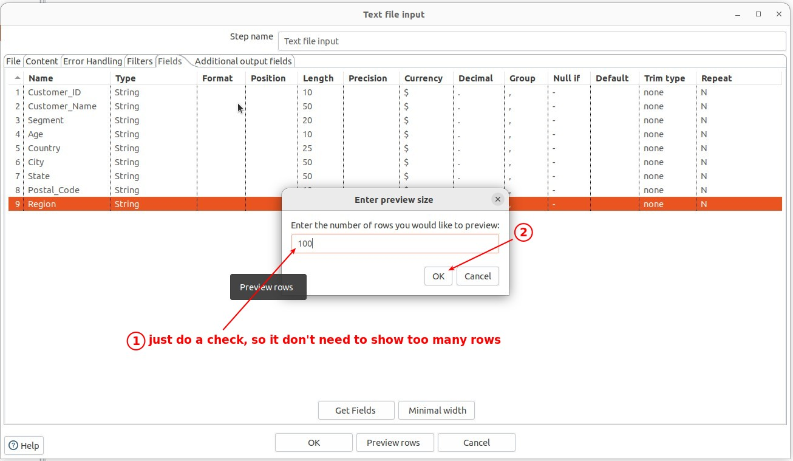

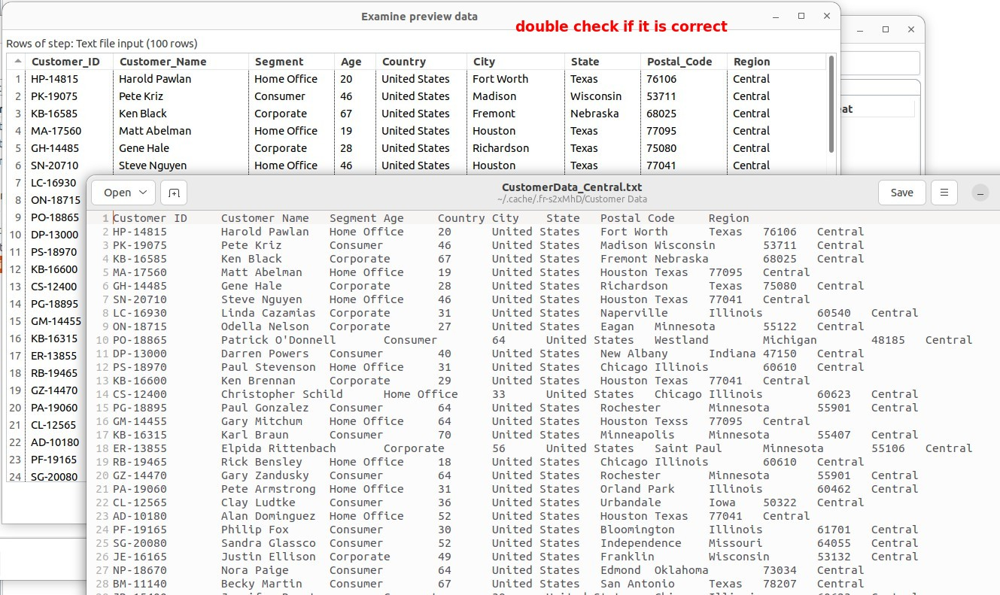

## **Subset**

### _Columns_

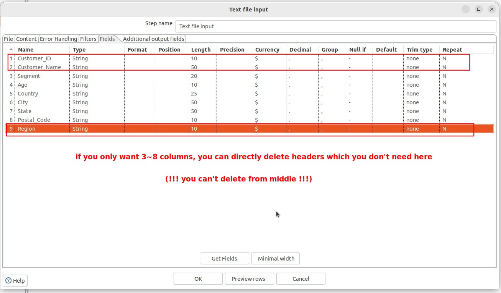

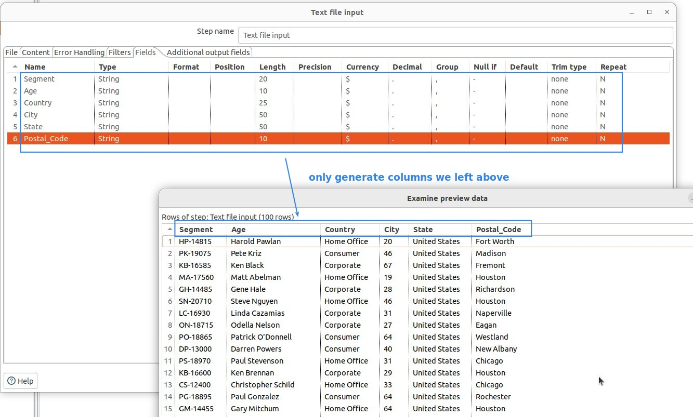

### _Rows_

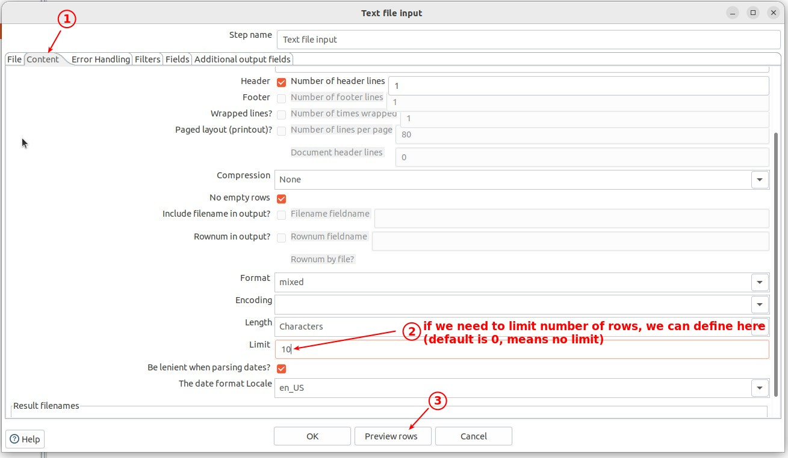

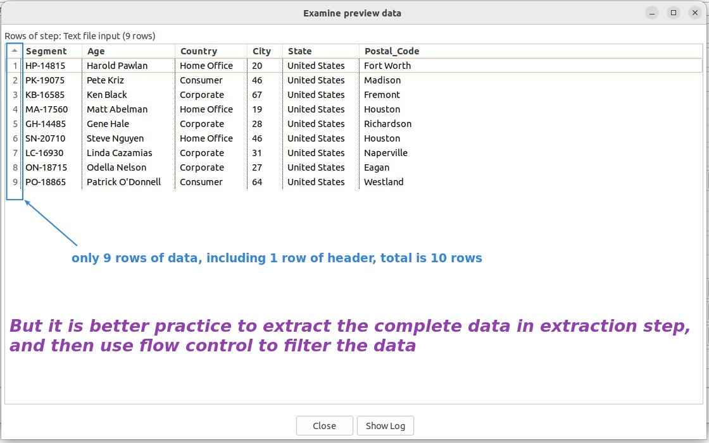
