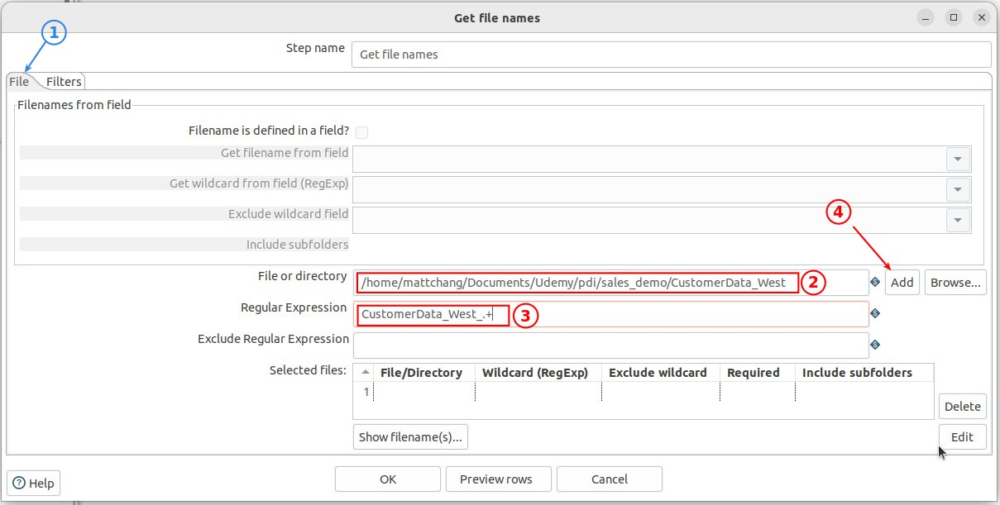

## **Data source: multiple CSV files**

## **There are two components**

- Flowing two example we will all use 'Text file input' components.

## **Single 'Text file input'**

### _File tab_

### _Contetn tab_

### _Fields tab_

### _Preview_

## **'Get file name' -> 'Text file input'**

### _File tab_

### _Preview output of 'Get file name'_

### _Connect to 'Text file input'_

### _Content tab_

### _Fields tab_

### _Preview result (different way)_

