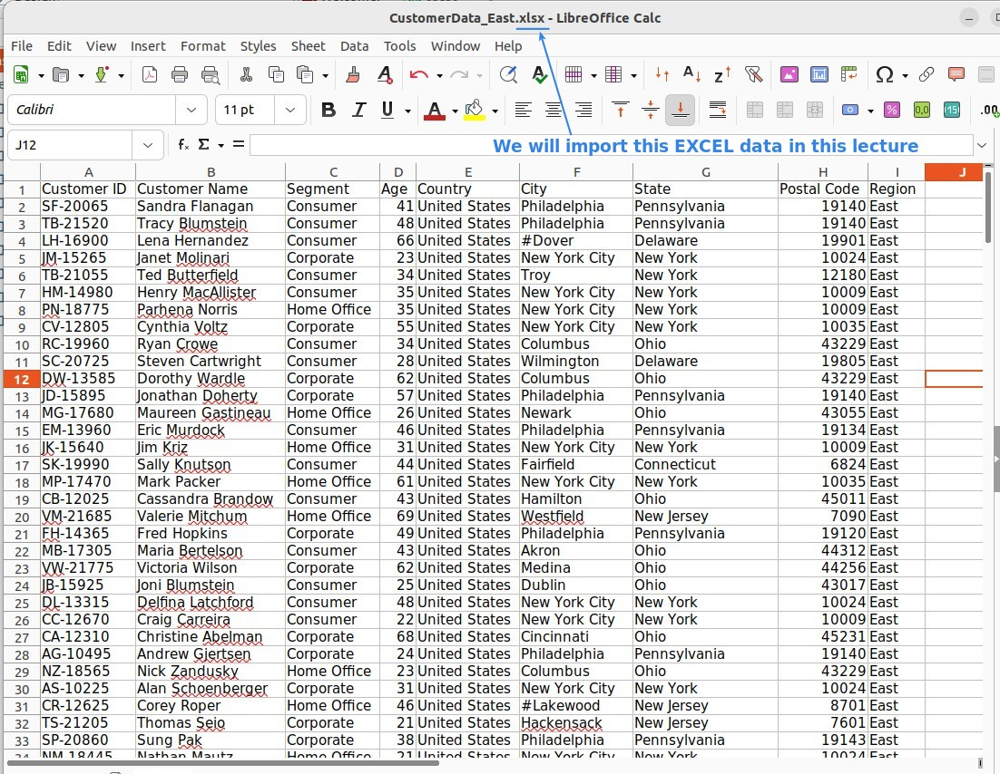
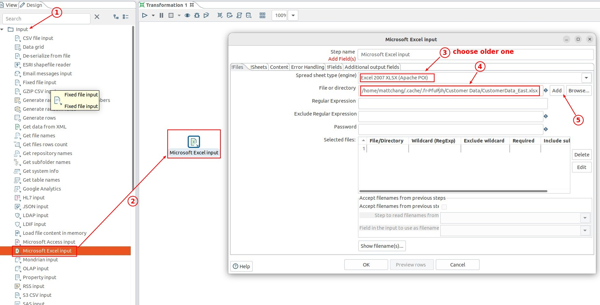
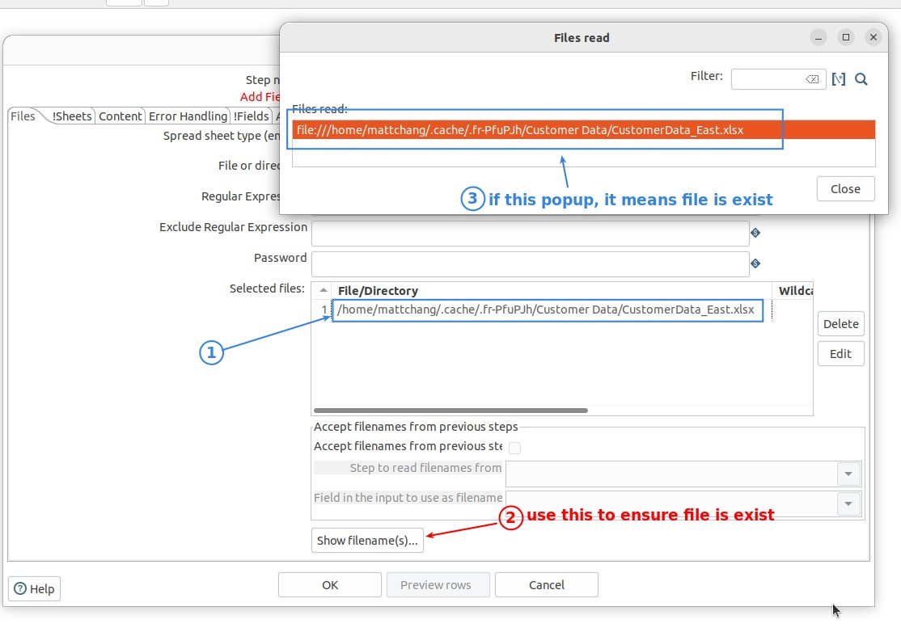
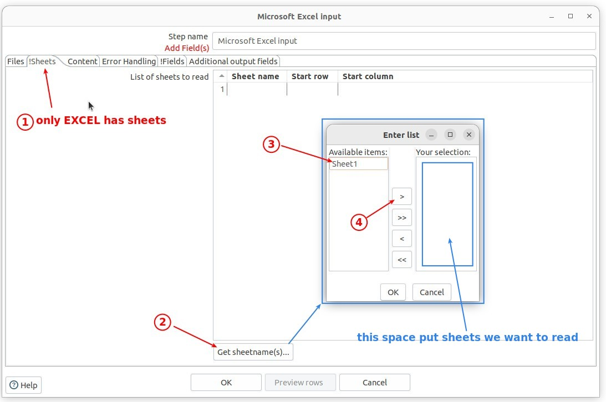
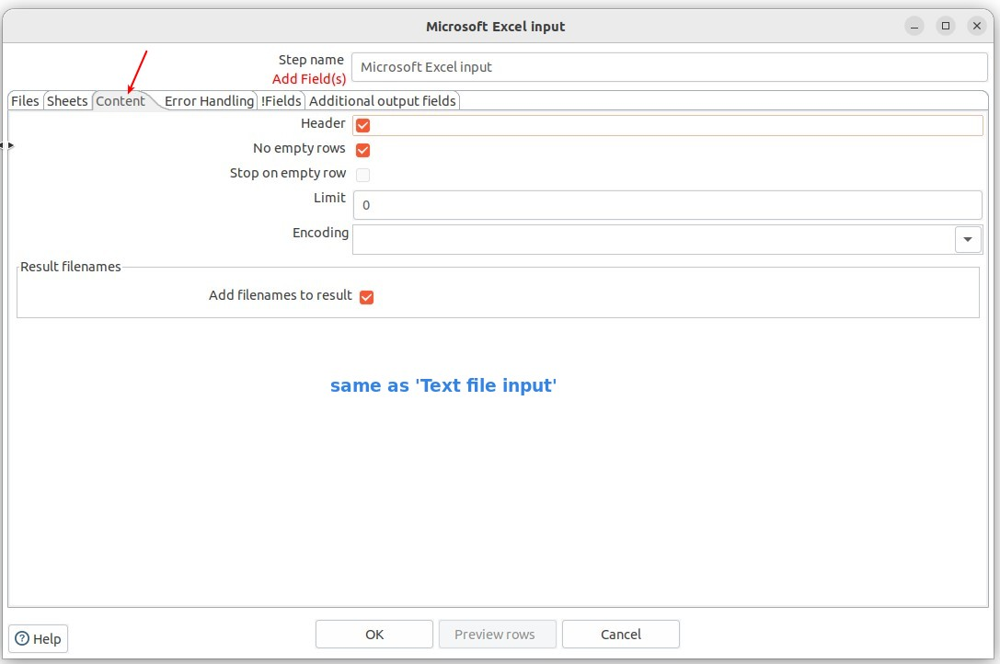
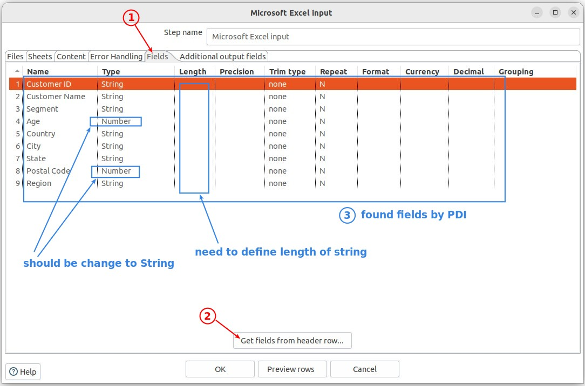
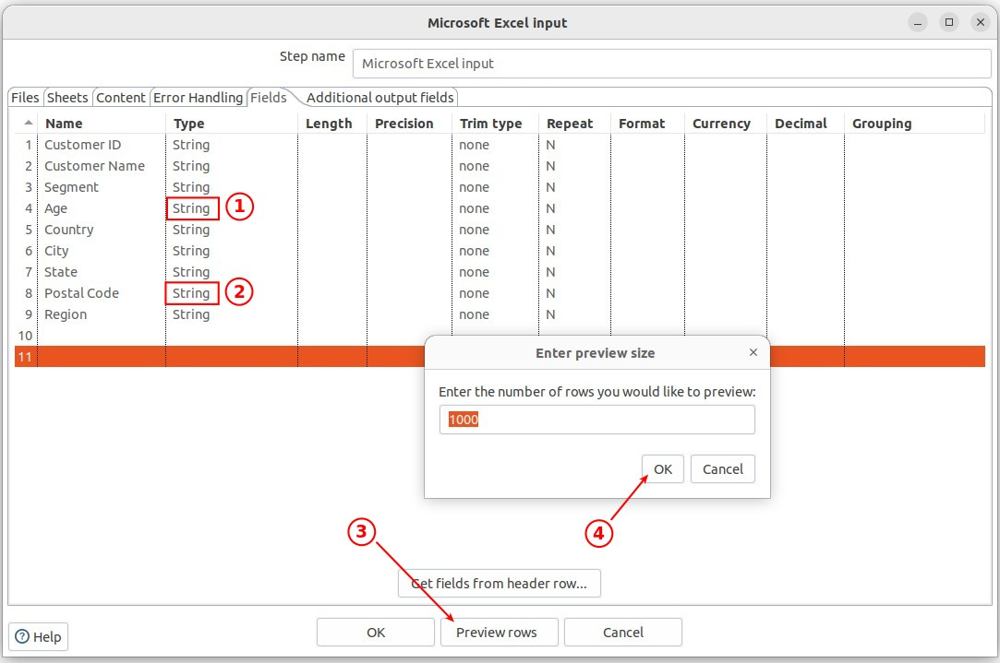
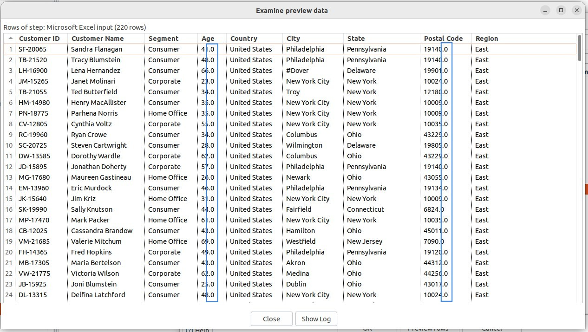
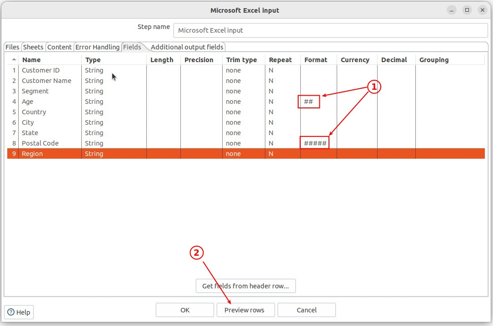
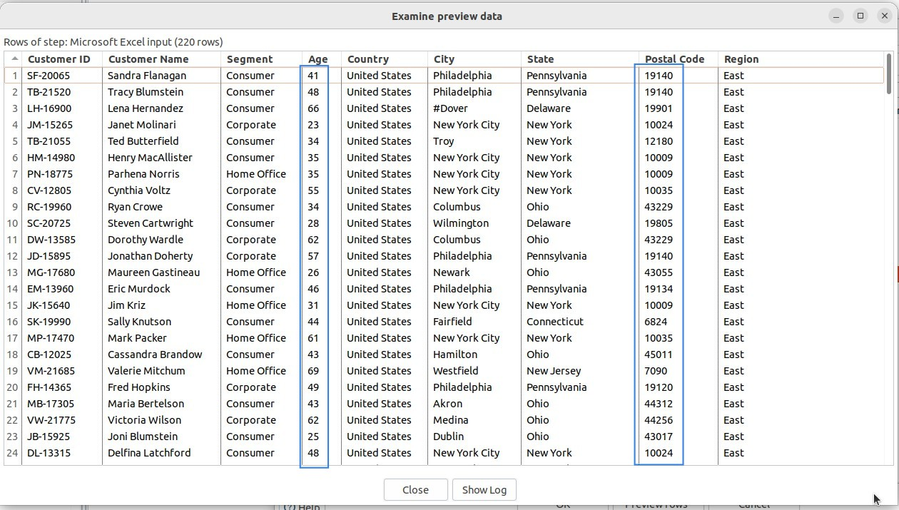

## **Data source: EXCEL**

- Try not to use EXCEL as a data source, choose CSV or text files if possible

- Importing data from Excel is real pain because:

  - Excel changes format, especially date format automatically.

  - There are sepcai characters such as line break character within a cell.

## **Component: Miscrosoft Excel Input**

### _File tab_

### _Sheets tab (Excel only)_

### _Content tab_

> Nothing special here...

### _Fields tab_

