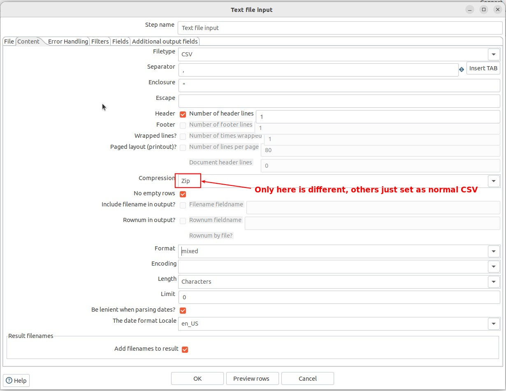

## **File source: Zip**

## **Component: Text File Input**

- There are other compression formats to choose from in Compression, even \*.gz is included.

## **Multiple CSV files in ZIP**

- This is usually done by using a component in the JOB to extract the ZIP into a folder, and the JOB has a dedicated component to do this.

