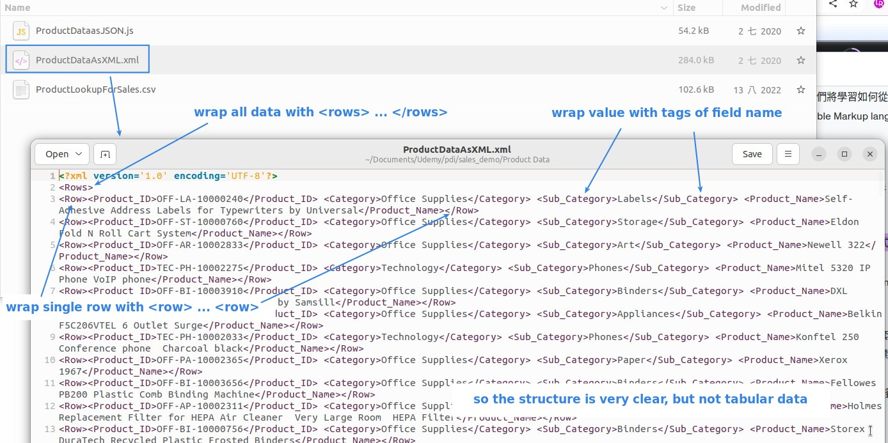
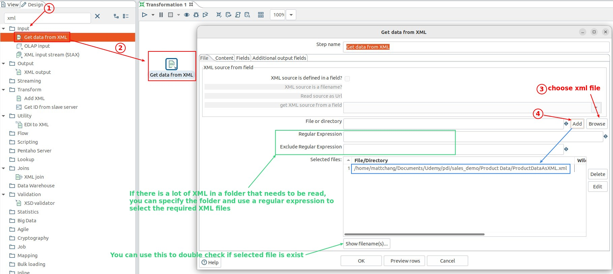
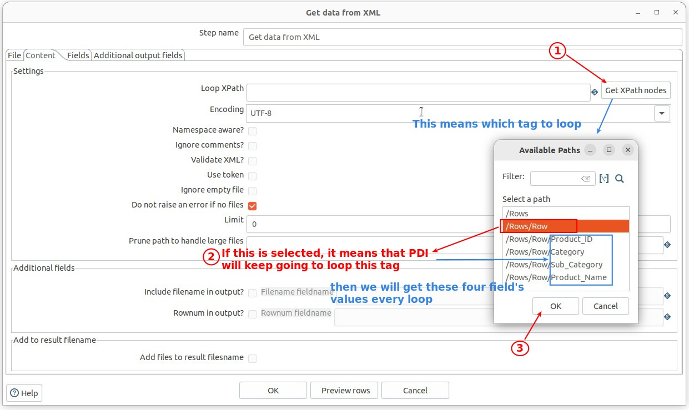
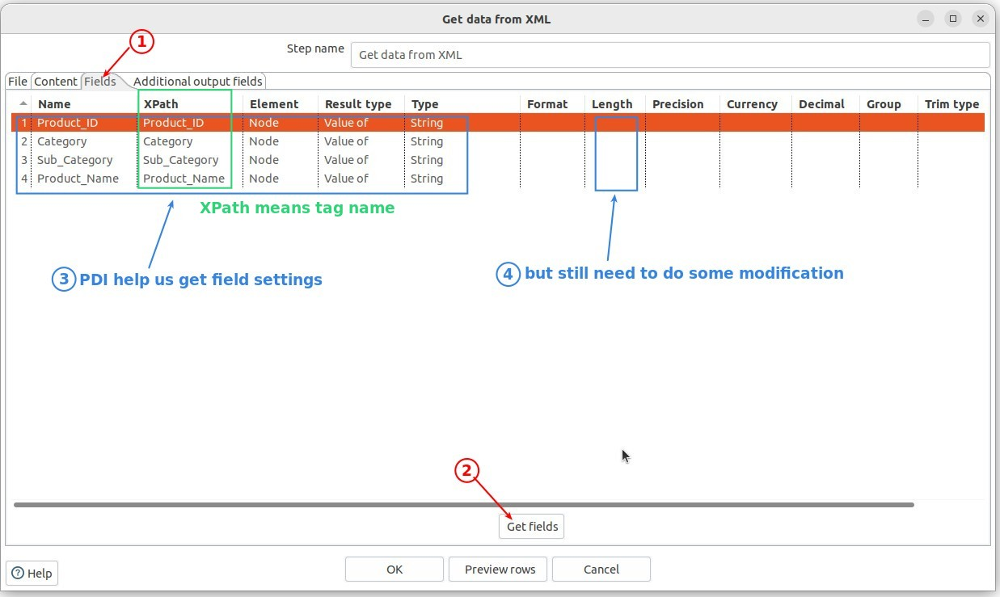
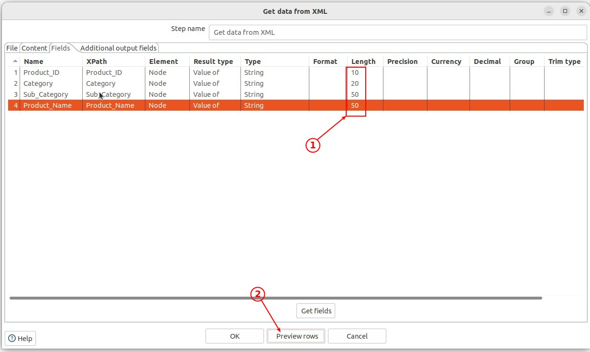
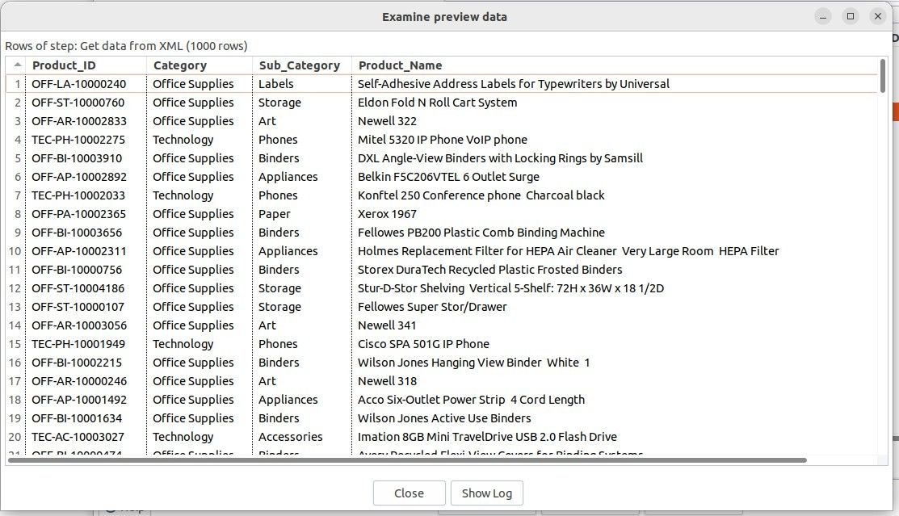

## **Data source: XML** 

- XML (eXtensible Markup Language) is a markup language that is used to describe data in a structured and self-contained manner.

- It is structured but non-tabular.

- It is basically text, too.

## **Component: Get Data From XML** 

### *Loop Xpath*    

### *Field settings* 

### *Preview* 

