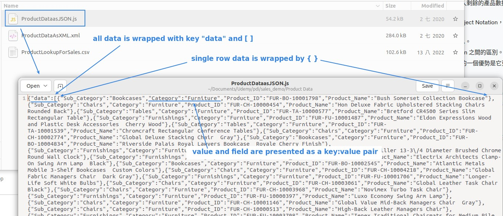
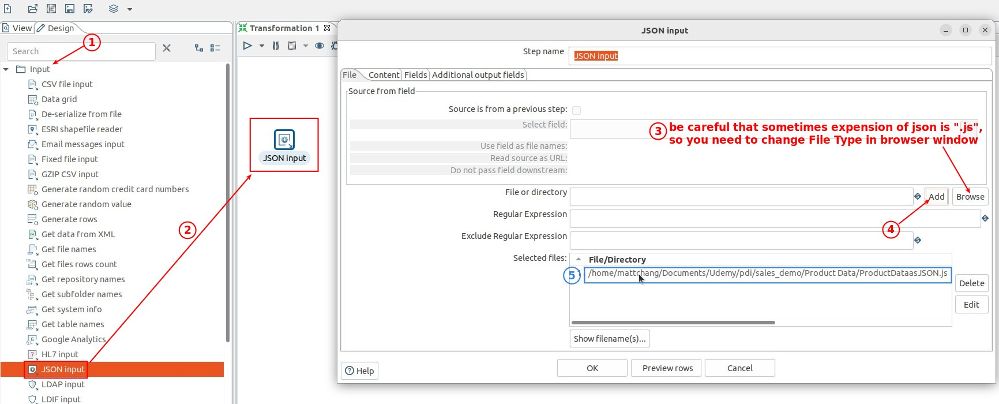
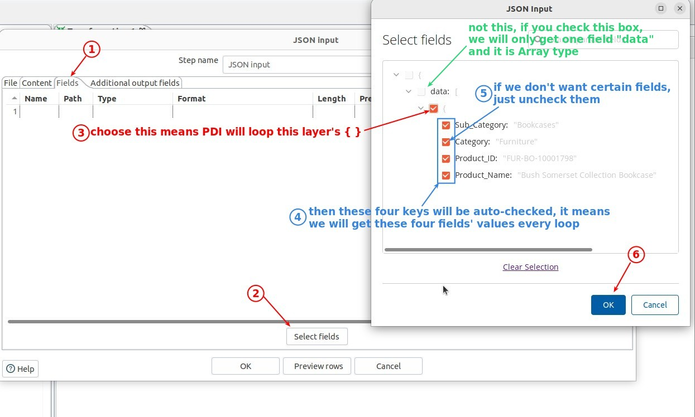
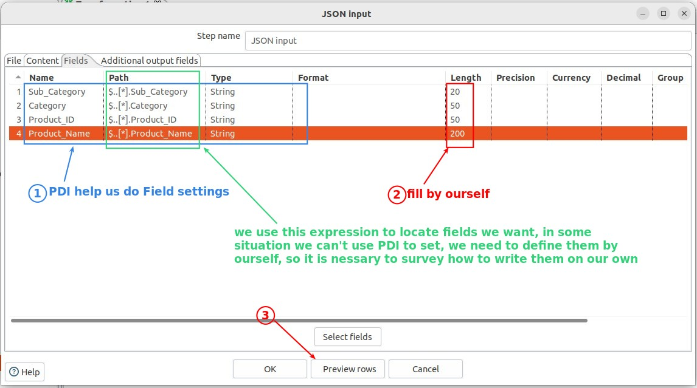
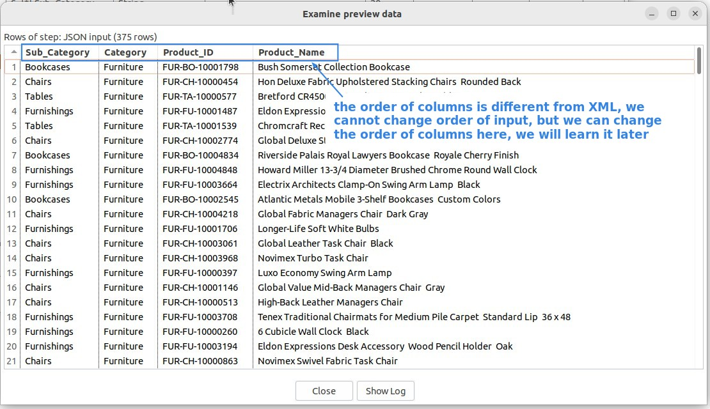

## **Data source: JSON** 

## **Component: JSON Input** 

### *Field settings* 

**Path** 

### *Preview* 

- The order of columns is different from the XML output, which can cause problems when merging two data later.

- Because the object in the language is unordered, the order of the keys is random when converting to json, so there is often a problem of inconsistency with the order of other data.

- But after we read the files (XML, JSON) into the PDI, we can modify the order of columns to the data in PDI.
