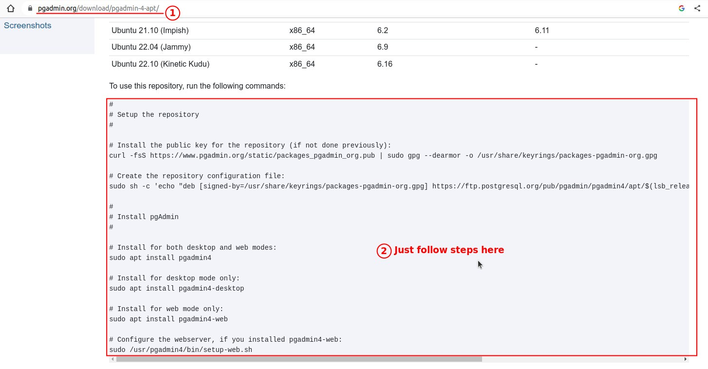
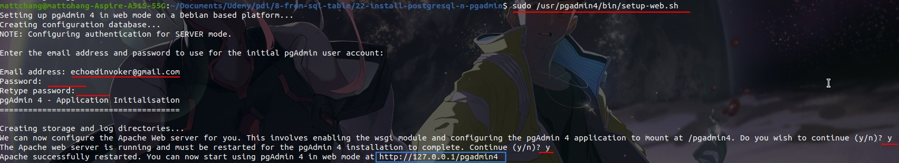
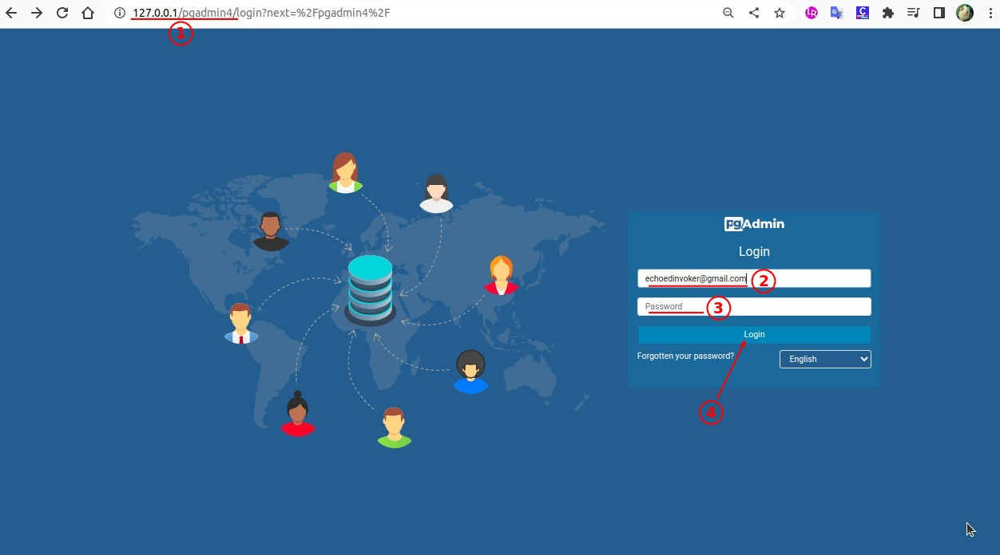
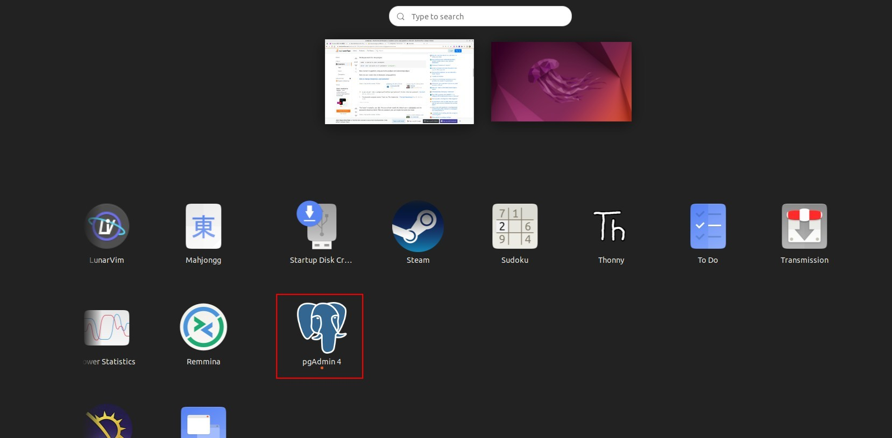
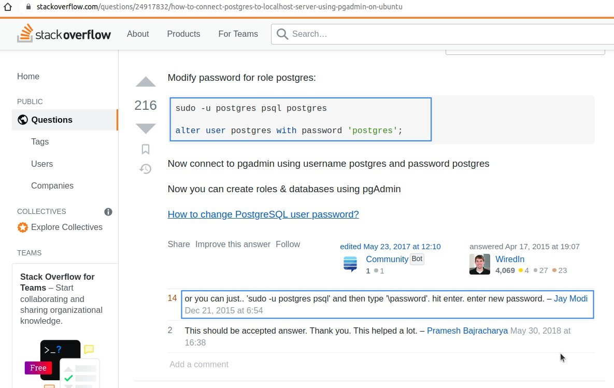
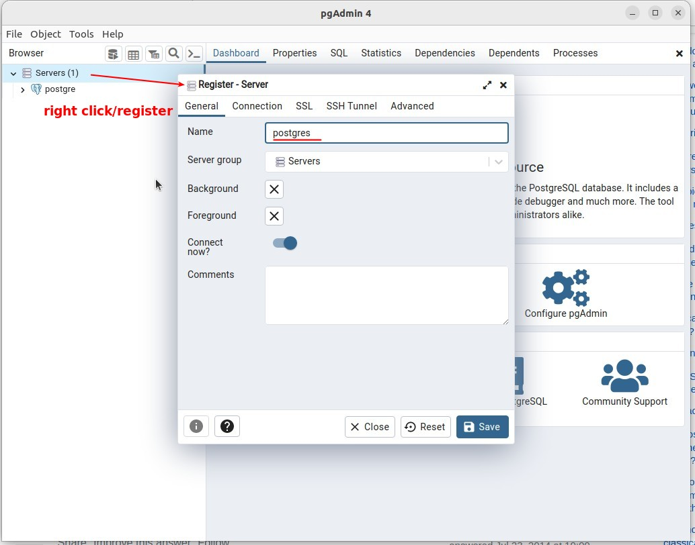
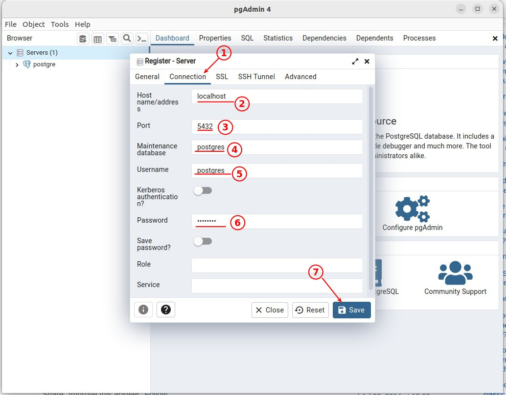
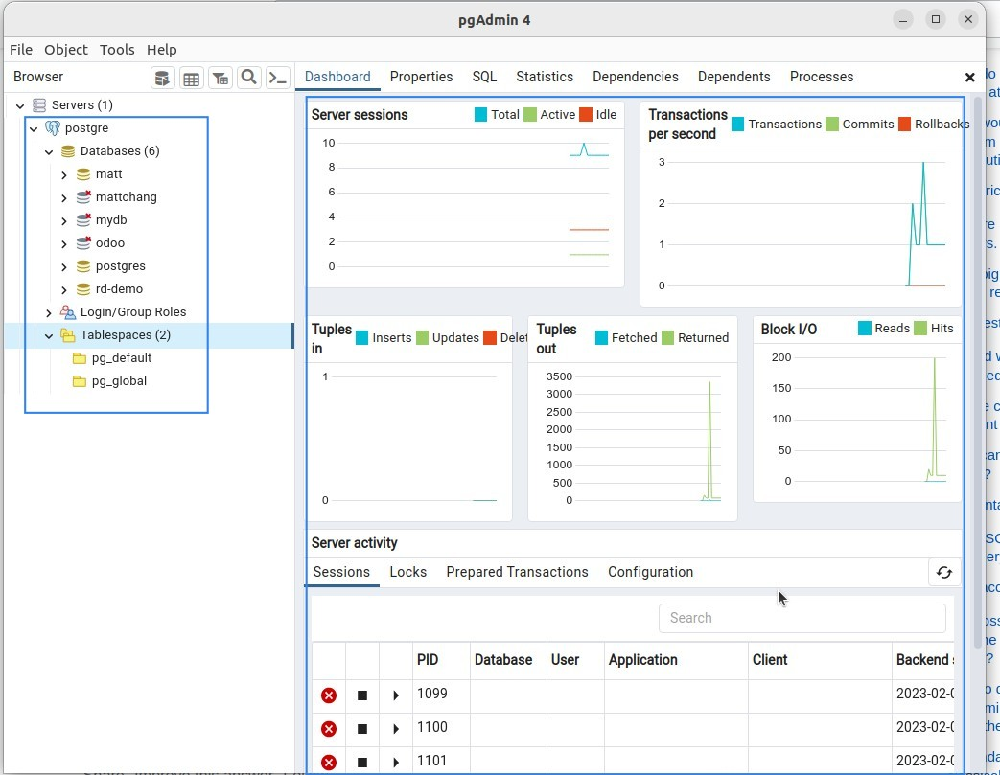
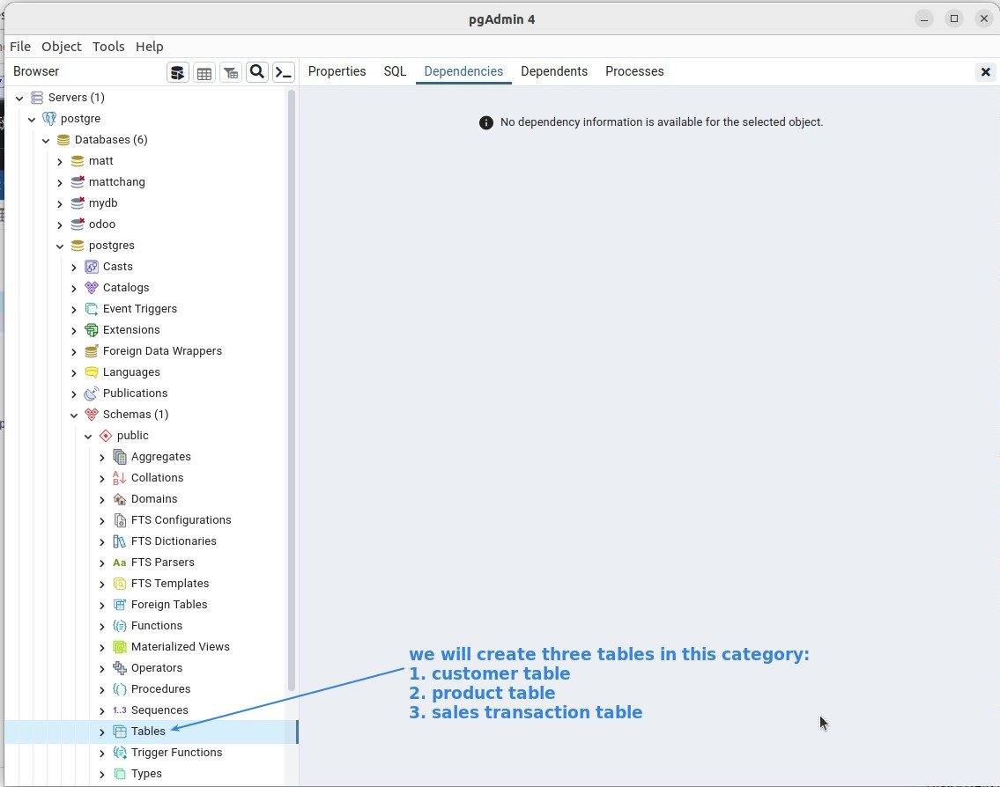
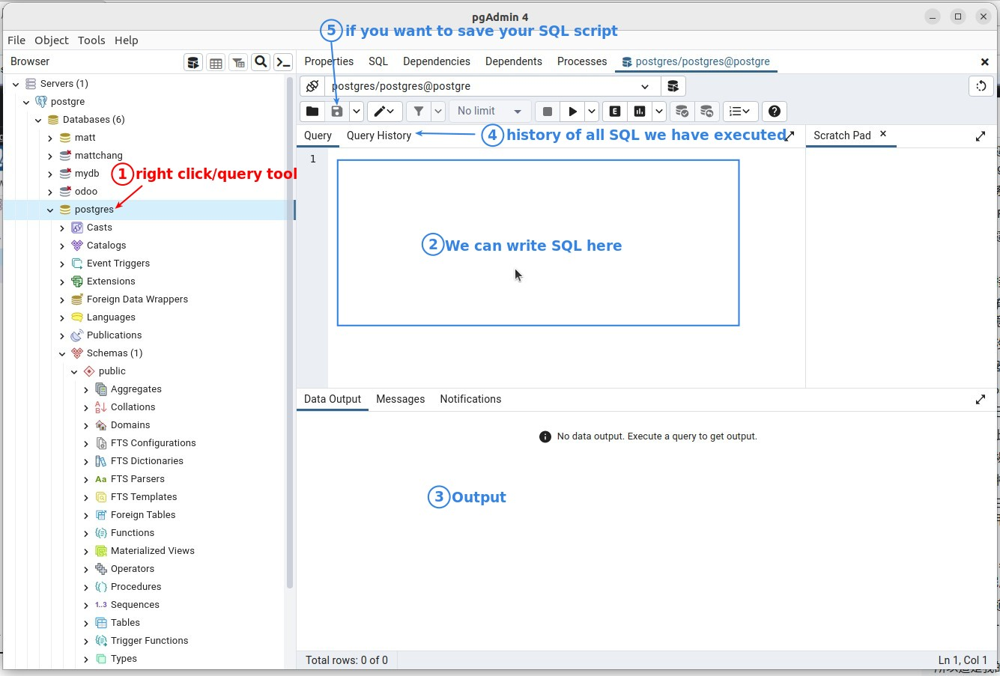

## **Install PGAdmin4**

> I've installed PostgreSQL before, so I'm skipping that part.

### _Install_

### _web_

- If you don't need to connect from other laptops, you don't need to install the web version if you only use it on your local computer, the desktop app is enough.

### _desktop_

## **PostgresSQL password & PGAdmin4 connections**

### *password of 'postgres'* 

- The default PostgreSQL account is 'postgres' but the password seems to be wrong, so I use the above method to reset the password.

### *connections setting in PGAdmin4*

## **UI Intro**

### _table_

### _SQL_

