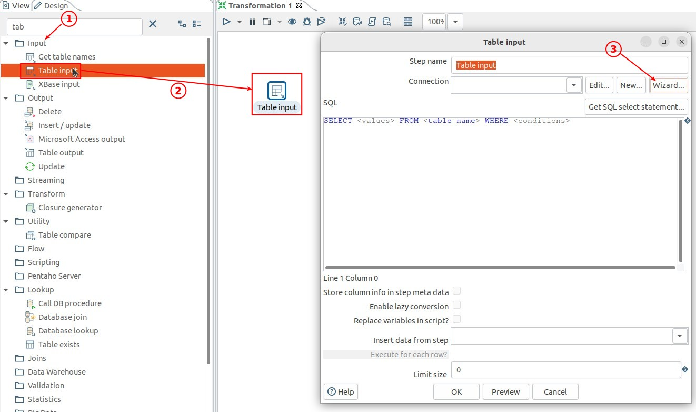
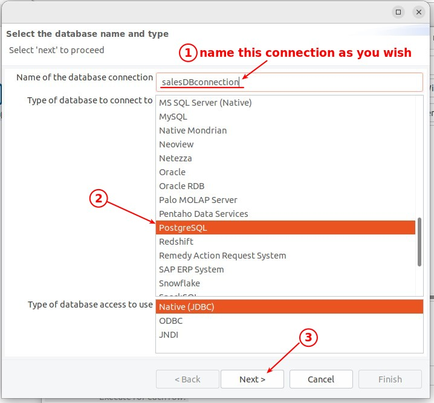
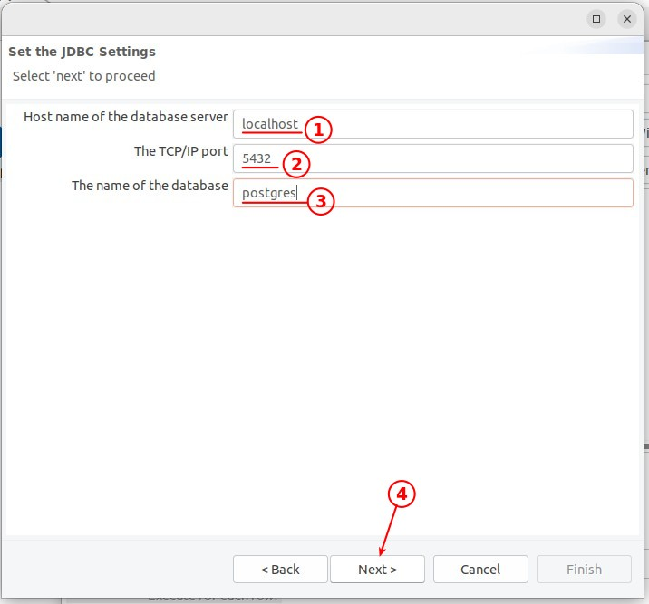
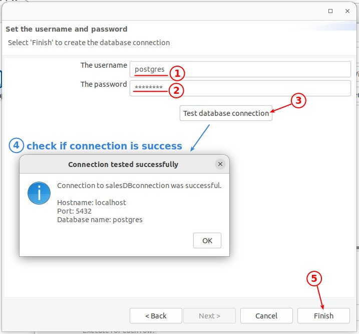
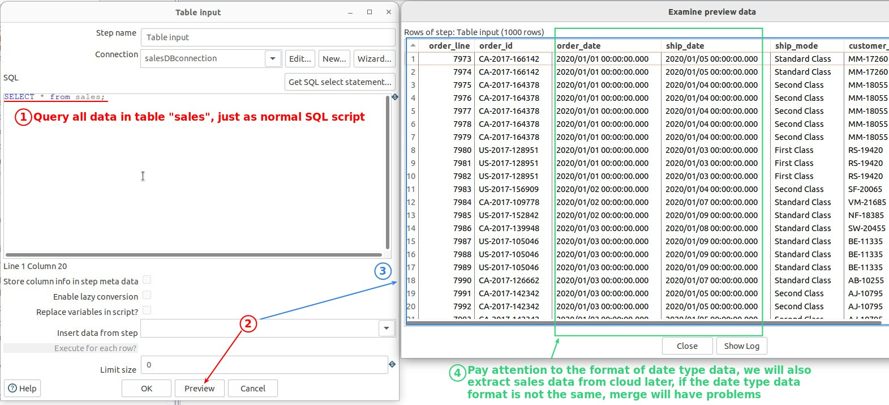

## **Component: Table input** 

> We use this component to extract data from the PostgreSQL database.

### _Build Connection to DB by Wizard_

- This component allows us to extract data from a wide variety of relevance databases.

- The informations used for the connection is actually similar to what we use when creating a connection in pgAdmin4.

### _Query with SQL script & Preview_

- Once the connection is established, we can enter the SQL script directly into the component.

- Note that Preview reflects the data queried by SQL script, so SQL script should be written first before using Preview.
