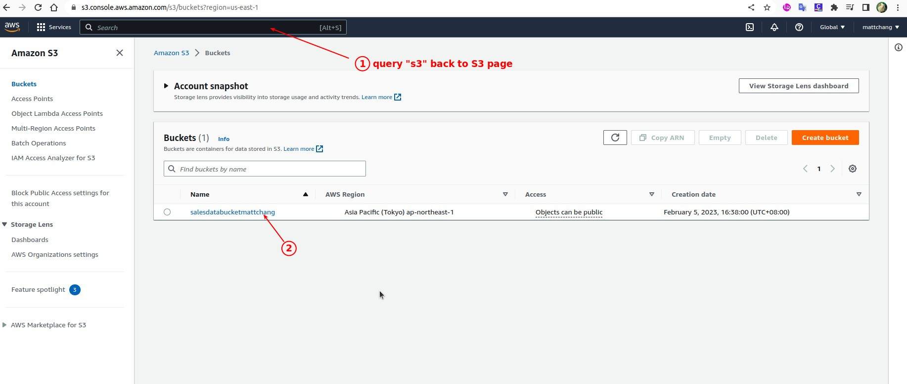
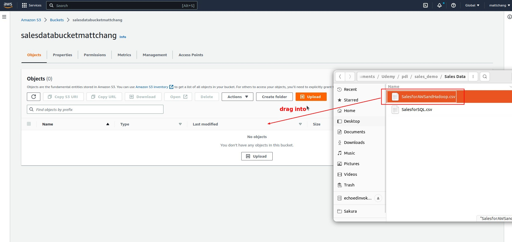
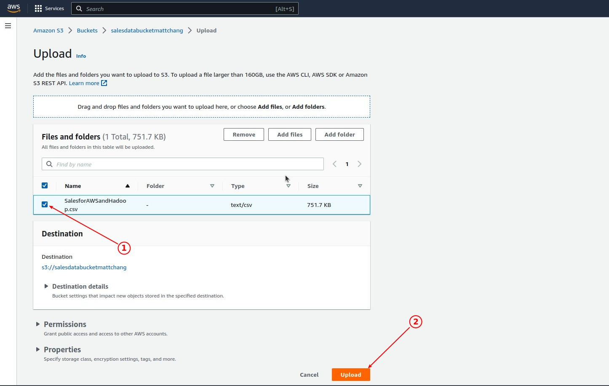
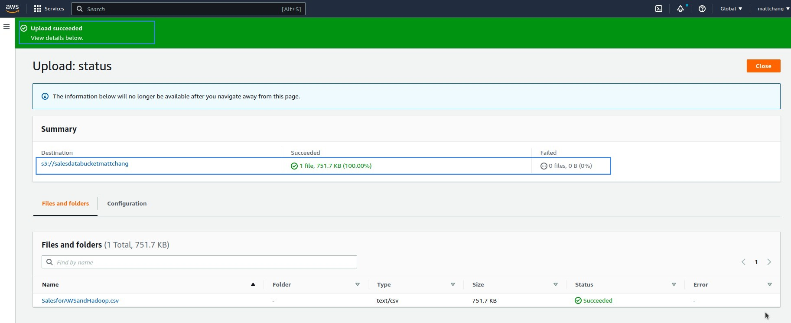

## **Sign in AMAZON & S3** 

## **Create a Bucket** 

**Naming it** 
  

**Unblock anyone, this is a public one** 

**Done it & confirm** 

## **Create Access Keys** 

> There are two access keys, public and private. We need them to access the bucket from PDI.

**Create access keys** 

**root alert**

- This is not an AWS course, so we won't discuss it, just focus on getting the bucket up.

**Done it & save keys**

## **Upload CSV file to the bucket** 

**Choose bucket** 

**Upload CSV file** 

**Done & Confirm**

