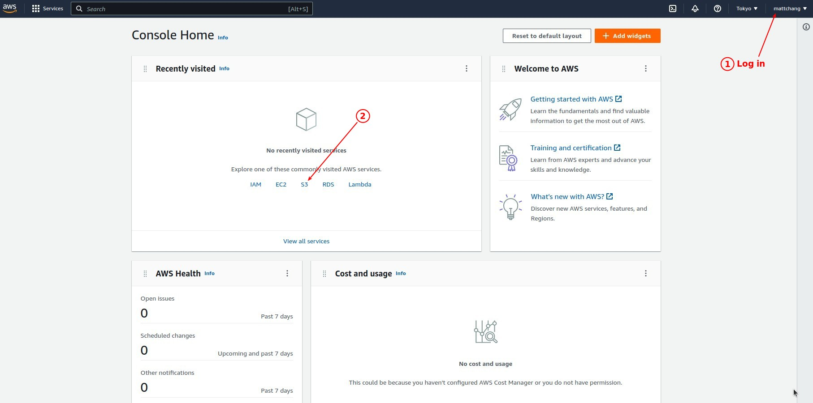
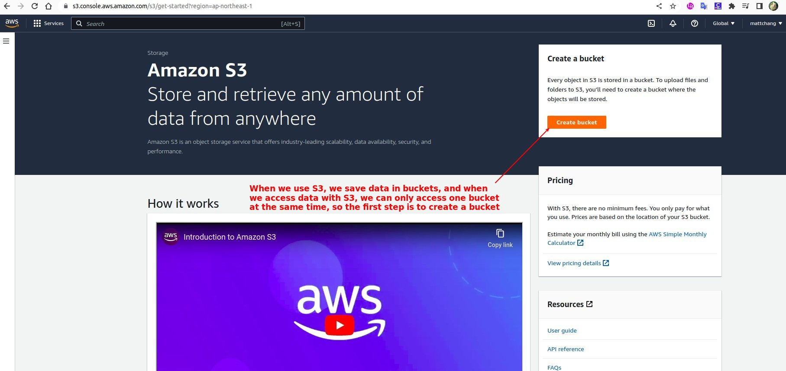
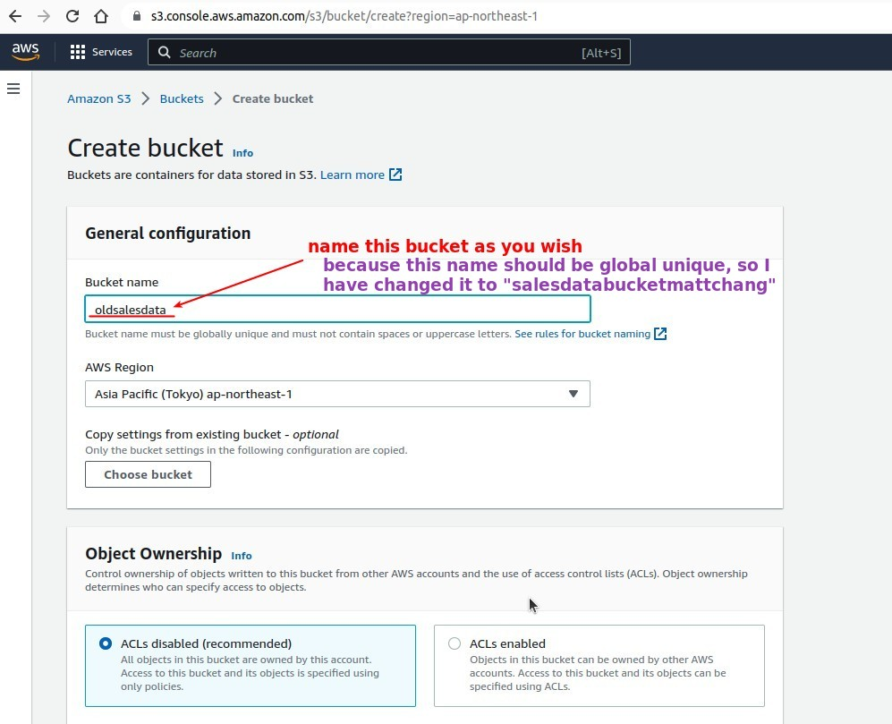
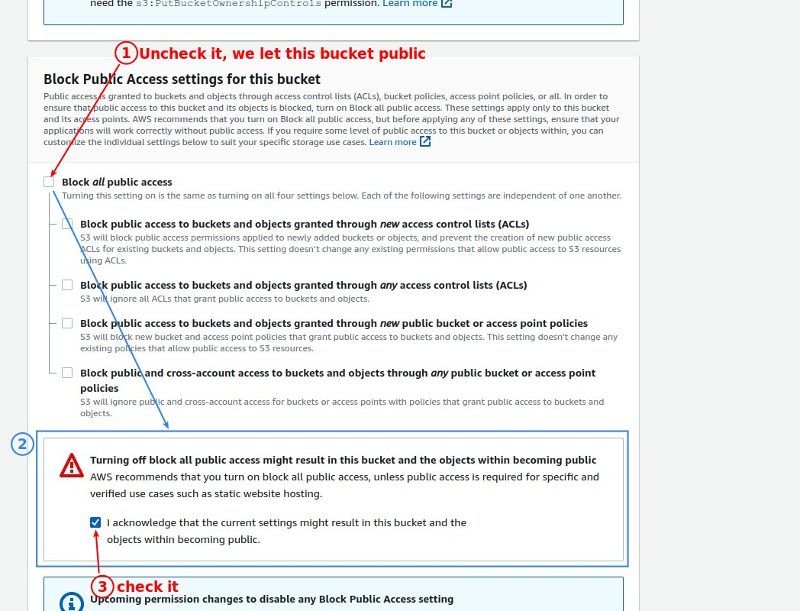
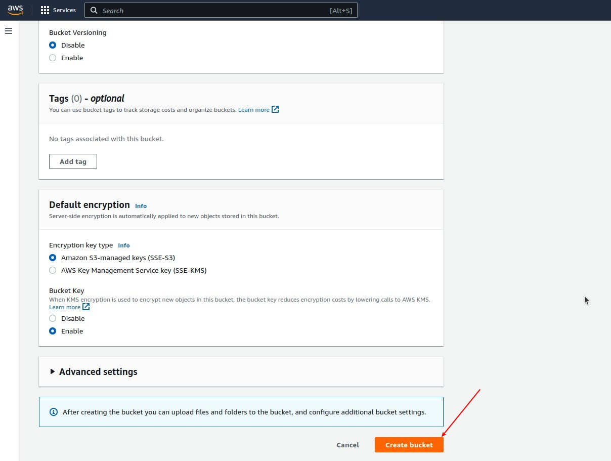
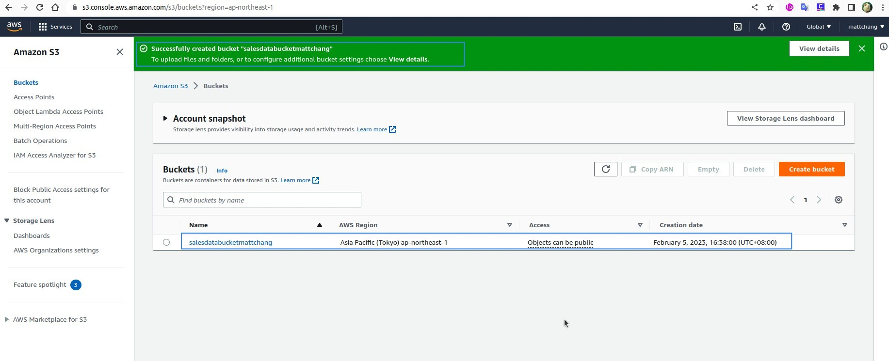
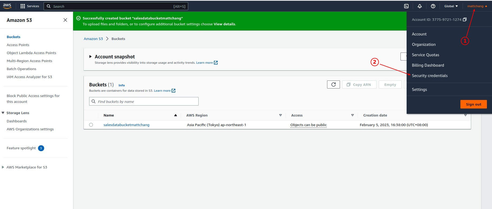
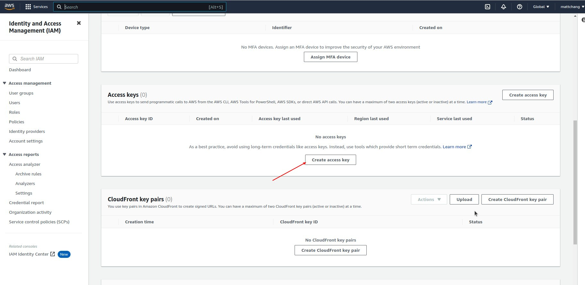
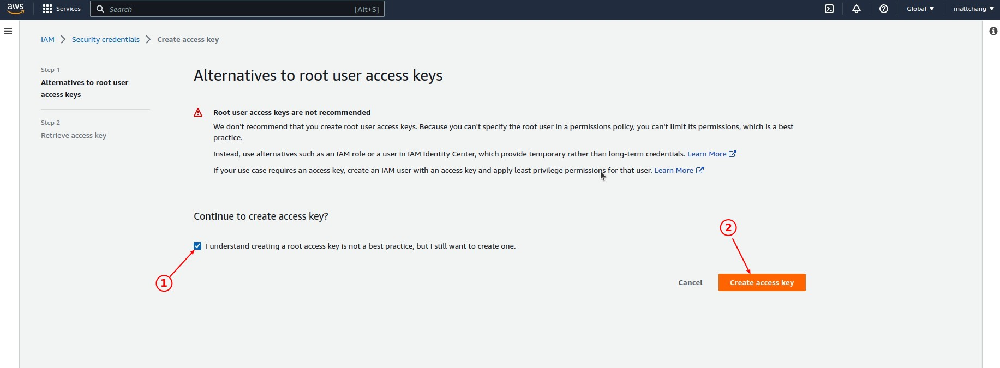
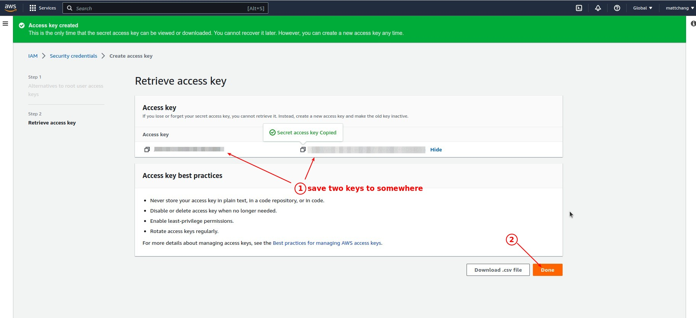

## **Sign in AMAZON & S3** 

## **Create a Bucket** 

**Naming it** 
  

**Unblock anyone, this is a public one** 

**Done it & confirm** 

## **Create Access Keys** 

> There are two access keys, public and private. We need them to access the bucket from PDI.

**Create access keys** 

**root alert**

**Done it & save keys**

