## **Components selection** 

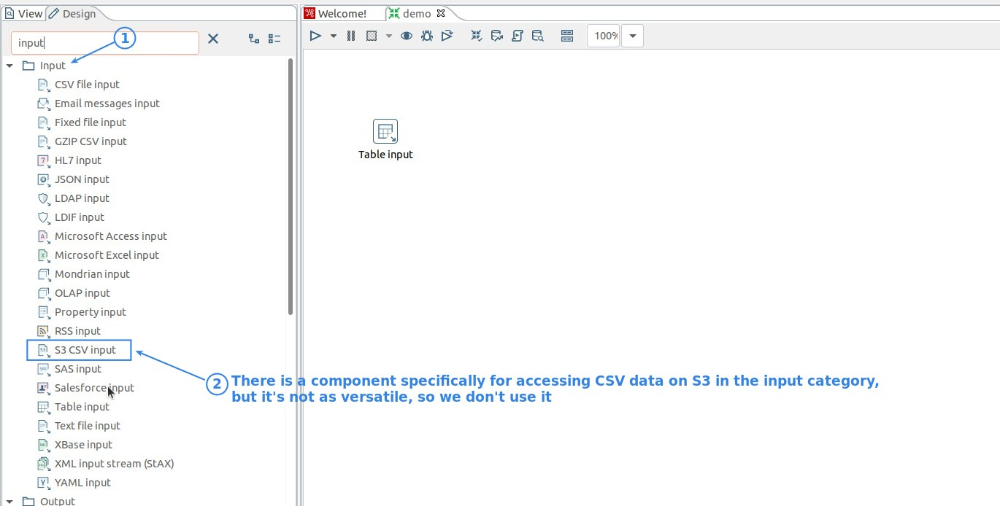

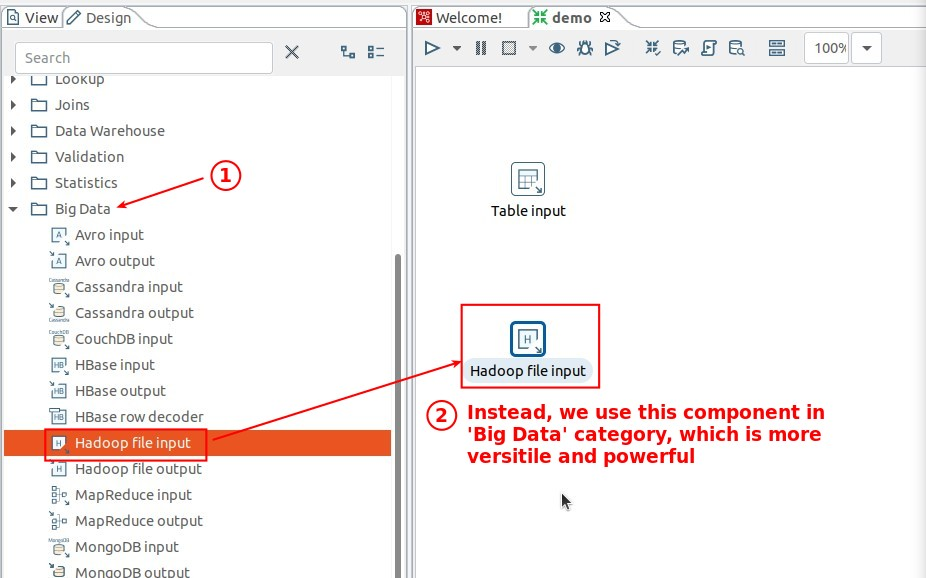

## **Component: Hadoop File Input**

### _Path to AWS S3 CSV_

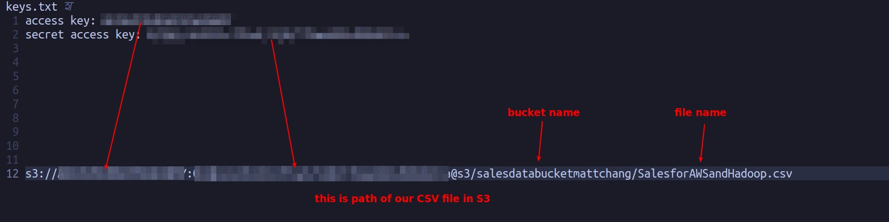

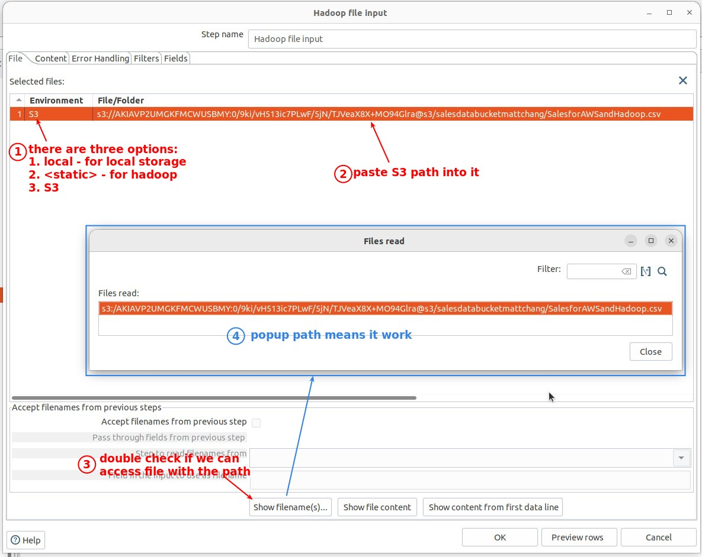

### _Content tab_

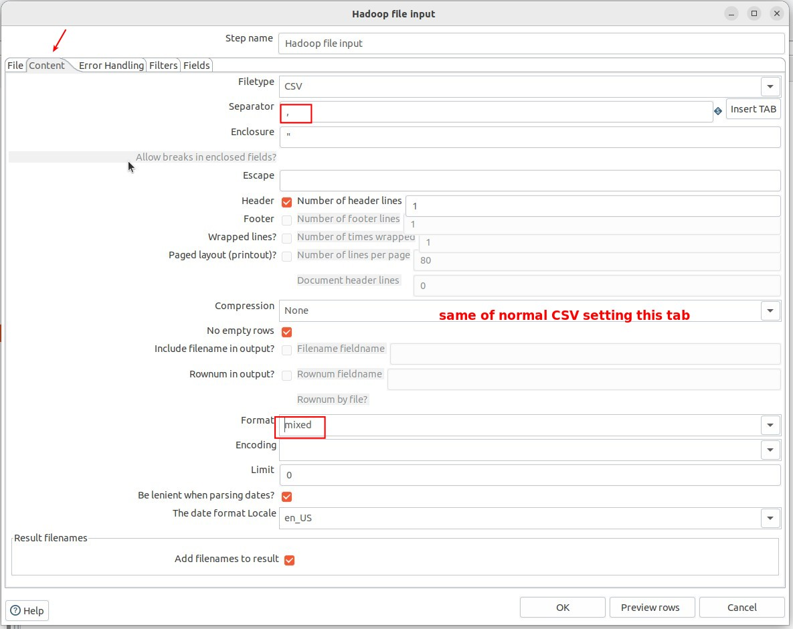

### _Get Fields_

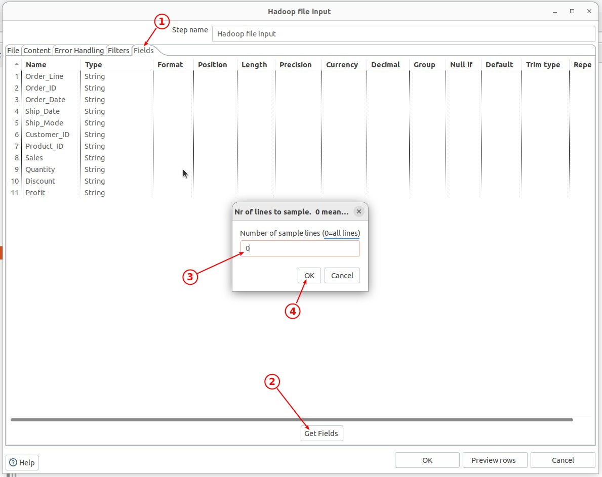

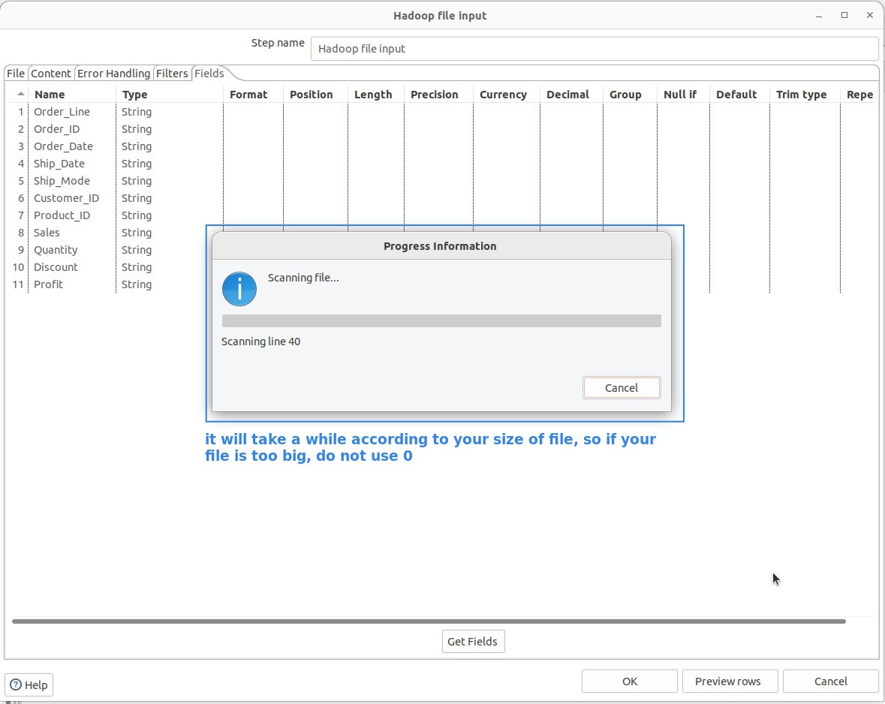

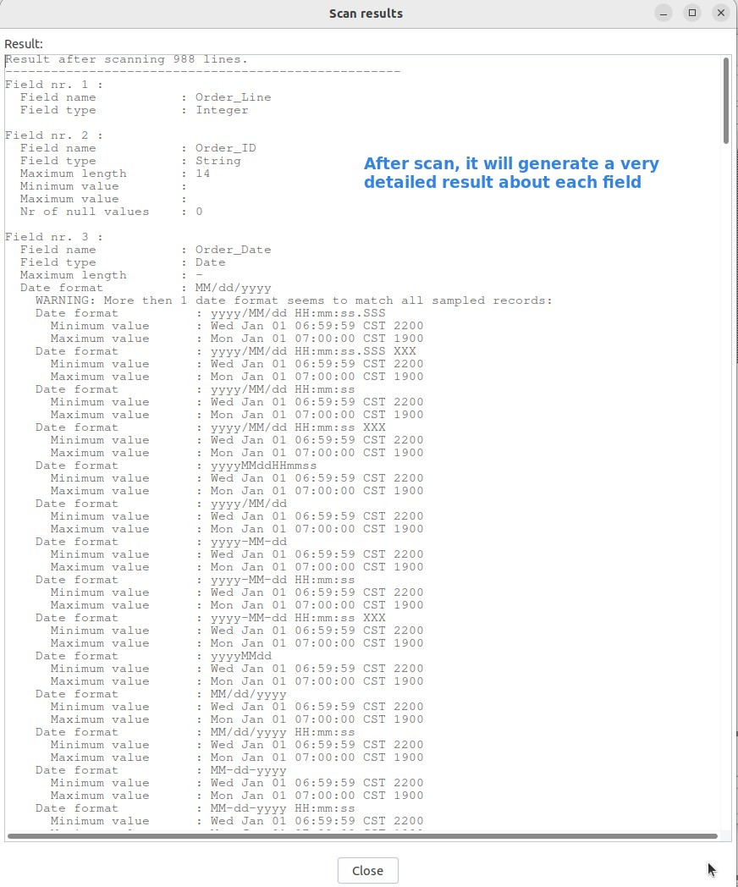

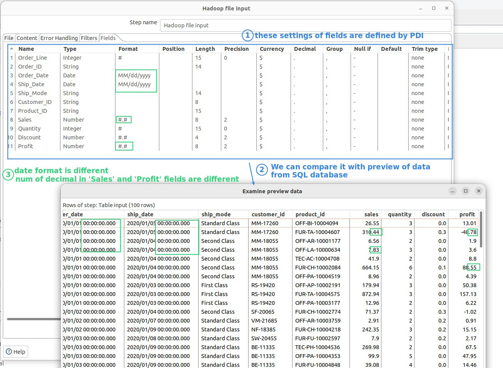

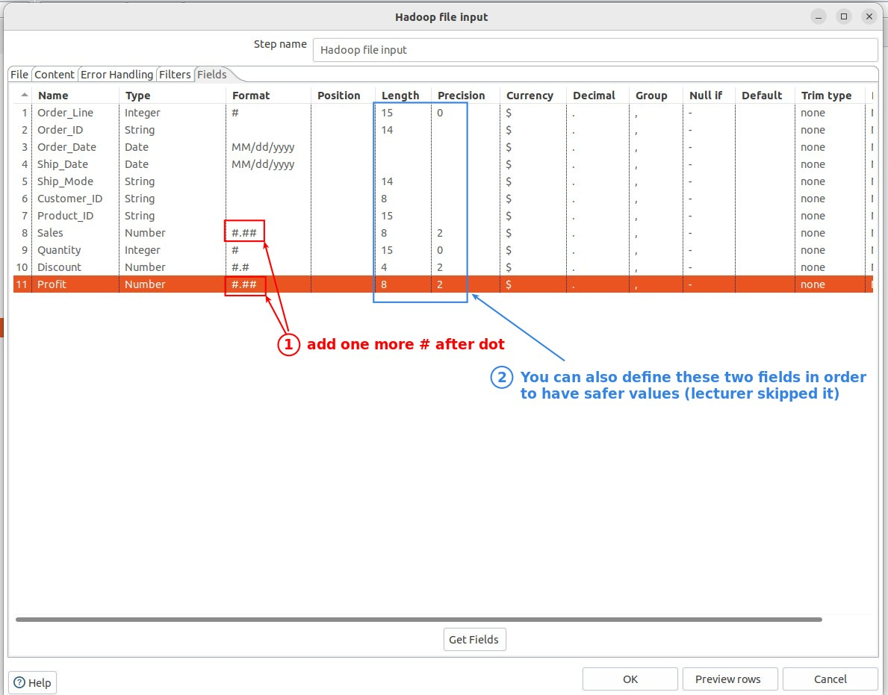

### _Preview (Error)_

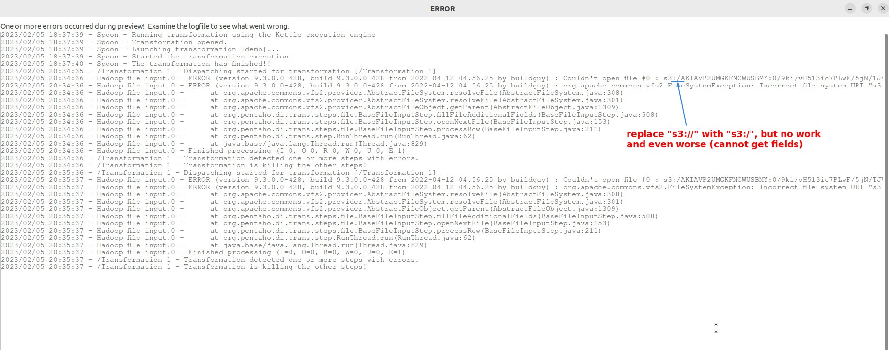

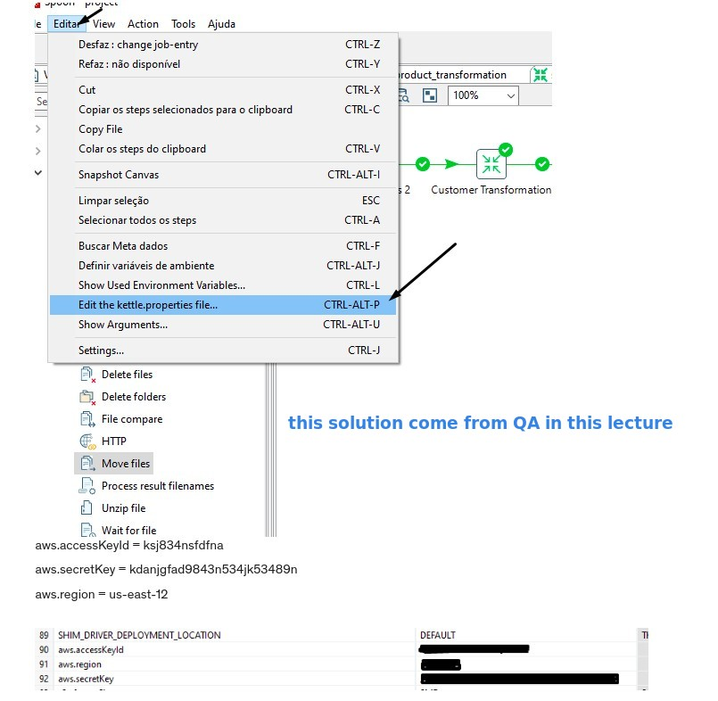

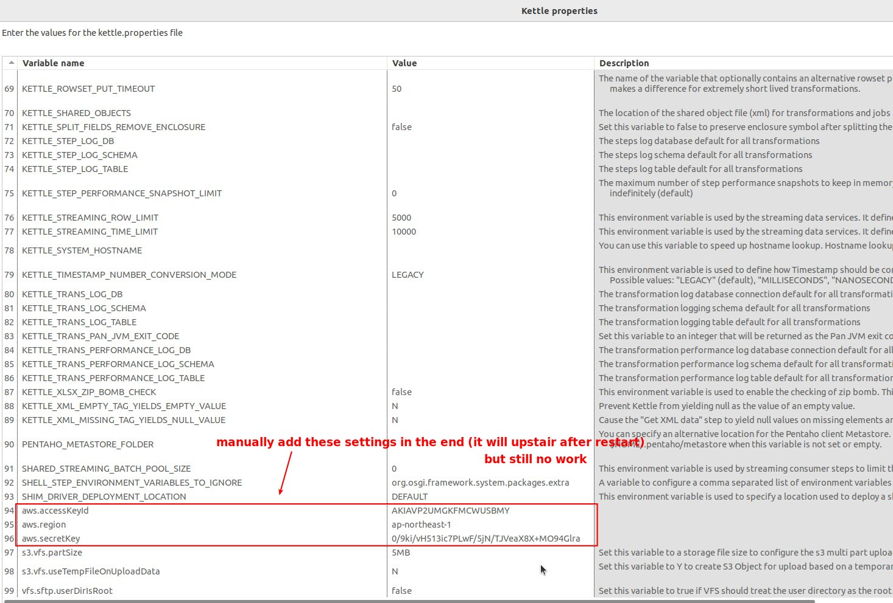

## **Component: S3 CSV Input**

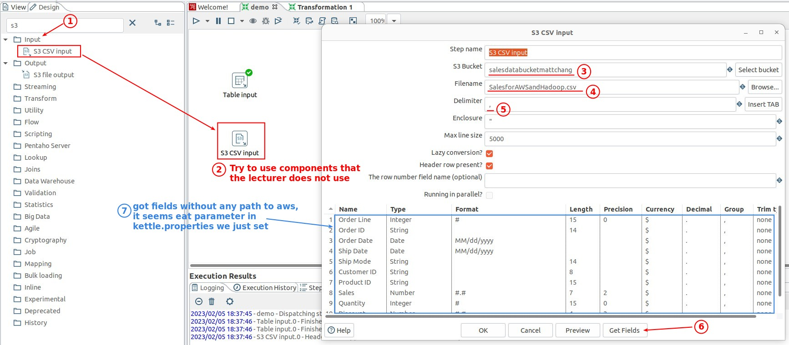

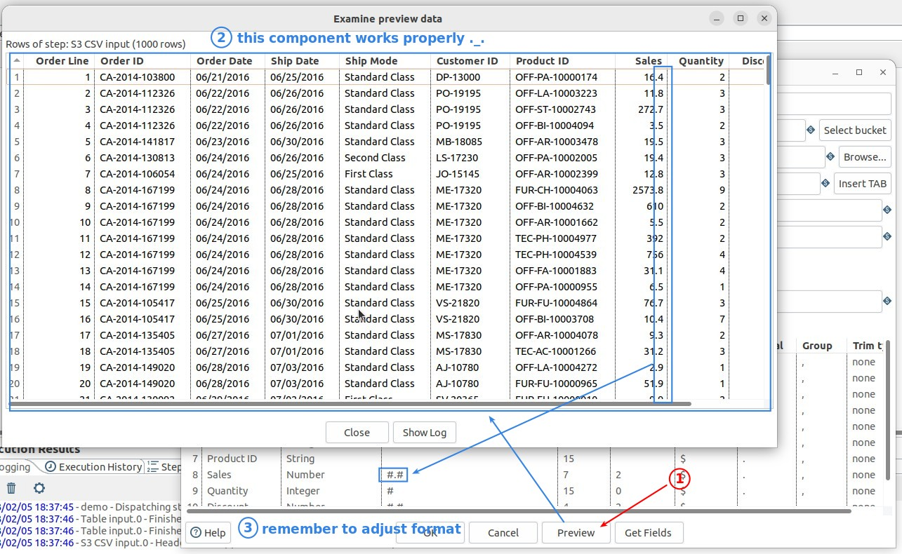
